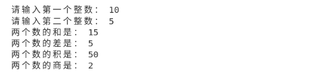
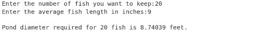
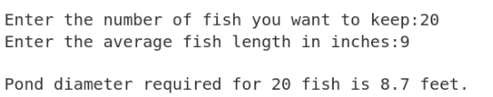
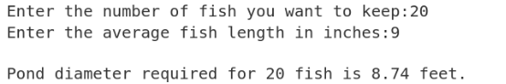
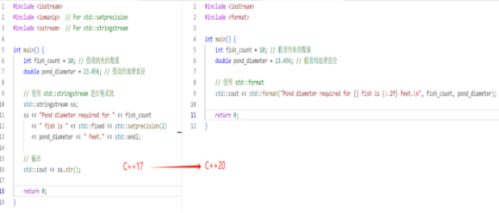
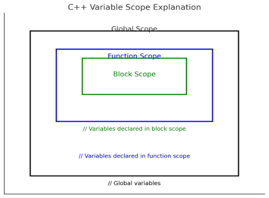

# C++基础知识

# **第一章：C++基础知识/基本数据类型**

1979年，贝尔实验室的本贾尼等人试图分析unix内核的时候，试图将内核模块化，于是在C语言的基础上进行扩展，增加了类的机制，完成了一个可以运行的预处理程序，称之为C with classes。语言的发展是由浅入深的过程。我们先来看下C++的历史版本。

| 阶段           | 内容                                                                                                                                                                                                                                                                                                                                                         |
| :------------- | :----------------------------------------------------------------------------------------------------------------------------------------------------------------------------------------------------------------------------------------------------------------------------------------------------------------------------------------------------------- |
| C with classes | 类及[派生类](https://zhida.zhihu.com/search?q=%E6%B4%BE%E7%94%9F%E7%B1%BB&zhida_source=entity&is_preview=1)、公有和私有成员、类的构造和析构、[友元](https://zhida.zhihu.com/search?q=%E5%8F%8B%E5%85%83&zhida_source=entity&is_preview=1)、内联函数、赋值运算符重载等                                                                                        |
| C++1.0         | 添加[虚函数](https://zhida.zhihu.com/search?q=%E8%99%9A%E5%87%BD%E6%95%B0&zhida_source=entity&is_preview=1)概念，函数和运算符重载，引用、常量等                                                                                                                                                                                                              |
| C++2.0         | 更加完善支持面向对象，新增保护成员、[多重继承](https://zhida.zhihu.com/search?q=%E5%A4%9A%E9%87%8D%E7%BB%A7%E6%89%BF&zhida_source=entity&is_preview=1)、对象的初始化、[抽象类](https://zhida.zhihu.com/search?q=%E6%8A%BD%E8%B1%A1%E7%B1%BB&zhida_source=entity&is_preview=1)、静态成员以及const成员函数                                                     |
| C++3.0         | 进一步完善，引入模板，解决多重继承产生的二义性问题和相应构造和析构的处理                                                                                                                                                                                                                                                                                     |
| C++98          | C++标准第一个版本，绝大多数编译器都支持，得到了国际标准化组织(ISO)和美国标准化协会认可，以模板方式重写C++标准库，引入了STL([标准模板库](https://zhida.zhihu.com/search?q=%E6%A0%87%E5%87%86%E6%A8%A1%E6%9D%BF%E5%BA%93&zhida_source=entity&is_preview=1))                                                                                                    |
| C++03          | C++标准第二个版本，语言特性无大改变，主要：修订错误、减少多异性                                                                                                                                                                                                                                                                                              |
| C++05          | C++标准委员会发布了一份计数报告(Technical Report，TR1)，正式更名[C++0x](https://zhida.zhihu.com/search?q=C++0x&zhida_source=entity&is_preview=1)，即：计划在本世纪第一个10年的某个时间发布                                                                                                                                                                   |
| C++11          | 增加了许多特性，使得C++更像一种新语言，比如：[正则表达式](https://zhida.zhihu.com/search?q=%E6%AD%A3%E5%88%99%E8%A1%A8%E8%BE%BE%E5%BC%8F&zhida_source=entity&is_preview=1)、基于范围for循环、auto关键字、新容器、列表初始化、[标准线程库](https://zhida.zhihu.com/search?q=%E6%A0%87%E5%87%86%E7%BA%BF%E7%A8%8B%E5%BA%93&zhida_source=entity&is_preview=1)等 |
| C++14          | 对C++11的扩展，主要是修复C++11中漏洞以及改进，比如：泛型的[lambda表达式](https://zhida.zhihu.com/search?q=lambda%E8%A1%A8%E8%BE%BE%E5%BC%8F&zhida_source=entity&is_preview=1)，auto的返回值类型推导，二进制字面常量等                                                                                                                                        |
| C++17          | 在C++11上做了一些小幅改进，增加了19个新特性，比如：[static_assert](https://zhida.zhihu.com/search?q=static_assert&zhida_source=entity&is_preview=1)()的文本信息可选，Fold表达式用于可变的模板，if和switch语句中的[初始化器](https://zhida.zhihu.com/search?q=%E5%88%9D%E5%A7%8B%E5%8C%96%E5%99%A8&zhida_source=entity&is_preview=1)等                        |
| **C++20**      | **自C++11以来最大的发行版，引入了许多新的特性，比如：模块(Modules)、协程(Coroutines)、范围(Ranges)、概念(Constraints)等重大特性，还有对已有特性的更新：比如Lambda支持模板、范围for支持初始化等**                                                                                                                                                             |
| C++23         | 制定完善中 |

提出问题：

请问，一个程序都包含什么内容呢？今天我们从简单的数学问题开始学习，彻底搞清楚程序的组成。

## **1.1变量、数据和数据类型**

数学运算中有加减乘除，我们把它叫做四则运算，我们的计算器可以计算加减乘除，计算机当然也能计算！要想让计算机对我们的加减乘除进行计算，那么我们就必须想办法让计算机听懂我们的语言，这时候就该我们编程语言出场了，编程语言有好多种，常见的有C、C++、Python、Java等等，现在我们就C++语言来开始我们等的编程之旅，我想这一定是一个很奇妙、很难忘、很有意义的开始。

代码分析：

### **1.1.1 整数的计算**

假如我们现在要计算两个数的和、差、积、商，这两个数由用户确定（需要用户输入），用户输入两个数之后，分别输出这两个数的和、差、积、商。请问你要怎么解决？

比如说我们有两个数，分别是10和5，我们现在能够很容易的算出它们的和、差、积、商分别是15、5、50、2，但是我们该怎么让计算机去帮助我们计算呢？

运算是由运算符定义的，例如+用于相加求和，\*用于相乘求积。运算符操作的值成为操作数，在表达式10\*5中，操作数是10和5，乘法运算符需要两个操作数，所以成为二元运算符，只需要一个操作数的运算符叫做一元运算符。

上面这个简单的小学问题我相信大家都能“秒杀”。我们把两个数的和叫做sum（随意取名即可，就好像小狗的名字可以是lucky也可以是lucy一样），那么sum = 10+ 5=15;毫无疑问。诸如10、5这样的整数，我们在编程语言中把它们叫做整型变量，暂且把这两个数叫做num1、num2，也就是num1=10；num2=5；那么现在两个数的和就可以表示为sum = num1 + num2；按照同样的道理，两个数的差我们把它叫做difference，那么difference = num1 - num2；同理，两个数的积就是product = num1 \* num2；（注意，在编程语言之中，我们通常把“x”写作“\*”）；那么两个数的商就是quotient = num1 / num2; 下面我们就开始把这个题目的解题过程使用编程语言表示出来：

#include <iostream>
using namespace std;
int main()
{
*// 定义整型变量*
int num1, num2;
int sum, difference, product;
double quotient; *// 存储商，使用 double 以处理可能的浮点结果*
*// 提示用户输入两个整数*
cout << "请输入第一个整数：";
cin >> num1;
cout << "请输入第二个整数：";
cin >> num2;
*// 计算和、差、积和商*
sum = num1 + num2;               *// 和*
difference = num1 - num2;        *// 差*
product = num1 \* num2;           *// 积*
quotient = static\_cast<double>(num1) / num2;
*// 商，强制转换为 double 以避免整除*
*// 输出结果*
cout << "两个数的和是：" << sum << endl;
cout << "两个数的差是：" << difference << endl;
cout << "两个数的积是：" << product << endl;
cout << "两个数的商是：" << quotient << endl;
return 0;
}

运行上面的代码，按照指引，你就会很容易且迅速的计算两个数的和、差、积、商了。

在上面我们说到的计算两个数的和、差、积、商，前面提到的sum1、sum2在编程中我们通常把它叫做变量，加减乘除计算得到的和差积商也是变量，但是我们说的加减乘除在这里被称之为运算符。变量有很多类型（如整数、浮点数、字符等），变量的类型决定可以存储的值的性质和操作方式。

我们小学时候就学过，有理数可以分为整数和分数，整数分为正整数、零和负整数，分数分为有限小数和无限循环小数。在编程中，我们把值为整数的变量叫做整型变量，值为分数的变量叫做浮点变量。整数分为正整数、零和负整数，那么负整数就得用有符号整型来表示，我们所说的分数（分为有限小数和无限循环小数），分数在编程语言中就得用浮点型 来表示，我们都知道小数分为有限小数和无限小数，于是就出现了单精度浮点型（float）、双精度浮点型（double float）和扩展的双精度浮点型（long double）。

我们说到了有符号和无符号的两种类型，接下来我们来看一下他们之间究竟有着怎样的区别以及我们在使用时需要注意什么呢？

- signed（带符号）：

signed 类型可以表示负数、零和正数。它的值范围包含有符号的整数。

默认情况下，C++ 中的整数类型（如 int）是 signed。这意味着它们可以存储从负数到正数的数值。

当需要处理负数和正数（如计算室外温度或盈亏）时使用。

- unsigned（无符号）：

unsigned 类型只能表示零和正数。它不可以表示负数，因此它的数值范围从零开始，最大值通常是相同位数的 signed 类型的最大值的两倍。

使用 unsigned 类型时，负数值的表示被“使用”以扩大数值范围为正数。

当只需要非负数（如数组索引、计数或存储二进制数据）时使用。这样可以基于unsigned的最大值来扩展数值范围，使其更有效。

热点问题：溢出风险

在计算时，混合使用signed 和 unsigned 类型可能会出现意外。例如当负数和unsigned值相加时，负数将被看作是大型的无符号数，这就可能会导致溢出或者其他的错误。

### **1.1.2 浮点数的计算**

浮点数的计算和整数的计算相同。但是需要注意的是，取模运算符不能用于浮点操作数。此外还可以对浮点变量应用前缀和后缀形式的递增和递减运算符（++和--）,作用和整数相同。

## **1.2浮点字面量**

对浮点型（单精度、双精度、扩展的双精度）的学习

老王现在想建一个鱼塘养鱼，根据自家的场地来看建造一个圆形的鱼塘最合适，但是通过研究发现只有保证池塘的面积为2平方英尺，才能确保每一条鱼能有6英寸长，请你编程实现输入鱼的数量和确定鱼塘的直径来保证鱼有足够的生长空间。

#include <iostream>
#include<numbers>
#include<cmath>
using namespace std;
int main()
{
*//2 square feet pond surface for every 6 inches of fish*
    const double fish\_factor { 2.0/0.5 };   *//Area per unit length of fish;*
const double inches\_per\_foot { 12.0};
double fish\_count {};   *//Number of fish*
double fish\_length{};    *//Average length of fish*
cout << "Enter the number of fish you want to keep:";
cin >> fish\_count;
cout << "Enter the average fish length in inches:";
cin >> fish\_length;
fish\_length /= inches\_per\_foot;
cout << '\n';
const double pond\_area {fish\_count \* fish\_length \* fish\_factor};
const double pond\_diameter {2.0 \* sqrt(pond\_area / numbers::pi)};
cout << "Pond diameter required for " << fish\_count << " fish is "
<< pond\_diameter << " feet.\n";
- }

注意：上面的代码中使用了const修饰符。const修饰符用于固定变量的值，被它修饰的变量不能被改变。通常我们把这种固定不变的值成为常量，在C++中，常量可以通过宏定义（使用define预处理指令）或const关键字来定义。

上面的代码给出了详细的解决方案，通俗易懂。运行上面的程序，假设我们现在想要养20条鱼，每条鱼的平均长度为9英寸（1英尺等于12英寸），我们会得到结果如下：

在实际问题中，我们挖鱼塘不可能也没必要非得精准到毫米甚至以下的级别，所以我们就可以输出精度相对较低的数值。

## **1.3 格式化字符串**

在C++20中引入了一个很强大的函数：std::format()。使用它可以得到更加简洁和可读性更好的代码，执行速度很快。假设现在我们只需要将上面的代码的输出精确到小数点后一位。

- cout << format("Pond diameter required for {} fish is {:.2} " feet.\n",fish\_count,pond\_diameter);

上面代码中的{:.}就是我们所说的格式说明符，默认情况下，这个整数指定了总有效位数（在本例中为2），包含小数点前和小数点后的位数。因此，输出结果为：

当然我们也可以让精度指定小数点后的位数，叫做浮点数“定点”格式化，需要在格式说明符中再加上字母f，在这个例子中就是把{:.2}换做{:.2f}，这样我们得到的输出结果为：

注意：C++20引入的巨大变化：
假设我们使用C++17编写这个程序的代码，那么代码的体量完全是不一样的。因为C++17本身不支持std::format，所以我们就需要使用std::stringstream或printf风格的格式化，就是下图中左边的示例。在下图左边的C++17代码中，使用 std::stringstream 来构建格式化字符串。使用 std::fixed 和 std::setprecision(2) 来保证数字格式化为小数点后两位。最后使用 std::cout 输出整合后的字符串。总体看来比较麻烦，但是C++20的代码就显得通俗易懂了。

## **1.4  处理基本数据类型**

### **1.4.1 运算符的优先级和相关性**

与数学中的运算符一样，编程语言表达式中的运算符也是有特定的执行顺序的，表达式中运算符的执行顺序由运算符的优先级决定。小学数学中我们都知道“先乘除后加减”，当加减同时出现时，我们到底先计算加还是减呢？在编程中的运算符组具有左相关性和右相关性，但是几乎所有的运算符组都具有做相关性，因此大多数涉及到优先级相同的运算符的表达式都会从左到右计算。

### **1.4.2全局变量**

同高中所学的函数有作用域和值域一样，我们的变量也有作用域。变量定义的位置具有很大的灵活性，我们应该着重考虑的是变量需要什么样的作用域。

从某方面来说，根据作用域可以把变量分为全局变量和局部变量，全局变量从程序开始运行时存在，直到程序运行结束时消失，我们说它具有静态的存储持续时间。但是我们不能把所有的变量都声明为全局变量，这是因为我们实际应用的程序包含大量的函数、语句和变量组成。把所有的变量都声明为全局作用域，而且全局变量会在整个程序运行的过程中占用内存，使得程序需要的内存多于使用局部变量以重用内存的情形。下面的图能够帮助你更好的理解全局作用域、函数作用域、块作用域之间的关系。

- Global Scope（全局作用域）：全局变量声明在所有函数之外，可以在整个程序中访问。
- Function Scope（函数作用域）：函数内声明的变量，仅在函数内部可访问。
- Block Scope（块作用域）：变量在一个块（如if、for、while等语句中的大括号）中声明，只在该块内可访问。

1\.5 本章小结/总结  第2、3章的小结进行节选。

- 任何类型的常量都称为字面量，字面量有自己的类型。
- 整型字面量可以定义为十进制、十六进制、八进制或二进制。
- ++和—运算符是为数值变量执行加1或减1运算的特殊简写形式，二者都有前缀和后缀形式。
- 浮点数的类型有float、double、long double。
- <format>模块的std::format()函数为文本输出的格式化提供了大量选项。	可以存储整数的基本类型有float、int、long和long long。它们存储带符号的整数，也可以在这些类型名称的前面使用类型修饰符unsigned，使该类型占用相同的字节数，但只存储不带符号的整数。
- 当等号左边的类型与等号右边的类型不相同时，编译器会将表达式结果的类型自动转换为等号左边的类型。当左边的类型不能完全包含与右边的类型相同的信息时，就可能丢失信息。例如，double转换为int或把long转换为short时。
- 四种主要的运算符对应二元运算符中+、-、\*和/。对于整数，取模运算会得到整数除法后的余数。
- 使用const固定变量的值以后，编译器会在程序的源代码文件中检查是否试图修改声明为const的变量。

