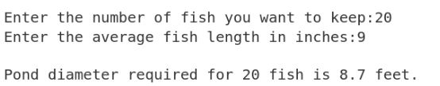
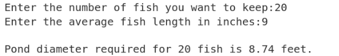
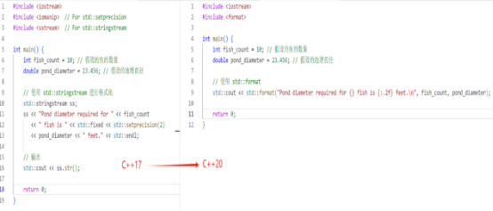
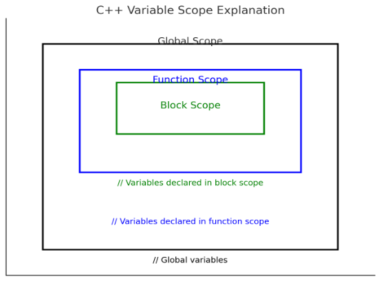

# 基本数据类型

## **1.1变量、数据和数据类型**

数学运算中有加减乘除，我们把它叫做四则运算，我们的计算器可以计算加减乘除，计算机当然也能计算！要想让计算机对我们的加减乘除进行计算，那么我们就必须想办法让计算机听懂我们的语言，这时候就该我们编程语言出场了，编程语言有好多种，常见的有C、C++、Python、Java等等，现在我们就C++语言来开始我们等的编程之旅，我想这一定是一个很奇妙、很难忘、很有意义的开始。

代码分析：

### **1.1.1 整数的计算**

假如我们现在要计算两个数的和、差、积、商，这两个数由用户确定（需要用户输入），用户输入两个数之后，分别输出这两个数的和、差、积、商。请问你要怎么解决？

比如说我们有两个数，分别是10和5，我们现在能够很容易的算出它们的和、差、积、商分别是15、5、50、2，但是我们该怎么让计算机去帮助我们计算呢？

运算是由运算符定义的，例如+用于相加求和，\*用于相乘求积。运算符操作的值成为操作数，在表达式10\*5中，操作数是10和5，乘法运算符需要两个操作数，所以成为二元运算符，只需要一个操作数的运算符叫做一元运算符。

上面这个简单的小学问题我相信大家都能“秒杀”。我们把两个数的和叫做sum（随意取名即可，就好像小狗的名字可以是lucky也可以是lucy一样），那么sum = 10+ 5=15;毫无疑问。诸如10、5这样的整数，我们在编程语言中把它们叫做整型变量，暂且把这两个数叫做num1、num2，也就是num1=10；num2=5；那么现在两个数的和就可以表示为sum = num1 + num2；按照同样的道理，两个数的差我们把它叫做difference，那么difference = num1 - num2；同理，两个数的积就是product = num1 \* num2；（注意，在编程语言之中，我们通常把“x”写作“\*”）；那么两个数的商就是quotient = num1 / num2; 下面我们就开始把这个题目的解题过程使用编程语言表示出来：
```
#include <iostream>  

using namespace std;  

int main() {  
    // 定义整型变量  
    int num1, num2;  
    int sum, difference, product;  
    double quotient; // 存储商，使用 double 以处理可能的浮点结果  

    // 提示用户输入两个整数  
    cout << "请输入第一个整数：";  
    cin >> num1;  
    cout << "请输入第二个整数：";  
    cin >> num2;  

    // 计算和、差、积和商  
    sum = num1 + num2;               // 和  
    difference = num1 - num2;        // 差  
    product = num1 * num2;           // 积  
    quotient = static_cast<double>(num1) / num2; // 商，强制转换为 double 以避免整除  

    // 输出结果  
    cout << "两个数的和是：" << sum << endl;  
    cout << "两个数的差是：" << difference << endl;  
    cout << "两个数的积是：" << product << endl;  
    cout << "两个数的商是：" << quotient << endl;  

    return 0;  
}
```
运行上面的代码，按照指引，你就会很容易且迅速的计算两个数的和、差、积、商了。


在上面我们说到的计算两个数的和、差、积、商，前面提到的sum1、sum2在编程中我们通常把它叫做变量，加减乘除计算得到的和差积商也是变量，但是我们说的加减乘除在这里被称之为运算符。变量有很多类型（如整数、浮点数、字符等），变量的类型决定可以存储的值的性质和操作方式。

我们小学时候就学过，有理数可以分为整数和分数，整数分为正整数、零和负整数，分数分为有限小数和无限循环小数。在编程中，我们把值为整数的变量叫做整型变量，值为分数的变量叫做浮点变量。整数分为正整数、零和负整数，那么负整数就得用有符号整型来表示，我们所说的分数（分为有限小数和无限循环小数），分数在编程语言中就得用浮点型 来表示，我们都知道小数分为有限小数和无限小数，于是就出现了单精度浮点型（float）、双精度浮点型（double float）和扩展的双精度浮点型（long double）。

我们说到了有符号和无符号的两种类型，接下来我们来看一下他们之间究竟有着怎样的区别以及我们在使用时需要注意什么呢？
```
 signed（带符号）：
```
signed 类型可以表示负数、零和正数。它的值范围包含有符号的整数。

默认情况下，C++ 中的整数类型（如 int）是 signed。这意味着它们可以存储从负数到正数的数值。

当需要处理负数和正数（如计算室外温度或盈亏）时使用。
```
 unsigned（无符号）：
```
unsigned 类型只能表示零和正数。它不可以表示负数，因此它的数值范围从零开始，最大值通常是相同位数的 signed 类型的最大值的两倍。

使用 unsigned 类型时，负数值的表示被“使用”以扩大数值范围为正数。

当只需要非负数（如数组索引、计数或存储二进制数据）时使用。这样可以基于unsigned的最大值来扩展数值范围，使其更有效。

热点问题：溢出风险

在计算时，混合使用signed 和 unsigned 类型可能会出现意外。例如当负数和unsigned值相加时，负数将被看作是大型的无符号数，这就可能会导致溢出或者其他的错误。

### **1.1.2 浮点数的计算**

浮点数的计算和整数的计算相同。但是需要注意的是，取模运算符不能用于浮点操作数。此外还可以对浮点变量应用前缀和后缀形式的递增和递减运算符（++和--）,作用和整数相同。

## **1.2浮点字面量**

对浮点型（单精度、双精度、扩展的双精度）的学习

老王现在想建一个鱼塘养鱼，根据自家的场地来看建造一个圆形的鱼塘最合适，但是通过研究发现只有保证池塘的面积为2平方英尺，才能确保每一条鱼能有6英寸长，请你编程实现输入鱼的数量和确定鱼塘的直径来保证鱼有足够的生长空间。
```
#include <iostream>  
#include <numbers>  
#include <cmath>  

using namespace std;  

int main() 
{  
    const double fish_factor { 2.0 / 0.5 };   // Area per unit length of fish  
    const double inches_per_foot { 12.0 };  
    double fish_count {};   // Number of fish  
    double fish_length {};   // Average length of fish  

    cout << "Enter the number of fish you want to keep: ";  
    cin >> fish_count;  
    
    cout << "Enter the average fish length in inches: ";  
    cin >> fish_length;  

    fish_length /= inches_per_foot; // Convert length to feet  

    // Calculate pond area and diameter  
    const double pond_area { fish_count * fish_length * fish_factor };  
    const double pond_diameter { 2.0 * sqrt(pond_area / numbers::pi) };  

    cout << "Pond diameter required for " << fish_count   
         << " fish is " << pond_diameter << " feet.\n";  

    return 0;  
}
```
注意：上面的代码中使用了const修饰符。const修饰符用于固定变量的值，被它修饰的变量不能被改变。通常我们把这种固定不变的值成为常量，在C++中，常量可以通过宏定义（使用define预处理指令）或const关键字来定义。

上面的代码给出了详细的解决方案，通俗易懂。运行上面的程序，假设我们现在想要养20条鱼，每条鱼的平均长度为9英寸（1英尺等于12英寸），我们会得到结果如下：


在实际问题中，我们挖鱼塘不可能也没必要非得精准到毫米甚至以下的级别，所以我们就可以输出精度相对较低的数值。

## **1.3 格式化字符串**

在C++20中引入了一个很强大的函数：std::format()。使用它可以得到更加简洁和可读性更好的代码，执行速度很快。假设现在我们只需要将上面的代码的输出精确到小数点后一位。
```
cout << format("Pond diameter required for {} fish is {:.2} " feet.\n",fish\_count,pond\_diameter);
```
上面代码中的{:.}就是我们所说的格式说明符，默认情况下，这个整数指定了总有效位数（在本例中为2），包含小数点前和小数点后的位数。因此，输出结果为：

当然我们也可以让精度指定小数点后的位数，叫做浮点数“定点”格式化，需要在格式说明符中再加上字母f，在这个例子中就是把{:.2}换做{:.2f}，这样我们得到的输出结果为：



注意：C++20引入的巨大变化：
假设我们使用C++17编写这个程序的代码，那么代码的体量完全是不一样的。因为C++17本身不支持std::format，所以我们就需要使用std::stringstream或printf风格的格式化，就是下图中左边的示例。在下图左边的C++17代码中，使用 std::stringstream 来构建格式化字符串。使用 std::fixed 和 std::setprecision(2) 来保证数字格式化为小数点后两位。最后使用 std::cout 输出整合后的字符串。总体看来比较麻烦，但是C++20的代码就显得通俗易懂了。



## **1.4  处理基本数据类型**

### **1.4.1 运算符的优先级和相关性**

与数学中的运算符一样，编程语言表达式中的运算符也是有特定的执行顺序的，表达式中运算符的执行顺序由运算符的优先级决定。小学数学中我们都知道“先乘除后加减”，当加减同时出现时，我们到底先计算加还是减呢？在编程中的运算符组具有左相关性和右相关性，但是几乎所有的运算符组都具有做相关性，因此大多数涉及到优先级相同的运算符的表达式都会从左到右计算。

### **1.4.2全局变量**

同高中所学的函数有作用域和值域一样，我们的变量也有作用域。变量定义的位置具有很大的灵活性，我们应该着重考虑的是变量需要什么样的作用域。

从某方面来说，根据作用域可以把变量分为全局变量和局部变量，全局变量从程序开始运行时存在，直到程序运行结束时消失，我们说它具有静态的存储持续时间。但是我们不能把所有的变量都声明为全局变量，这是因为我们实际应用的程序包含大量的函数、语句和变量组成。把所有的变量都声明为全局作用域，而且全局变量会在整个程序运行的过程中占用内存，使得程序需要的内存多于使用局部变量以重用内存的情形。下面的图能够帮助你更好的理解全局作用域、函数作用域、块作用域之间的关系。



- Global Scope（全局作用域）：全局变量声明在所有函数之外，可以在整个程序中访问。
- Function Scope（函数作用域）：函数内声明的变量，仅在函数内部可访问。
- Block Scope（块作用域）：变量在一个块（如if、for、while等语句中的大括号）中声明，只在该块内可访问。

1\.5 本章小结/总结  第2、3章的小结进行节选。

- 任何类型的常量都称为字面量，字面量有自己的类型。
- 整型字面量可以定义为十进制、十六进制、八进制或二进制。
- ++和—运算符是为数值变量执行加1或减1运算的特殊简写形式，二者都有前缀和后缀形式。
- 浮点数的类型有float、double、long double。
- <format>模块的std::format()函数为文本输出的格式化提供了大量选项。	可以存储整数的基本类型有float、int、long和long long。它们存储带符号的整数，也可以在这些类型名称的前面使用类型修饰符unsigned，使该类型占用相同的字节数，但只存储不带符号的整数。
- 当等号左边的类型与等号右边的类型不相同时，编译器会将表达式结果的类型自动转换为等号左边的类型。当左边的类型不能完全包含与右边的类型相同的信息时，就可能丢失信息。例如，double转换为int或把long转换为short时。
- 四种主要的运算符对应二元运算符中+、-、\*和/。对于整数，取模运算会得到整数除法后的余数。
- 使用const固定变量的值以后，编译器会在程序的源代码文件中检查是否试图修改声明为const的变量。


# **第四章 函数**

C++中的函数分为很多种，包括内置函数、标准库函数、用户自定义函数、成员函数、虚函数、函数模板和Lambda表达式。

## **4.1 内置函数**

我们所说的内置函数其实就是C++编译器自带的函数，它不需要用户来编写，取之即用。常见的内置函数包括数学函数、字符串函数、类型转换函数等。例如，sin()函数用于计算正弦值，strlen()函数用于计算字符串的长度等。这些函数都属于C++的标准库函数，因此在程序中无需显式包含相应的头文件即可直接使用。
```
#include <iostream>
#include <cmath>
using namespace std;
int main()
{
double number, squareRoot;
cout << "输入一个数字: ";
cin >> number; // sqrt()是一个用于计算平方根的库函数*
squareRoot = sqrt(number);
cout << "数字 " << number << " 的平方根= " << squareRoot << "\n";
return 0;
}
```
输出结果为：


在上面的示例中，调用sqrt()库函数来计算数字9的平方根。

上述程序中的注意代码#include <cmath>。 在这里cmath是头文件。sqrt()函数定义在cmath头文件中。当你使用#include <cmath>将文件cmath的内容包含到这个程序中时，您可以在这个程序中使用cmath中定义的所有函数。此外需要注意的是，每个有效的C ++程序至少具有一个函数，即main()函数。

## **4.2 标准库函数**

标准库函数是C++标准库提供的一组函数，他们可以实现各种常见的操作，包括输入输出、容器操作、算法操作等。标准库函数通常定义在各自的头文件中，例如<iostream>头文件中定义了输入输出函数，<vector>头文件中定义了向量容器类，<algorithm>头文件中定义了各种算法函数等。程序员在开发时可以很方便的调用，涵盖了输入输出、字符串处理、数学运算、容器管理、算法操作等多个方面。

### **4.2.1 输入输出库：**

如<iostream>中的std::cout和std::cin，用于控制台的输入输出操作。

### **4.2.2 字符串处理库：**

如<string>中的std::string类，各种字符串相关的操作（拼接、比较、查找等）。

### **4.2.3 容器库：**

如<vector>、<list>、<map>等提供不同类型的数据结构，可以存储和管理集合数据。

### **4.2.4 算法库：**

如<algorithm>中的各种算法（排序、查找、变换等），它们是针对容器的通用算法。

### **4.2.5 数学库：**

如<cmath>提供的数学函数，比如std::sqrt()（计算平方根）、std::pow()（计算幂）等。

### **4.2.6 日期和时间库：**

如<ctime>中的函数，用于处理时间和日期，比如std::time()、std::difftime()等。

### **4.2.7 线程和并发库（C++11及以后）：**

如<thread>用于多线程编程，<mutex>用于线程同步等。

### **4.2.8 文件操作库：**

如<fstream>用于文件的读写操作，包括std::ifstream（输入文件流）和std::ofstream（输出文件流）。

### **4.2.9 使用标准库函数的优势**

- 提高生产力：标准库函数可以节省开发时间，避免重复造轮子。
- 可靠性：它们经过广泛使用和测试，通常比自己实现的功能更稳健。
- 可移植性：C++标准库在不同的编译器和操作系统上具有良好的兼容性，可以让你的代码在多种平台上运行。
- 性能优化：许多标准库函数都被优化，可以提供更好的性能和效率。

## **4.3 用户自定义函数**

用户自定义函数是程序员自己定义的函数，可以根据实际需求定义不同类型的函数来实现不同的功能。用户自定义函数的基本结构包括函数头和函数体，其中函数头包括函数名、参数列表和返回值类型，函数体包括函数的具体实现。例如，下面是一个简单的用户自定义函数示例：
```
 #include <iostream>
 using namespace std;
 int add(int a, int b)
 {
return a + b;
 }
 int main()
 {
int sum = add(1, 2);  *// 调用add()函数计算1+2的和*
cout << sum << endl;  *// 输出3*
return 0;
 }
```
在上面的示例中，add();函数是一个用户自定义函数，它接受两个整数参数并返回他们的和。在main()函数中，我们调用了add()函数来计算1和2的和，并将结果存储在变量sum中。

## **4.4 成员函数**

成员函数就是定义在类中的函数，他可以访问类的私有成员和保护成员。成员函数的调用方式包括通过对象和通过指针。通过对象调用成员函数时，可以使用点运算符.来访问成员函数；通过指针调用成员函数时，可以使用箭头运算符 “->”来访问成员函数。
```
#include <iostream>  
#include <cmath> // 包含cmath库用于数学常量和函数  

class Circle {  
public:  
    // 构造函数  
    Circle(int r) : radius(r) {}  

    // 计算面积的成员函数  
    double area() {  
        return M_PI * radius * radius; // 使用M_PI常量计算圆的面积  
    }  

    // 访问器函数，用于设置半径  
    void setRadius(int r) {  
        radius = r;  
    }  

private:  
    int radius; // 半径  
};  

int main() {  
    Circle circle(0); // 创建一个Circle对象，同时初始化半径为0  
    circle.setRadius(5); // 设置半径为5  
    double area = circle.area(); // 通过对象调用area()函数计算面积  
    std::cout << area << std::endl; // 输出78.5398...  
    return 0;  
}
```
代码说明：

类定义：定义了一个 Circle 类，包含一个私有成员变量 radius 以及一个计算面积的成员函数 area()。

构造函数：Circle(int r)，用于初始化 radius。

成员函数：area() 计算圆的面积，使用了 M\_PI 来表示 π（圆周率），需要包含 <cmath> 头文件。

访问函数：setRadius(int r) 允许设定半径。

主函数：在 main() 中，创建一个 Circle 对象，调用设置半径的函数，然后计算并输出圆的面积。

## **4.5 虚函数**

虚函数是一种在基类中声明、在派生类中实现的函数，用于实现多态。虚函数允许派生类重写基类的函数，从而实现不同的功能。当通过基类指针或引用调用虚函数时，实际调用的是派生类中的函数。
```
class Shape {  
public:  
    virtual int area() {  
        return 0;  
    }  
};  

class Rectangle : public Shape {  
public:  
    Rectangle(int w, int h) : width(w), height(h) {}  

    int area() {  
        return width * height;  
    }  

private:  
    int width;  
    int height;  
};  

int main() {  
    Shape *shape = new Rectangle(5, 4);  
    int area = shape->area();  // 调用Rectangle中的area()函数计算面积  
    cout << area << endl;  // 输出20  
    delete shape;  
    return 0;  
}
```
在上述示例中，Shape类定义了一个虚函数area()，并将其声明为虚函数，以便在派生类中重写。Rectangle类是Shape类的派生类，它重写了area()函数以计算矩形的面积。在main()函数中，我们通过Shape指针创建了一个Rectangle对象，并调用了area()函数来计算矩形的面积。

## **4.6 函数模板**

函数模板是一种通用的函数定义，可以用来创建多个具有相似功能的函数。函数模板定义时使用类型参数，可以在函数调用时指定具体的类型，从而创建对应的函数。函数模板可以用于任何类型，包括内置类型、用户自定义类型和标准库类型。
```
template<typename T>
T max(T a, T b)
{
  return a > b ? a : b;
}
 int main()
 {
int i = max(1, 2);
double d = max(3.14, 2.71);
cout << i << endl;  // 输出2
cout << d << endl;  // 输出3.14
return 0;
 }
```
上面的示例代码中，max函数是一个函数模板，它用于返回两个参数中的最大值。函数模板的类型参数是T，可以用于任何类型。在main()函数中，我们调用了两次max函数，一次使用整数参数，一次使用双精度浮点数参数。由于编译器能够自动推断出函数模板的类型参数，因此我们不需要显式地指定类型参数。

那么C++中的函数究竟是什么呢？对于我们初学者来讲可能显得不太容易理解，我们可以把这多种类别的函数看作是一个运作的餐厅。接下来我们就把函数中包含的内容比喻为餐厅中的各个组成。

## **4.7 Lambda表达式**
Lambda 表达式就像一个快速制作小点心的秘方。在 C++ 中，Lambda 允许你定义一个匿名函数（没有名字的函数），而且它可以方便地捕获外部变量，用于计算或处理数据。这样你就能在需要时快速调用这些小点心的制作流程，而不需要事先准备好所有的工具和材料。它的一般语法如下所示：
```
[capture list](parameter list) -> return type

{

function body

}
```
下面给出一个Lambda表达式示例：
```
#include <algorithm>  
#include <iostream>  
#include <vector>  

using namespace std;  

int main() {  
    vector<int> v = {1, 2, 3, 4, 5};  
    int sum = 0;  
    for_each(v.begin(), v.end(), [&sum](intx) { sum += x; });  
    cout << sum << endl;  // 输出15  
    return 0;  
}
```
上面的示例代码中，我们使用STL算法for\_each遍历了一个整数向量，并使用Lambda表达式计算向量中所有整数的和。Lambda表达式的参数列表包含了一个int类型的参数x，function body部分使用了这个参数计算和，并将结果累加到sum变量中。[&sum]部分用于将sum变量作为Lambda表达式的外部变量进行捕获。由于Lambda表达式的返回值类型可以被推断出来，因此我们没有指定返回值类型。

## **4.8 趣味理解**

如果你感觉还是对上面讲解的函数知识理解不够深刻，下面的例子或许会对你有帮助：

（1）函数作为“菜品”：

在一个餐厅中，每道菜可以被看作是一个函数。顾客（调用者）通过点菜（调用函数）来请求特定的菜品（功能）。

菜品名称：每道菜都有一个名称，类似于函数名，便于顾客识别和点餐。

配料（参数）：菜品的原材料就是函数的参数。当顾客点餐时，可以根据个人口味（参数）请求不同的配料，比如“加辣”或“少盐”。

上菜（返回值）：餐厅最后把菜品呈上来的过程就像函数返回结果，顾客期待最终的美食（返回值）。

（2） Lambda 表达式作为“临时供餐”

有时餐厅会根据当日的食材推出临时供餐（例如，今日鲜鱼），它相当于一个临时的、按需提供的菜品。

灵活性：顾客可以根据当天的市场供应（条件）选择是否点这道特餐，这类似于使用 Lambda 表达式来快速定义一些简单的功能而无需事先定义函数。

（3） 函数模板作为“多样化菜谱”

想象餐厅的菜单上有一类“自定义汉堡”，顾客可以选择不同种类的肉（牛肉、鸡肉、素食等），这就像函数模板。

适应性：这种汉堡可以根据顾客的选择（输入类型）灵活变化，体现了函数模板的特性，即同一函数可以处理不同类型的输入。

（4） 概念（Concepts）作为“厨师标准”

餐厅的厨师会有一套标准，在选购食材之前会检查材料（比如新鲜程度、菜的质量等），这就是我们说的概念的作用。

规范性：只有符合相应标准的食材才能被用来制作菜品，这提升了菜品的质量，类似于在C++20中使用概念来确保传入函数的参数符合预期类型和条件。

（5） 范围（Ranges）作为“配菜组合”

在餐厅里有些主菜会配有自动组合的配菜，比如沙拉和薯条，这可以比作C++20中的范围（Ranges）。

自动配合：通过简单的点餐，主菜自动与特定配菜搭配，这类似于使用范围可以简化对容器的操作。

（6） 协程作为“并行厨房”

大型餐厅的厨房可能会同时忙于准备多道菜，每个厨师在准备不同的菜，这类似于C++20中的协程。

高效运作：厨师在等待某个配料的同时，可以继续完成其他菜品的准备。这种并行处理让餐厅的运作更加高效，类似于使用协程处理异步任务。

## **4.9 C++20函数新变化**

除此之外，需要值得注意的是C++20中函数的内容做出了一些新的变化，比如C++20中放宽了constexpr函数使用更多特性、引入了consteval关键字、改进模板参数，提供更灵活的模板参数定义，支持推断模板参数、引入concepts等等，下面我们一起来学习这些内容：

### **4.9.1 constexpr 函数的扩展**

在 C++17 中，constexpr 函数有一定的限制，例如不能使用动态内存分配。而在 C++20 中，这些限制被放宽，允许 constexpr 函数使用更多特性。


### **4.9.2 consteval 函数的引入**

C++20 引入了 consteval 关键字，表示函数必须在编译时求值。
```
consteval int square(int x)
{
return x \* x;
}
int main()
{
constexpr int result = square(5); *// 合法*
*// int val = square(rand()); // 不合法，因为 rand() 在运行时*
std::cout << "Square of 5 is: " << result << "\n";
return 0;
}
```
### **4.9.3 模板参数的改进**

C++20支持推断模板参数，使得模板参数定义更加灵活。


### **4.9.4 使用 Ranges 库**

C++20使用 Ranges 库，使得处理集合的操作更加简洁和高效。


### **4.9.5 Concepts 的引入**

C++20 引入了 Concepts，允许在模板中定义约束条件，使得代码的可读性和安全性提高。


# <a name="_hlk179466321"></a>**第五章 C++中的类和面向对象编程**

## **5.1 引言**

### **5.1.1 什么是面向对象编程（OOP）？**

面向对象编程是一种程序设计范式，它将程序视为对象的集合。每个对象都可以包含数据和操作这些数据的方法，从而使程序结构更接近现实世界。

### **5.1.2 OOP的四大基本特征**

- **封装**：将数据和方法封装在一起，限制外部访问，增强数据安全性。
- **继承**：允许一个类从另一个类派生，复用代码并扩展功能。
- **多态**：同一操作作用于不同对象时，表现出不同的行为。
- **抽象**：只关注对象的必要特征，忽略不相关的细节。

### **5.1.3 OOP的优势**

- **可重用性**：通过继承，可以重用已有的代码，减少重复劳动。
- **可维护性**：清晰的结构使得代码更易于理解和维护。
- **灵活性**：通过多态性，可以根据需要动态改变对象的行为。

### **5.1.4 类的基本概念**

- **类**：是对象的蓝图或模板，定义了对象的属性（数据）和行为（方法）。
- **对象**：是类的实例，代表实际存在的事物。

### **5.1.5 示例：简单的“学生”类**
```
#include <iostream>  
#include <string>  // 添加此行以支持 std::string  

class Student {  
public:  
    std::string name;  
    int age;  

    void introduce() {  
        std::cout << "Hello, I'm " << name << " and I'm " << age << " years old." << std::endl;  
    }  
};  

int main() {  
    Student student;  
    student.name = "Alice";  
    student.age = 20;  
    student.introduce();  
    return 0;  
}
```
## **5.2 类和面向对象编程**

### **5.2.1 定义类和对象**

- **类**：可以看作是一个模板，定义了某一类事物的共同特征和行为。比如，一个“汽车”类可以定义所有汽车的属性（如颜色、品牌、速度）和行为（如启动、刹车、加速）。
- **对象**：是类的实例，表示具体的事物。比如，你可以用“我的车”来表示“汽车”类的一个具体对象。

### **5.2.2 类的基本结构**

一个类通常由以下几个部分组成：

- **成员变量**：描述对象的特征（属性）。
- **成员函数**：描述对象的行为（方法）。

### **5.2.3 示例：创建一个“汽车”类**
```
#include <iostream>   

class Car 
{  
public:  
    // 成员变量  
    std::string brand;  
    std::string color;  
    int speed;  

    // 成员函数：启动汽车  
    void start() 
    {  
        std::cout << "The " << color << " " << brand << " is starting." << std::endl;  
    }  

    // 成员函数：加速  
    void accelerate(int increase) 
    {  
        speed += increase;  
        std::cout << "The " << brand << " accelerates to " << speed << " km/h." << std::endl;  
    }  
};  

int main() 
{  
    Car myCar;  // 创建一个Car类的对象  
    myCar.brand = "Toyota";  // 设置属性  
    myCar.color = "red";  
    myCar.speed = 0;  
    myCar.start();  // 调用成员函数  
    myCar.accelerate(50);  // 加速  
    return 0;  
}
```
#### **代码解析：**

- 在这个例子中，Car类定义了三个成员变量：brand（品牌）、color（颜色）和speed（速度）。
- start和accelerate是这个类的成员函数，分别用于启动汽车和加速。

### **5.2.4 如何使用类**

- **创建对象**：使用类的构造函数创建对象（如 Car myCar;）。
- **访问成员**：通过点运算符（.）访问对象的属性和方法（如 myCar.start();）。

### **5.2.5 类的作用**

- **组织代码**：类将相关的数据和操作组合在一起，使代码更清晰易懂。
- **提高可重用性**：可以创建多个对象而不需要重复代码，例如，可以创建多个汽车对象，每个对象都有不同的属性。

## **5.3 类的继承**

### **5.3.1 继承和聚合**

- **继承**：允许一个类（派生类）从另一个类（基类）获取属性和方法。这样，派生类可以复用基类的代码，同时可以添加或修改自己的特性。
- **聚合**：表示一种“拥有”的关系，一个类可以包含另一个类的对象，但并不是通过继承关系。

### **5.3.2 继承的基本语法**

DerivedClass 是派生类，BaseClass 是基类，使用 public 表示公共继承。
```
class DerivedClass : public BaseClass
{
// 派生类的内容
};
```
## **5.3.3 示例：创建一个“动物”类和派生类“狗”**
```
#include <iostream>  

class Animal {  // 基类  
public:  
    void eat() {  
        std::cout << "This animal is eating." << std::endl;  
    }  
};  

class Dog : public Animal {  // 派生类  
public:  
    void bark() {  
        std::cout << "The dog barks." << std::endl;  
    }  
};  

int main() {  
    Dog myDog;  // 创建Dog类的对象  
    myDog.eat();  // 调用基类的方法  
    myDog.bark();  // 调用派生类的方法  
    return 0;  
}
```
#### **代码解析：**

- 在这个例子中，Animal 是基类，定义了一个 eat 方法。
- Dog 是派生类，继承了 Animal 的所有特性，并增加了一个 bark 方法。

### **5.3.4 使用继承的好处**

- **代码复用**：可以在多个派生类中共享基类的代码，减少重复。
- **逻辑清晰**：通过继承，可以建立类之间的层次结构，使代码结构更加清晰。

### **5.3.5 示例：创建一个“交通工具”类和派生类“汽车”和“自行车”**
```
#include <iostream>  

class Vehicle 
{  // 基类  
public:  
    void start() 
    {  
        std::cout << "The vehicle is starting." << std::endl;  
    }  
};  

class Car : public Vehicle {  // 派生类  
public:  
    void honk() 
    {  
        std::cout << "The car honks." << std::endl;  
    }  
};  

class Bicycle : public Vehicle {  // 另一个派生类  
public:  
    void ringBell() 
    {  
        std::cout << "The bicycle rings its bell." << std::endl;  
    }  
};  

int main() 
{  
    Car myCar;  
    myCar.start();  // 调用基类方法  
    myCar.honk();   // 调用派生类方法  
    
    Bicycle myBike;  
    myBike.start();  // 调用基类方法  
    myBike.ringBell();  // 调用派生类方法  
    
    return 0;  
}
```
#### **代码解析：**

- Vehicle 类是基类，定义了 start 方法。
- Car 和 Bicycle 类都是派生类，分别添加了自己的特定行为（如 honk 和 ringBell）。

## **5.4 类成员的访问级别**

### **5.4.1 访问修饰符**

在C++中，类成员（变量和方法）的访问级别由访问修饰符控制。主要有三种访问修饰符：

- **public（公共）**：公共成员可以被类的外部访问。
- **protected（保护）**：保护成员只能在基类和派生类中访问，不能被类的外部访问。
- **private（私有）**：私有成员只能在类的内部访问，外部无法访问。

### **5.4.2 示例：访问修饰符的用法**
```
#include <iostream>  

class Example 
{  
public:  
    int publicVar;  // 公共变量  

protected:  
    int protectedVar;  // 保护变量  

private:  
    int privateVar;  // 私有变量  

public:  
    // 构造函数  
    Example() 
    {  
        publicVar = 1;  
        protectedVar = 2;  
        privateVar = 3;  
    }  

    void display() 
    {  
        std::cout << "Public: " << publicVar << std::endl;  
        std::cout << "Protected: " << protectedVar << std::endl;  
        std::cout << "Private: " << privateVar << std::endl;  
    }  
};  

int main() 
{  
    Example obj;  
    obj.publicVar = 10;  // 可以访问公共变量  
    // obj.protectedVar = 20;  // 错误：无法访问保护变量  
    // obj.privateVar = 30;  // 错误：无法访问私有变量  
    obj.display();  // 调用显示函数  
    return 0;  
}
```
#### **代码解析：**

- 在这个例子中，Example 类有三个变量：publicVar、protectedVar 和 privateVar，分别对应不同的访问级别。
- main 函数可以访问 publicVar，但无法访问 protectedVar 和 privateVar。

### **5.4.3 访问修饰符的意义**

- **public**：允许外部代码访问，适合需要公开的属性和方法。
- **protected**：允许派生类访问，适合在继承中需要的属性。
- **private**：保护内部数据，防止外部直接访问，增强封装性。

### **5.4.4 示例：使用访问修饰符的好处**
```
#include <iostream>  

class BankAccount 
{  
private:  
    double balance;  // 余额是私有的  
public:  
    BankAccount() : balance(0) {}  // 构造函数初始化余额为0  

    void deposit(double amount) 
    {  
        if (amount > 0) 
        {  
            balance += amount;  // 只允许正数存款  
            std::cout << "Deposited: " << amount << std::endl;  
        }  
    }  

    void displayBalance() 
    {  
        std::cout << "Current Balance: " << balance << std::endl;  
    }  
};  

int main() 
{  
    BankAccount account;  
    account.deposit(100);  // 存款  
    account.displayBalance();  // 显示余额  
    // account.balance = 1000;  // 错误：无法直接访问私有变量  
    return 0;  
}
```
#### **代码解析：**

- 在这个例子中，BankAccount 类的 balance 变量是私有的，外部无法直接修改。
- 通过公共方法 deposit 和 displayBalance，可以安全地管理余额。

## **5.5 派生类中的构造函数**

### **5.5.1 构造函数的概念**

- **构造函数**是一个特殊的成员函数，用于初始化对象。当创建对象时，构造函数会自动调用。
- 构造函数的名称与类名相同，并且没有返回值。

### **5.5.2 基类构造函数的调用**

- 当创建派生类对象时，基类的构造函数会首先被调用。这是因为派生类依赖于基类的初始化。

### **5.5.3 示例：基类和派生类的构造函数**
```
#include <iostream>  

class Animal {  // 基类  
public:  
    Animal() {  
        std::cout << "Animal created." << std::endl;  
    }  
};  

class Dog : public Animal {  // 派生类  
public:  
    Dog() {  
        std::cout << "Dog created." << std::endl;  
    }  
};  

int main() {  
    Dog myDog;  // 创建Dog对象  
    return 0;  
}
```
#### **代码解析：**

在这个例子中，创建 Dog 对象时，首先会调用 Animal 的构造函数，然后才会调用 Dog 的构造函数。输出为：

Animal created.

Dog created.

### **5.5.4 使用构造函数初始化成员变量**

- 可以在构造函数中初始化成员变量，确保在创建对象时赋予合适的初始值。

### **5.5.5 示例：带参数的构造函数**
```
#include <iostream>  

class Car  
{  // 基类  
public:  
    std::string brand;  
    int year;  
    // 带参数的构造函数  
    Car(std::string b, int y)  
    {  
        brand = b;  
        year = y;  
        std::cout << "Car created: " << brand << ", Year: " << year << std::endl;  
    }  
};  

class ElectricCar : public Car  
{  // 派生类  
public:  
    ElectricCar(std::string b, int y) : Car(b, y)  
    {  // 调用基类构造函数  
        std::cout << "ElectricCar created." << std::endl;  
    }  
};  

int main()  
{  
    ElectricCar myCar("Tesla", 2022);  // 创建ElectricCar对象  
    return 0;  
}
```
#### **代码解析：**

- 在这个例子中，Car 类有一个带参数的构造函数，可以初始化品牌和年份。
- ElectricCar 类在其构造函数中使用初始化列表调用基类构造函数，确保 Car 的成员变量被正确初始化。

## **5.6 多重继承**

### **5.6.1 什么是多重继承？**

- **多重继承**是指一个类可以继承多个基类。这使得派生类可以同时拥有多个基类的特性和行为。

### **5.6.2 多重继承的基本语法**
```
class DerivedClass : public BaseClass1, public BaseClass2 
{
*// 派生类的内容*
 };
```
- DerivedClass 是派生类，BaseClass1 和 BaseClass2 是基类。

**5.6.3 示例：使用多重继承**
```
#include <iostream>  

class Animal {  // 第一个基类  
public:  
    void eat() {  
        std::cout << "Animal is eating." << std::endl;  
    }  
};  

class Pet {  // 第二个基类  
public:  
    void play() {  
        std::cout << "Pet is playing." << std::endl;  
    }  
};  

class Dog : public Animal, public Pet {  // 派生类  
public:  
    void bark() {  
        std::cout << "Dog barks." << std::endl;  
    }  
};  

int main() {  
    Dog myDog;  
    myDog.eat();  // 调用Animal的方法  
    myDog.play(); // 调用Pet的方法  
    myDog.bark(); // 调用Dog的方法  
    return 0;  
}
```
#### **代码解析：**

- 在这个例子中，Dog 类同时继承了 Animal 和 Pet 两个基类，可以访问这两个基类的方法。

### **5.6.4 多重继承的优势**

- **灵活性**：通过多重继承，可以组合不同类的特性，创建功能更强大的类。
- **代码复用**：可以复用多个基类的功能，减少代码冗余。

### **5.6.5 多重继承中的问题：继承成员的模糊性**

- 当多个基类中有相同名称的方法时，会导致模糊性，这时编译器无法判断调用哪个方法。

### **5.6.6 示例：解决模糊性**
```
#include <iostream>  

class A {  
public:  
    void show() {  
        std::cout << "A's show()" << std::endl;  
    }  
};  

class B {  
public:  
    void show() {  
        std::cout << "B's show()" << std::endl;  
    }  
};  

class C : public A, public B {  
public:  
    void show() {  
        A::show(); // 明确调用A的show()  
        B::show(); // 明确调用B的show()  
    }  
};  

int main() {  
    C obj;  
    obj.show(); // 调用C的show()，同时调用A和B的show()  
    return 0;  
}
```
#### **代码解析：**

- 在这个例子中，C 类通过 A::show() 和 B::show() 明确指定了调用哪个基类的方法，从而解决了模糊性问题。

## **5.7 多态性**

### **5.7.1 什么是多态性？**

- **多态性**是指同一操作作用于不同对象时，表现出不同的行为。简单来说，多态允许使用基类的指针或引用来调用派生类的方法。

### **5.7.2 多态性的类型**

1. **编译时多态性**（静态多态性）：通过函数重载和运算符重载实现。
2. **运行时多态性**（动态多态性）：通过虚函数实现。

### **5.7.3 示例：编译时多态性**

**通过函数重载实现多态性。**
```
#include <iostream>  
#include <string> // 添加此行以确保 std::string 可以使用  

class Print {  
public:  
    void show(int i) {  
        std::cout << "Integer: " << i << std::endl;  
    }  

    void show(double d) {  
        std::cout << "Double: " << d << std::endl;  
    }  

    void show(std::string s) {  
        std::cout << "String: " << s << std::endl;  
    }  
};  

int main() {  
    Print print;  
    print.show(5);         // 调用整数版本  
    print.show(5.5);       // 调用双精度版本  
    print.show("Hello");   // 调用字符串版本  
    return 0;  
}
```
#### **代码解析：**

- 在这个例子中，show 方法被重载以接受不同类型的参数，实现了编译时的多态性。

### **5.7.4 运行时多态性的实现：虚函数**

- **虚函数**是基类中声明为 virtual 的成员函数，用于实现运行时多态性。

### **5.7.5 示例：使用虚函数实现运行时多态性**
```
#include <iostream>  

class Animal 
{  // 基类  
public:  
    virtual void sound() 
    {  // 声明为虚函数  
        std::cout << "Animal makes a sound." << std::endl;  
    }  
};  

class Dog : public Animal 
{  // 派生类  
public:  
    void sound() override 
    {  // 重写虚函数  
        std::cout << "Dog barks." << std::endl;  
    }  
};  

class Cat : public Animal 
{  // 另一个派生类  
public:  
    void sound() override 
    {  // 重写虚函数  
        std::cout << "Cat meows." << std::endl;  
    }  
};  

void makeSound(Animal* animal) 
{  
    animal->sound();  // 通过基类指针调用  
}  

int main() 
{  
    Animal* myDog = new Dog();  // 基类指针指向派生类对象  
    Animal* myCat = new Cat();  
    makeSound(myDog);  // 输出：Dog barks.  
    makeSound(myCat);  // 输出：Cat meows.  
    delete myDog;  // 释放内存  
    delete myCat;  
    return 0;  
}
```
#### **代码解析：**

- 在这个例子中，sound 函数在基类 Animal 中声明为虚函数。在派生类 Dog 和 Cat 中重写了该方法。
- 通过基类指针 Animal\* 调用 sound 方法时，实际调用的是派生类的版本，这就是运行时多态性。

### **5.7.6 虚函数中的默认实参值**

- 虚函数的默认实参值在编译时就会确定，无法在运行时进行动态绑定。

## **5.. C++17与C++20的对比**

### **5.8.1 C++17与C++20的变化**

C++20在类和面向对象编程方面引入了一些重要的变化和新特性，提升了代码的可读性和可维护性。以下是几个主要的变化：

**概念（Concepts）**：

C++20引入了概念，用于约束模板参数，使得代码更易于理解和使用。概念提供了一种方法来指定类型的要求，增强了模板编程的可读性。

**示例**：
```
#include <iostream>  
#include <concepts>  

template<typename T>  
concept Incrementable = requires(T a) {  
    { ++a } -> std::same_as<T&>; // 检查自增操作  
};  

template<Incrementable T>  
void increment(T& value) {  
    ++value;  
}  

int main() {  
    int x = 5;  
    increment(x); // 合法  
    std::cout << x << std::endl; // 输出6  
    return 0;  
}
```
**范围for循环（Ranges）**：

C++20引入了范围for循环，允许更方便地遍历容器，增强了对集合的操作能力。

**示例**：
```
#include <iostream>  
#include <vector>  

int main() {  
    std::vector<int> numbers = {1, 2, 3, 4, 5};  

    // 更简洁的遍历  
    for (int n : numbers) {  
        std::cout << n << " ";  
    }  

    std::cout << std::endl;  
    return 0;  
}
```
**三方运算符（Spaceship Operator）**：

C++20引入了“太空船运算符”<=>，简化了比较操作的实现，自动生成比较函数。

**示例**：
```
#include <iostream>  

class Point 
{  
public:  
    int x, y;  

    // 自动生成比较运算符  
    auto operator<=>(const Point&) const = default;  
};  

int main() 
{  
    Point p1{1, 2};  
    Point p2{2, 3};  

    if (p1 < p2) 
    {  
        std::cout << "p1 is less than p2" << std::endl;  
    }  
    return 0;  
}
```
### **5.8.2 C++20的优势**

- **更强的类型安全**：通过概念，编译器可以在编译时检查模板参数，减少运行时错误。
- **更简洁的代码**：使用范围for循环和太空船运算符可以使代码更加简洁易读，减少样板代码的量。
- **提升了可维护性**：新特性让代码逻辑更清晰，便于维护和扩展。

## **5.9 总结**

### **5.9.1 总结**

在本章节中，我们学习了C++的面向对象编程（OOP）基础，包括类的定义、继承、访问控制、构造函数的使用、多重继承以及多态性。接着，我们还对比了C++17与C++20的主要特性和变化，重点介绍了C++20的新特性，如概念、范围和太空船运算符。以下是主要内容的回顾：

- **类与对象**：类是描述对象的蓝图，对象是类的实例。我们可以定义类的成员变量和成员函数，以描述对象的属性和行为。
- **继承**：通过继承，派生类可以获取基类的属性和方法，实现代码复用。访问修饰符（public、protected、private）控制了成员的可见性。
- **构造函数**：用于初始化对象的特殊成员函数。构造函数可以带参数，使用初始化列表来设置成员变量的初值。
- **多重继承**：允许一个类继承多个基类，增加了灵活性和功能。需要注意处理潜在的模糊性。
- **多态性**：同一操作对不同对象表现出不同的行为。通过虚函数实现运行时多态性，使得基类指针可以调用派生类的方法。
- **C++20的新特性**：包括概念、范围、太空船运算符等，使得C++编程更加灵活和简洁，增强了代码的可读性和安全性。

### **5.9.2 习题**

为了加深理解和实践所学的知识，下面是一些练习题：

- **类的定义**：

定义一个 Student 类，包含学生姓名、年龄和学号作为成员变量，添加一个方法来显示学生的信息。

- **继承**：

创建一个 Animal 基类，包含 speak() 方法。然后定义一个 Cat 和一个 Dog 派生类，分别实现不同的叫声。

- **访问控制**：

在上面的 Animal 类中，使用访问修饰符保护成员变量，确保只有通过方法才能访问它们。

- **多重继承**：

创建两个基类 Person 和 Employee，分别包含 name 和 employeeID。定义一个 Manager 类，从这两个基类继承，并添加一个方法显示所有信息。

- **多态性**：

定义一个基类 Shape，包含一个虚函数 area()。创建 Circle 和 Rectangle 类，分别实现 area() 方法，并展示多态性。

- **C++20新特性**：

尝试使用C++20的概念定义一个模板函数，限制只能接受浮点类型作为参数。

# **第六章 模块和名称空间**

对于大型程序，虽然可以把所有代码塞到一个源文件中，但会造成原文件过大，修改、编译困难的问题。如果把彼此相关的源代码组织成为可组合起来的逻辑单元，放到各自的文件中，那么管理大型代码库就容易多了。C++20中，模块是首选的组合单元。

并且随着代码库增长越多，或者依赖于越多的第三方库，就越有可能存在相同名称的两个函数、全局变量、类型等。在C++中，推荐的方法是让不同的子系统在独立的名称空间中声明自己的函数，变量等名称。

## **6.1模块**

模块是一个封装的代码单元，可以包含函数、类、变量等。模块通过接口文件定义其公共 API，其他代码可以通过导入模块来使用这些 API。

在C++20之前，使用头文件（#include）进行代码分割，容易出现头文件重复包含和编译速度慢等问题，尤其在大型项目中尤为明显。C++20引入模块后解决了很多问题。模块只用编译一次，不用像头文件一样需要反复编译，大大缩短了编译时间。模块中的某些修改不会触发该模块用户的重新编译。模块不受任何外部定义的宏的影响，并且在模块内部定义的任何宏对模块外部的任何代码都不可见。

模块的定义通常分为两个部分：模块接口和模块实现。

### **6.1.1模块接口：**

模块需要显式地声明要导出的内容。使用export关键字从模块中导出实体，没有从模块中导出的内容，只在该模块中可见。所有导出实体的集合叫做接口。

模块接口文件，是为模块提供功能定义的接口。模块接口文件通常以.cppm为扩展名。模块接口以声明开头，声明该文件正在定义一个具有特定名称的模块。
```
 // math\_operations.cppm (模块接口)
 export module math\_operations;
 export int add(int a, int b)
 {
   return a + b;
 }
 export int subtract(int a, int b)
 {
    return a - b;
 }
```
### **6.1.2模块实现：**

一个模块被分为一个模块接口文件和一个或多个模块实现文件。模块实现文件通常以.cpp为扩展名。关于模块的实现用户可以自主选择是放在模块接口文件中还是模块实现文件中。

模块实现文件中同样包含一个已命名模块的声明，用于指定实现所针对的模块，但不用加export关键字。
```
 // math\_operations.cpp (模块实现)*
 module math\_operations; *// 不需要 export*
 int multiply(int a, int b)
 {
return a \* b;
 }
 int divide(int a, int b)
 {
return a / b;
 }
```
### **6.1.3导入模块：**

如果想使用某个模块的功能，就需要导入这个模块。导入模块之后，可以直接使用模块定义的函数和类。通过import可以声明导入的模块，例如：
```
import <iostream>
 *// main.cpp
 #include math\_operations;
 #include <iostream>;
 int main()
 {
std::cout << "Sum: " << add(3, 4) << std::endl;
std::cout << "Difference: " << subtract(10, 5) << std::endl;
// multiply 和 divide 不可用，因为它们没有被 export
return 0;
 }
```
注意：C++20中某些可用的头文件不能保证是可导入的，为了安全，还是使用#include替换import声明。#include指令应该放在全局模块片段，必须出现在任何命名模块声明之前，以匿名模块的声明开始。

### **6.1.4模块的分割**

模块可以分为多个文件，使用import语句来引用其他模块。
```
 // math\_operations.cppm (模块接口)*
 export module math\_operations;
 export int add(int a, int b);
 export int subtract(int a, int b);
 // math\_operations\_impl.cpp (模块实现)*
 module math\_operations;
 int add(int a, int b)
 {
return a + b;
 }
 int subtract(int a, int b)
 {
return a - b;
 }
```
### **6.1.5预编译模块**

C++20还引入了预编译模块的概念，可以将模块编译成二进制格式，以加快后续的编译过程。

6\.1.6模块的优势

（1）减少编译时间：模块通过一次编译即可生成中间代码，后续只需引用模块的接口，而不必去重新解析整个头文件。

（2）避免命名冲突：模块使用独立的命名空间，避免了头文件中常见的命名冲突问题。

（3）简化依赖管理：使用模块可以减少编译器需要处理的依赖关系，从而提高编译效率。

6\.1.7模块与头文件的对比

下面的示例展示了如何使用模块与传统的头文件机制进行对比。

在这个例子中，`math\_operations.h` 是一个常规的头文件，其中定义了一个 `add` 函数。每次编译 `main.cpp` 时，编译器都要处理这个头文件。

对比说明：

① 模块接口文件 (.cppm): 在使用模块时，我们创建一个 `.cppm` 文件来定义模块接口。在文件中使用 `export` 关键字，表明哪些函数是外部可见的。

② 导入模块: 使用 import语句来引入模块，而不是使用 #include。这样做可以显著减少编译器处理的符号表。

③ 编译与链接: 使用模块的代码在编译时会生成一个一次性编译的模块文件，未来的编译会快速引用这个中间代码，而不需重新解析整个模块。

## **6.2名称空间**

在C++中，名称可以是变量、函数、结构、枚举、类以及类和结构的成员。当随着项目的增大，名称相互冲突的可能性也将增加。使用多个厂商的类库时，可能导致名称冲突。例如，两个库可能都定义了名为 List、Tree 和 Node 的类，但定义的方式不兼容。用户可能希望使用这个个库的 List 类，而使用另一个库的Tree类。这种冲突被称为名称冲突问题。

名称空间用来处理不同代码段的名称冲突问题。库函数的名称无法改变，而改变自己的函数名称有非常痛苦。则可以使用名称空间，从而制定定义名称的环境。

### **6.2.1 名称空间的定义声明**

定义命名空间,需要使用到namespace关键字,后面跟命名空间的名字,然后接一对{}即可,{}中即为命名空间的成员。比如：
```
 #include <iostream>;
 namespace mycode
 {
void foo()
{
 std::cout << "foo() called in the mycode namespace" << std::endl;
}
 }
```
foo()函数放在mycode名称空间中，与第三方库中的同名函数区分开。如果想调用名称空间的foo()，需使用：：在函数名之前给出名称空间。：：为作用域解析运算符：
```
Mycode::foo();
```
或者helloworld中
```
std::cout<<“hello world!”<<std::endl;
```
### **6.2.2名称空间的使用**

同一名称空间的代码可以调用该名称空间的其他代码，而不需要显示说明该名称空间。用using指令避免预先指明名称空间。这个指令会通知编译器，后面的代码将使用指定名称空间的名称。
```
 using namespace mycode;
 int main()
 {
mycode::foo(); // Calls the "foo" function in the "mycode" namespace
foo();   // implies mycode::foo();*
 }
```
一个源文件中可包含多条 using 指令，但注意不要过度使用。

可以在Hello World 程序中加入名称空间，cout和endl实际上是定义在std名称空间中的名称。可使用using 指令重新编写Hello World程序，如下所示。
```
 #include <iostream>;
 using namespace std;
 int main()
 {
cout <<" Hello, World!" << endl;
 }
```
初次之外，可以使用using 指令引用名称空间内的特定项。如：using std::cout，后面的代码可使用cout 而不需要预先指明这个名称空间，但仍然需要显式说明std名称空间中的其他项。
```
using std::cout;

cout << "Hello, World!" << std::endl;
```
警告:全局作用域应放在较小的作用域，例如名称空间或类作用域中，甚至是在文件头部。

### **6.2.3内联名称空间**

C++11标准引入了内联命名空间的概念，它的语法就是在namespace前面加个inline关键字，如：
```
 inline namespace MyCode
 {
// source code*
 }
```
内联命名空间中的名字可以被上层命名空间直接使用，也就是说，我们无需在内联空间的名字前添加该命名空间的名字为前缀，通过上层命名空间的名字就可以直接访问他，如下：
```
namespace MyCode {  
    namespace V1 {  
        void foo() {}  
    }  

    inline namespace V2 {  
        void foo() {}  
    }  
}  

int main() {  
    MyCode::V1::foo();  
    MyCode::foo();  
}
```
调用Lib\_V1命名空间的foo函数，前面需要加上Lib\_V1的前缀，而访问Lib\_V2命名空间的foo函数则不需要。内联命名空间的作用之一是，当我们有一个模块，这个模块提供了一组接口供外部调用，有时我们需要升级接口以提供不同的功能，而新接口不与老接口兼容，我们希望新写的代码将调用我们提供的新接口，但是又不希望影响老的代码，所以老的接口需要保留。这时就可以使用内联命名空间的办法来解决，就如上面的例子中，我们把新接口放在命名空间Lib\_V2中，并定义为内联的命名空间，使用者只需通过MyCode前缀就可以访问到它们，如：MyCode::foo()，老的代码的逻辑不需要改动，只需将原来调用接口的地方加个前缀，如MyCode::Lib\_V1::foo()。

内联命名空间在第一次定义时必须加上inline关键字，之后再重新打开命名空间时可以加上inline关键字，也可以不加上。

### **6.2.4 嵌套名称空间**

嵌套命名空间在C++98中已有，如上节中的代码就定义了一个嵌套命名空间，但它的写法比较冗余，如果要定义多重的嵌套则显得更加冗余，特别是在代码缩进时，比如：
```
 namespace A
 {
namespace B
{
namespace C
{
     void foo() {}
}
}
 }
```
访问foo函数时通过A::B::C::foo()来调用，如果定义命名空间时也可以像这样的话代码将会变得更加简洁，因此C++17标准中引入了更简洁的嵌套命名空间的定义方式，如：
```
 namespace A::B::C
 {
void foo() {}
 }
```
这样代码就显得简洁得多，它也更符合我们的使用习惯。当遗憾的是，在C++17中没有解决在嵌套命名空间中定义内联命名空间，也就是说在上面的嵌套命名空间中没法加入inline关键字，使得子命名空间成为内联的，直到C++20标准中完善了这个功能。
```
namespace A::B::inline C {  
    void foo() {}  
}  

// 它等同于如下定义：  
namespace A::B {  
    inline namespace C {  
        void foo() {}  
    }  
}  

// 调用foo函数：  
A::B::foo();  

// 或者也可以这样定义：  
namespace A::inline B::C {  
    void foo() {}  
}  

// 它等同于如下定义：  
namespace A {  
    inline namespace B {  
        namespace C {  
            void foo() {}  
        }  
    }  
}
```
### **6.2.5 名称空间的优势**

① 防止名称冲突：当多个开发者或第三方库使用相同的类名、函数名或其他标识符时，可能会发生名称冲突。命名空间可以确保每个标识符都有其独特的全限定名。

② 更好的组织结构：命名空间有助于将代码逻辑分组，使其更易于管理和理解。

③ 提高可读性和可维护性：通过明确地定义代码所属的范围，命名空间可以使代码更加清晰，从而提高可读性和可维护性。

# <a name="_toc177736253"></a>**第七章：C++20 的协程与并发**

<a name="_toc177736254"></a>**7.1 C++20 中的协程概念
什么是协程？**
--------------

协程（Coroutine）是一种函数，可以在执行过程中暂停，并在之后的某个时刻恢复执行。不同于传统函数从开始执行到结束一气呵成，协程允许挂起、保存执行状态、并在之后的时刻继续运行。这使得协程非常适合于处理异步任务、生成器（generators）等情境。

协程和线程的区别：

线程是并发执行的，允许多个线程同时运行。

协程虽然也可以挂起和恢复，但本质上是单线程的，是编写异步代码的一种简化方式。

为什么使用协程？

协程的优势在于，它们简化了异步编程模型，避免了回调地狱（callback hell）问题。在传统异步编程中，代码往往会嵌套得非常复杂，协程的出现让代码可以像同步执行一样顺序书写，但在某些点可以暂停，等待某些异步操作完成。

## <a name="_toc177736255"></a>**7.2 协程的实现与使用**

协程的核心关键词：

co\_await: 暂停当前协程的执行，等待某个值或任务完成。

co\_yield: 暂停协程并返回一个值给调用者，可以在之后恢复执行。

co\_return: 从协程中返回结果，结束协程。

基本协程结构：

要定义一个协程，函数的返回类型必须是一个特定的协程返回类型，比如 std::future 或自定义的类型。
```
#include <iostream>  
#include <coroutine>  

struct ReturnObject {  
    struct promise_type {  
        ReturnObject get_return_object() { return {}; }  
        std::suspend_never initial_suspend() { return {}; }  
        std::suspend_never final_suspend() noexcept { return {}; }  
        void return_void() {}  
        void unhandled_exception() {}  
    };  
};  

ReturnObject myCoroutine() {  
    std::cout << "First part of coroutine\n";  
    co_await std::suspend_always{};  // 协程暂停  
    std::cout << "Second part of coroutine\n";  
}  

int main() {  
    auto coro = myCoroutine();  // 调用协程  
    std::cout << "Back in main\n";  
    // 需要一些机制来继续协程，这里简单展示概念  
    // 实际上需要外部调度器或任务系统  
}
```
在这个例子中，myCoroutine() 是一个简单的协程，执行到 co\_await 时会暂停，控制权回到主程序。

## <a name="_toc177736256"></a>**7.3 C++20协程与C++17的区别**

C++17 并不原生支持协程。在 C++17 中，如果需要实现类似协程的行为，开发者往往要使用回调函数或利用第三方库（如 Boost、libuv）来模拟协程。这种方式编写的异步代码会显得更复杂和不直观。而 C++20 则通过语言级别的支持使得协程编写更简洁、更直观。

C++17 异步编程的一个典型场景是使用 std::future 和 std::async：
```
 #include <iostream>
 #include <future>
 int doWork() {
std::this\_thread::sleep\_for(std::chrono::seconds(2));
return 42;
 }
 int main() {
 std::future<int> result = std::async(std::launch::async, doWork);
std::cout << "Waiting for result...\n";
std::cout << "Result: " << result.get() << std::endl;
 }
```
虽然 std::async 可以实现异步调用，但它并没有协程那种暂停和恢复的功能。

## <a name="_toc177736257"></a>**7.4 并发编程的基本概念**

什么是并发编程？

并发编程指的是多个任务在同一时间段内执行，目的是提升程序的性能和响应性。并发与并行的区别在于：

并发：多个任务在同一时间段内交替执行，但不一定同时执行。

并行：多个任务同时执行。

在 C++ 中，并发编程主要依靠线程、任务和锁等机制来实现。

线程与锁

在 C++ 中，线程是实现并发的重要工具。通过 std::thread 我们可以轻松创建新线程并行执行任务。
```
#include <iostream>

#include <thread>

void threadFunction() {

std::cout << "Thread function\n";

}

int main() {

std::thread t(threadFunction);  // 创建新线程

t.join();  // 等待线程执行完成

std::cout << "Main function\n";

}
```
上述代码演示了如何创建并启动一个新线程。

C++17与C++20的并发改进

C++17引入了大量与并发相关的工具，如：

- std::shared\_mutex: 允许多个读线程并行读取，同时只有一个写线程可以独占访问。
- std::scoped\_lock: 可以同时锁定多个锁，避免死锁问题。

C++20在此基础上，引入了更高层次的并发工具以及对硬件线程的更高效利用。

## <a name="_toc177736258"></a>**7.5 C++20协程与并发结合示例**

通过 C++20 的协程，可以大大简化并发编程中的异步处理。协程允许你编写看似同步的代码，实际背后可以异步运行。

示例：使用协程进行异步文件读取

假设我们需要异步读取文件内容，C++17 的实现可能会使用 std::future 和线程池，而在 C++20 中我们可以使用协程来实现。
```
#include <iostream>  
#include <fstream>  
#include <string>  
#include <coroutine>  

struct FileReader {  
    struct promise_type;  
    using handle_type = std::coroutine_handle<promise_type>;  

    struct promise_type {  
        std::string data;  

        FileReader get_return_object() {  
            return FileReader{handle_type::from_promise(*this)};  
        }  

        std::suspend_never initial_suspend() { return {}; }  
        std::suspend_always final_suspend() noexcept { return {}; }  
        void return_void() {}  
        void unhandled_exception() {}  
    };  

    handle_type coro;  

    FileReader(handle_type h) : coro(h) {}  
    ~FileReader() { if (coro) coro.destroy(); }  

    bool resume() {  
        if (!coro.done()) {  
            coro.resume();  
            return true;  
        }  
        return false;  
    }  

    std::string getData() const { return coro.promise().data; }  
};  

FileReader readFile(std::string filename) {  
    std::ifstream file(filename);  
    std::string content;  

    if (file.is_open()) {  
        std::getline(file, content, '\0');  
    }  

    co_await std::suspend_always{};  // 模拟异步读取  
    co_return content;  
}  

int main() {  
    auto reader = readFile("example.txt");  
    std::cout << "Doing other work...\n";  
    reader.resume();  // 继续协程  
    std::cout << "File content: " << reader.getData() << std::endl;  
}
```
在这个例子中，我们使用了协程来读取文件，并在读取时暂停，模拟了异步文件读取的操作。

## **7.6 小结**

C++20 协程提供了一种简化异步编程的新工具，它允许程序像同步代码一样书写异步逻辑，避免了复杂的回调函数。

并发编程是 C++ 中提高程序性能的关键，C++17 和 C++20 都提供了强大的并发支持。

C++20 的协程使得异步任务和并发编程的结合更加自然，程序员可以轻松编写高效且简洁的代码。

# <a name="_toc177736260"></a>**第八章：基于 RISC-V Duo 开发板的小实验**

## <a name="_toc177736261"></a>**8.1 Duo（CV800B）的硬件架构与功能**

Milk-V Duo 是一款基于 CV1800B 芯片的超紧凑型嵌入式开发平台。 它可以运行 Linux 和 RTOS，为专业人士、工业 ODM、AIoT 爱好者、DIY 爱好者和创作者提供可靠、低成本、高性能的平台。

### <a name="_toc177736262"></a>**8.1.1 CV1800B简介**

CV1800B 是一款高性能、低功耗芯片，适用于住宅消费监控 IP 摄像机、家庭智能等众多产品，集成 H.264/H.265 视频压缩编码器和 ISP；支持数字宽动态、3D降噪、去雾、镜头畸变校正等图像增强和校正算法，为客户提供专业级的视频图像质量。

该芯片集成了自主研发的智能参考解决方案（人体检测、区域检测、运动检测），内置 DDR 以及完整的外围设备和外围设备，为支持客户产品开发和量产提供了高度集成且简单的解决方案。

### <a name="_toc177736263"></a>**8.1.2 CV1800B 上手指南**

安装系统

从microSD卡启动

需要准备：

- Duo，Duo256M 或者 DuoS
- 大于 1GB 的 microSD 卡
- Type-C 数据线

下载镜像和工具：

下载链接：[https://github.com/milkv-duo/duo-buildroot-sdk/releases/](https://github.com/milkv-duo/duo-buildroot-sdk/releases/)

选择下图中的内容下载：


下载镜像烧录工具，例如[balenaEtcher](https://etcher.balena.io/) 或 [Rufus](https://rufus.ie/en/)。

烧录镜像：

下面是使用BalenaEtcher 烧录系统镜像的步骤。

如图所示，点击Flash from file


点击 Select target


点击Flash！


随后，使用5V适配器或者电脑USB，用Type-C线连接Duo。Duo上的蓝色灯闪烁，表明启动成功。

注意：如果开机后蓝色 LED 未闪烁，说明系统没有正常运行，可能是烧录到 microSD 中的镜像有问题。您可以尝试用其他烧录软件重新烧录镜像，常用的烧录软件有 balenaEtcher，Rufus，Win32DiskImager 等。

## <a name="_toc177736264"></a>**8.2 如何在 Duo 开发板上运行 C++20 程序**

### <a name="_toc177736265"></a>**8.2.1 准备开发环境**

推荐使用本地的Ubuntu系统，本次使用：Ubuntu 20.04 LTS。也可以使用虚拟机中的Ubuntu系统、Windows 中 WSL 安装的 Ubuntu、基于 Docker 的 Ubuntu 系统。

### <a name="_toc177736266"></a>**8.2.2 安装编译依赖的工具**
```
sudo apt-get install wget git make
```
### <a name="_toc177736267"></a>**8.2.3 获取 Examples 源码**
```
git clone https://github.com/milkv-duo/duo-examples.git
```
### <a name="_toc177736268"></a>**8.2.4 加载编译环境**
```
cd duo-examples

source envsetup.sh
```
第一次加载会自动下载所需的 SDK 包，大小为180M左右，下载完会自动解压到duo-examples下，解压后的目录名为duo-sdk，下次加载时检测到已存在该目录，就不会再次下载了。

注: 如果因为网络原因无法完成SDK包的下载，请通过其他途径获取到duo-sdk.tar.gz包，手动解压到duo-examples目录下，重新source envsetup.sh。

### <a name="_toc177736269"></a>**8.2.5 编译测试**

以hello-world为例，进入该例子目录直接执行make即可：
```
cd hello-world

make
```
编译成功后将生成的helloworld可执行程序通过网口或者RNDIS网络等方式传送到 Duo 设备中，比如默认固件支持的 RNDIS 方式，Duo 的 IP 为192.168.42.1，用户名是root，密码是milkv。

scp helloworld root@192.168.42.1:/root/

发送成功后，在 ssh 或者串口登陆的终端中运行./helloworld，会打印Hello, World!
```
[root@milkv]~# ./helloworld

Hello, World!
```
显示出上述结果后，表明我们的开发环境可以正常使用了。

## <a name="_toc177736270"></a>**8.3 了解RISC-V**

众所周知，指令集在计算机软件和硬件之间架起一座沟通的桥梁，所谓的CPU指令集架构（ISA）就是CPU支持的所有指令和指令的字节级编码。像X86、ARM等不同的CPU家族都有着各自不同的ISA。我们说的RISC-V开源更确切地来说就是对指令集规范和标准的开源。

- RISC-V的初始构思（2010年）

RISC-V的概念最初由加州大学伯克利分校的研究团队提出，旨在创建一个简洁、灵活且开放的指令集架构，以满足学术研究和工业应用的需求。

- 开放性与标准化（2014年）

RISC-V的开放性吸引了广泛的关注，2014年，RISC-V基金会（非营利性组织）成立，旨在推动RISC-V的标准化和推广。该基金会汇集了来自学术界和工业界的专家，推动RISC-V的开发和应用。

- 扩展与应用（2016-2018年）

随着RISC-V的推广，多个扩展被提出并标准化，包括浮点扩展（F和D）、原子扩展（A）等。RISC-V逐渐被应用于嵌入式系统、处理器设计和高性能计算等领域。

- 工业应用与生态系统发展（2019年至今）

RISC-V开始在多个行业中获得实际应用，包括人工智能、物联网、数据中心等。越来越多的公司和组织开始支持RISC-V，推动其生态系统的发展，包括编译器、操作系统和硬件实现。

- 持续演进与未来展望

RISC-V仍在不断演进，新的扩展和特性持续被提出，旨在满足不断变化的技术需求。随着开源硬件的兴起，RISC-V有望在未来的计算架构中占据重要地位。

## <a name="_toc177736271"></a>**8.4 RISC-V、Duo与C++20**

前面我们讲到，Milk-V Duo是一款基于 CV1800B 芯片的超紧凑型嵌入式开发平台，基于RISC-V架构。下面我们将讲解如何在Duo上运行我们的C++20程序，这里将会讲解到新知识——交叉编译，包括交叉编译的概念、工具链的准备、环境搭建、编译的过程等等。

### <a name="_toc177736272"></a>**8.4.1 交叉编译是什么？**

简单的说，交叉编译就是在宿主机上将高级程序语言生成能够在目标机器上运行的可执行代码。也可以说交叉编译是指在一个操作系统或硬件架构（称为主机）上使用编译器生成适用于另一个操作系统或硬件架构（称为目标）的可执行文件。它的主要应用场景包括操作系统开发、多平台开发、嵌入式系统等，它具有高效率、高灵活性、节省资源的优点，但是环境的配置和调试的困难仍然是初学者需要面对和解决的。

交叉编译中包含两个概念，一个是体系结构（Architecture）一个是操作系统（Operating System）。同一个体系结构可以运行不同的操作系统；同一个操作系统也可以在不同的体系结构上运行。

交叉编译的必要性：

- 硬件限制：某些目标平台（如嵌入式设备）可能没有足够的资源来进行本地编译。
- 开发效率：在开发者的主机上编译可以加快开发速度，避免在目标设备上进行长时间的编译。
- 多平台支持：开发者可以为多个平台生成可执行文件，而不需要在每个平台上都进行编译。

  嵌入式系统开发时，运行程序的目标机器通常具有有限的存储空间和运算能力，然而，一般的编译工具链需要很大的存储空间，并需要很强的额CPU运算能力，为了解决这种问题就出现了交叉编译工具链，目前大多数交叉编译工具链都是在linux系统上运行的，这也取决于linux系统强大的功能和系统的稳定性。

### <a name="_toc177736273"></a>**8.4.2 交叉编译使用的工具链**

（1） 软件基础环境：


（2） 下载、安装和编译相关工具链

1. 链接：[https://github.com/riscv/riscv-gnu-toolchain](https://github.com/riscv/riscv-gnu-toolchain)
2. 下载下图所示的压缩包：


1. 点击


1. 下载

使用命令：
```
wget https://github.com/riscv-collab/riscv-gnu-toolchain/releases/download/2024.09.03/riscv64-glibc-ubuntu-22.04-gcc-nightly-2024.09.03-nightly.tar.gz
```


1. 解压：
```
tar -xzf riscv64-glibc-ubuntu-22.04-gcc-nightly-2024.09.03-nightly.tar.gz
```
1. 添加环境变量：

使用命令：sudo nano ~/.bashrc

验证：
```
banana@aiiworks-System-Product-Name:~$ echo $PATH

/usr/local/sbin:/usr/local/bin:/usr/sbin:/usr/bin:/sbin:/bin:/usr/games:/usr/local/games:/snap/bin:/home/banana/tool/riscv/bin
```
### <a name="_toc177736274"></a>**8.4.3 交叉编译的步骤**

假设你正在开发一个应用程序，目标是让它在Milk-V Duo（基于RISC-V架构的设备）上运行，但你在一台 x86 架构的 PC 上进行开发。你可以使用交叉编译工具链（如 gcc 的交叉编译版本）来编译你的代码，使其能够在 Milk-V Duo 上运行。

示例步骤：

安装交叉编译工具链：在你的 PC 上安装适合 Milk-V Duo（RISC-V架构） 的交叉编译工具链，例如 riscv64-unknown-linux-gnu。

编写代码：下面编写一个C++20代码，使用了C++20中的std::ranges和std::format，同样也可以检测我们的环境是否真正的支持C++20。
```
#include <iostream>

#include <vector>

#include <ranges>

#include <format>

int main() {

// 检查 std::ranges

std::vector<int> numbers = {1, 2, 3, 4, 5};

auto even\_numbers = numbers | std::views::filter([](int n) { return n % 2 == 0; });

std::cout << "Even numbers: ";

for (int n : even\_numbers) {

std::cout << n << " ";

}

std::cout << std::endl;

// 检查 std::format

std::string formatted = std::format("Hello, {}!", "C++20");

std::cout << formatted << std::endl;

return 0;

}
```
使用交叉编译器编译代码：
```
riscv64-unknown-linux-gnu-g++ -static -std=c++20 -o check\_cpp20 check\_cpp20.cpp
```
这一段命令中riscv64-unknown-linux-gnu-g++：

是一个交叉编译器，专门用于将C++代码编译为适用于RISC-V架构（64位）的Linux操作系统的可执行文件。g++是GNU C++编译器的名称。
```
-static：
```
这个选项指示编译器生成一个静态链接的可执行文件。静态链接意味着所有需要的库都将被包含在最终的可执行文件中，而不是在运行时动态链接。这使得生成的可执行文件在没有依赖库的情况下也能运行，但文件大小会增大。
```
-std=c++20：
```
这个选项指定使用C++20标准进行编译。C++20是C++语言的一个版本，包含了许多新特性和改进，如范围（ranges）、概念（concepts）、协程（coroutines）等。
```
-o check\_cpp20：
```
这个选项指定输出文件的名称。在这个例子中，编译器将生成一个名为check\_cpp20的可执行文件。
```
check\_cpp20.cpp：
```
这是要编译的源代码文件的名称。编译器将读取这个文件并生成可执行文件。

将生成的可执行文件传输到 Milk-V Duo：使用 scp 或其他文件传输工具将 hello 文件传输到 Milk-V Duo。

在 Milk-V Duo上运行：
```
./ check\_cpp20
```
通过以上步骤，你就可以在 x86 PC 上编写和编译代码，并在 Milk-V Duo 上运行它。这就是交叉编译的基本概念和实际应用。

下面是运行结果，很明显我们配置的工具链是成功的：


# **附录1：Linux下学习C++20**

## **一、Ubuntu 22.04.5 使用g++ 运行C++20 程序**

在尝试了vscode、msvc编译C++20的程序之后，我发现在windows系统下配置的支持C++20的编译环境不是很稳定，达不到理想的状态，于是我们就简单的使用Ubuntu来编译我们的C++代码。下图是Ubuntu的版本：


注意：这里的Ubuntu版本必须是 Ubuntu 22.04.5（或更高）版本，否则不支持C++20标准。

要想在Ubuntu中运行C++代码，我们就需要借助linux中的工具了，我们使用的是g++，版本为


安装步骤如下：
```
 sudo apt install build-essential
```
使用 apt 包管理工具以超级用户身份安装 build-essential 包。build-essential 是一个包含编译软件时所需的基本工具（如 GCC 编译器、make 工具等）的元包。
```
 sudo apt-get dist-upgrade --fix-missing
```
使用 apt-get 执行升级操作，dist-upgrade 将更新已安装的包，并处理依赖关系变化。--fix-missing 选项会在遇到缺失包时尝试修复它们。
```
 sudo apt install build-essential
```
再次安装 build-essential，可能是因为之前的命令未能成功完成。
```
 sudo add-apt-repository ppa:ubuntu-toolchain-r/test
```
添加一个第三方软件源（PPA），该 PPA 提供更新的工具链（如编译器）。
```
 sudo apt install gcc-13
```
安装 GCC 版本 13 编译器。
```
 sudo apt install g++-13
```
安装 G++ 版本 13，这是一种 C++ 编译器，与 GCC 配合使用。
```
sudo update-alternatives --install /usr/bin/gcc gcc /usr/bin/gcc-11 11
```
使用 update-alternatives 配置系统使用的 GCC 版本，将 GCC 11 加入选择列表，并指定其优先级为 11。
```
 sudo update-alternatives --install /usr/bin/gcc gcc /usr/bin/gcc-13 13
```
将 GCC 13 加入选择列表，并将其优先级设置为 13，这意味着它将被默认选择（即使有多个版本）。
```
 sudo update-alternatives --install /usr/bin/g++ g++ /usr/bin/g++-11 11
```
添加 G++ 11 到 update-alternatives 的选择列表，优先级为 11。
```
 sudo update-alternatives --install /usr/bin/g++ g++ /usr/bin/g++-13 13
```
添加 G++ 13 到选择列表，并设置优先级为 13。

接下来，我们稍微验证一下我们的环境，并测试一下是不是真的支持C++20标准。
```
#include <iostream>  
#include <vector>  

using namespace std;  

int main() {  
    /**  
     * __cplusplus 是用来标识所使用 C++ 标准版本的预定义宏  
     * 对于 C++11，会返回 201103  
     * 对于 C++14，会返回 201402  
     * 对于 C++17，会返回 201703  
     * 对于 C++20，会返回 202002  
     */  
    cout << __cplusplus << endl;  
    return 0;  
}
```
根据这段代码的注释就可以很简单的明白测试的原理了吧。


## **二、Ubuntu 22.04.5 使用vscode运行C++20程序**

1、在Ubuntu 22.04.5上安装vscode

（1）下载安装包

进入官网：[https://code.visualstudio.com/Download](https://code.visualstudio.com/Download) ，下载下面的文件：


（2）打开Terminal，键入命令：
```
sudo dpkg -i [刚刚下载的文件名]
```
（3）安装完成后，打开vscode：

在命令行中输入 code 即可打开

（4）新建文件夹，在home（如果是中文界面，就是在主目录）下新建文件夹，为vscode的工作空间。


（5）在vscode的左上角，文件 à 打开文件夹 à 选择新建的文件夹 à 选择信任 即可

（6）新建一个helloworld文件，键入下面的代码，运行检查是否支持C++20
```
#include <iostream>  
#include <vector>  

using namespace std;  

int main() {  
    /**  
     * __cplusplus 是用来标识所使用 C++ 标准版本的预定义宏  
     * 对于 C++11，会返回 201103  
     * 对于 C++14，会返回 201402  
     * 对于 C++17，会返回 201703  
     * 对于 C++20，会返回 202002  
     */  
    cout << __cplusplus << endl;  
    return 0;  
}
```
（7）运行，得到验证


注意：
如果你使用的非desktop版本的Ubuntu，那么请看下面的教程：

1. 下载VSCode的.deb文件 你可以使用wget直接下载VSCode的.deb安装包：
```
wget https://update.code.visualstudio.com/latest/linux-deb-x64/stable -O vscode.deb
```
1. 安装.deb文件 使用dpkg安装下载的.deb文件：
```
sudo dpkg -i vscode.deb
```
1. 安装依赖（如果有缺少依赖的错误） 如果在安装过程中遇到依赖性问题，运行以下命令来解决：
```
sudo apt *--fix-broken install*
```
1. 检查VSCode安装 验证安装是否成功：
```
code --version
```
如果出现版本信息，就说明已经安装成功了。


# C++基础知识

## C++20第一个程序: Helloworld

刚开始接触编程时，无论是学 C++，还是 Java、Python、C，第一个入门程序都是 Helloworld，实现在控制台打印一个“hello world”。C++20 是 C++ 语言一次非常重大的更新，加入了四个新特性：概念、范围、协程和模块，以及一些核心语言。这篇文章将会从 Helloworld 开始带你走进 C++20 的世界。

---

## 一、代码

```cpp
// helloworld.cpp
#include <iostream>

int main() {
    std::cout << "Hello, World!" << std::endl;
    return 0;
}
```

运行结果为：

---

## 二、知识分析


### 1. 注释

第一行：`// helloworld.cpp` 是一个注释行。

在 C++ 中，注释是用来解释代码的文本，它们对程序的编译和执行没有影响。C++ 提供了两种主要的注释方式：

- **单行注释**：使用两个斜杠 `//` 标记。编译器会忽略从 `//` 开始到该行末尾的文本。例如：

  ```cpp
  // 这是一个单行注释
  ```
- **多行注释**：也称为块注释，使用 `/*` 开始和 `*/` 结束。这种注释可以跨越多行。例如：

  ```cpp
  /*
      这是一个多行注释
      可以跨越多行
  */
  ```

代码示例：

```cpp
#include <iostream>

int main() {
    std::cout << "单行注释" << std::endl; // 这是一个单行注释，不可以跨行
    /*
        这是一个多行注释
        可以跨越多行
    */
    std::cout << "多行注释" << std::endl;
    return 0;
}
```

---

### 2. 模块导入

`#include <iostream>;` 是一条模块导入代码。

在 C++20 中，如果你想要使用某个模块中的功能，则需要导入这个模块。这是通过一条 `#include` 声明实现的。例如，Helloworld 小程序的第一行导入了名为 `<iostream>` 的模块，它声明了 C++ 提供的输入输出机制。

- **C++ 标准库** 是一个庞大而全面的库，包含了众多用于各种编程任务的类和函数，包括算法、容器、字符串处理、输入输出流等。
- **输入输出流库** 是 C++ 标准库中的一个重要组成部分，专门用于处理输入和输出操作。常用的类和对象包括：

  - `cin`：用于从标准输入读取数据。
  - `cout`：用于向标准输出写入数据。
  - `cerr`：用于向标准错误输出写入数据。

---

### 3. `main()` 函数

函数是 C++ 程序的重要组成部分之一。其基本结构为：

```cpp
返回值类型 函数名(形式参数) {
    代码
    return 返回值;
}
```

`main()` 函数是程序执行的起点。C++20 中，`main()` 函数返回一个 `int` 值以指示程序的最终执行状态。可以省略显式的 `return` 语句，此时会默认返回 0。

两种常见的 `main()` 函数定义：

```cpp
int main() {
    // 无参数版本
    return 0;
}

int main(int argc, char* argv[]) {
    // 带参数版本
    return 0;
}
```

- **`argc`**：传递给程序的参数个数。
- **`argv`**：包含这些参数的字符串数组。

---

### 4. 输入输出流

**输出流** 是用于数据输出的滑槽。`std::cout` 是对应于用户控制台或标准输出的滑槽，其他常见滑槽包括：

- `std::cerr`：用于输出错误信息。

使用 `<<` 运算符可以将数据放入滑槽。例如：

```cpp
#include <iostream>

int main() {
    std::cout << "There are " << 219 << " ways I love you." << std::endl;
    return 0;
}
```

输出结果为：`There are 219ways I love you.`

推荐的写法是使用 `std::format()`（定义在 `<format>` 中），用于格式化字符串：

```cpp
#include <iostream>
#include <format>

int main() {
    std::cout << std::format("There are {} ways I love you.", 219) << std::endl;
    return 0;
}
```

输出结果为：`There are 219 ways I love you.`

- **`std::endl`**：表示序列的结尾。当输出流遇到 `std::endl` 时，会刷新缓冲区并换行。

---
