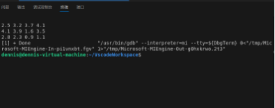

## **3.2 数组**

我们考虑这样一个问题：一个年级有200个学生，现需计算这个年级数学考试的平均成绩。从理论上考虑这很简单，只需要将这200个学生的数学成绩相加再除以200就行。而当我们编写代码时，需要引入200个float类型的变量用于定义学生成绩，极大地增加了开发成本。

事实上，我们通过观察可以发现，这些学生的成绩数据类型相同，并且是同一门课程、同一个年级学生的成绩。我们可以将它们组成一个数组，便于后续操作。

### **3.2.1 数组的定义**

在C++中，数组是一种用来存储相同类型元素的数据结构，一维数组是最简单的数组形式，它由一系列按顺序存储的元素组成，二维数组则可理解成是若干一维数组堆叠起来形成的矩阵。

### **3.2.2 一维数组**

它是一种线性结构，通常用于存储一组相同类型数据，适合对向量、序列等进行存储。其可通过下标直接访问，时间复杂度为O(1)。

3\.2.2.1 一维数组的定义与遍历方式

可直接通过下面格式定义，下标从0-数组元素个数-1：

数组元素数据类型 数组名[数组元素个数]；

随后通过如下语法为数组的每个元素赋值：

数组名[index]=a//将下标为index的元素赋值为a。

也可以通过以下格式定义：

数组元素数据类型 数组名[元素个数] {a1, a2, …, an};

或者也可以略去元素个数，直接写为以下形式，此时，编译器会自动确定数组中的元素个数：

数组元素数据类型 数组名[ ] {a1, a2, …, an};

要注意的一点时，初始化列表中的值的个数不能超过数组元素的个数，否则该语句不会编译。但可以少于数组元素的个数。此时没有提供初始值的元素就初始化为0.

若要定义元素值不能被修改的数组，需在类型前面加上关键字const。下面定义了一个unsigned int常量的数组。

若需要遍历一维数组，我们可以通过上节介绍的循环操作进行，该操作时间复杂度为O(n)，示例代码如下所示。
```
#include <iostream>  
#include <format>  
#include <cctype>  
using namespace std;  

int main()  
{  
    double rainfall[12] { 1.1, 2.8, 3.4, 3.7, 2.1, 2.3, 1.8, 0.0, 0.3, 0.9, 0.7, 0.5 };  
    double copy[12] {};  

    for (size_t i {}; i < 12; i++)  
    {  
        copy[i] = rainfall[i];  
    }  

    for (size_t i {}; i < 12; i++)  
    {  
        cout << copy[i] << " ";  
    }  

    return 0;  
}
```
该段代码将rainfall数组中的元素复制到了copy数组中，首先遍历rainfall数组，随后将其中的元素赋值给copy数组中的对应元素，最后遍历copy数组输出元素。但如果我们为数组增加了第13个元素，而我们又忘记更新for循环中使用的12，将会得到错误的结果。

为避免此类结果的发生，我们应该给数组的大小定义一个const变量，用它替代显式值，如下所示：

const size\_t size {12};

随后将循环控制条件中的i<12改为i<size即可

3\.2.2.2 确定一维数组的大小

在实际应用中，我们经常需要求出某个一维数组的大小，在必要时，需要一种确定数组大小的验证方法。

我们可以采用std::size()函数，该函数在使用前需采用以下语句导入array模块：
```
#include<array>
```
假设有如下数组：
```
int values[] {2,3,5,7,11,13,17,19,23,29};
```
我们便可以使用std::size(values)来求出数组的大小为10。完整代码如下所示：
```
#include <iostream>  
#include <array>  

using namespace std;  

int main()  
{  
    int values[] {2, 3, 5, 7, 11, 13, 17, 19, 23, 29};  
    cout << "the length of the array is: " << size(values) << endl;  

    return 0;  
}
```
运行结果如图8所示：


图8 采用std::size()函数获取数组长度的运行结果示意图

如果采用sizeof()函数，则需要用sizeof(values)除以sizeof(values[0])，因为sizeof()返回的是数据所占用的字节数。相比之下，还是采用size(values)比较简洁。

### **3.2.3 多维数组**

3\.2.3.1 基本定义

我们在前面介绍的数组仅需一个索引值定义。但在实际应用中，一个索引值可能无法满足开发者们的需求。此时，我们需要引入更多的索引值，并将这种数组称为多维数组。需要两个索引值的数组成为二维数组，需要三个索引值的称为三维数组，以此类推。

我们考察这样一个例子：某一个农夫有一片胡萝卜地，种植方式为三行四列。如果我们要通过二维数组来描述胡萝卜，则可声明一个二维数组：
```
int carrots[3][4] {};
```
通过该语句定义的三行四列的数组中每个值都被初始化为0。当我们需要存储第二行第三列胡萝卜的重量时，可以采用以下语句：
```
carrots[1][2]=1.5;
```
如果希望初始值不为0，我们也可通过如下方式初始化二维数组：
```
double carrots[3][4] 
{

{2.5,3.2,3.7,4.1},

{4.1,3.9,1.6,3.5},

{2.8,2.3,0.9,1.1}

};
```
而当我们在定义中省略某一些值时，就把被省略的值赋值为0。

在定义时也可省略第一个维度，但不可省略除第一个维度外的所有维度。例如，如果为二维数组提供12个值，编译器不知道数组是三行四列、六行二列抑或是其它组合，这意味着下面的数组定义会导致编译错误：
```
double carrots[][] 
{

{2.5,3.2,3.7,4.1},

{4.1,3.9,1.6,3.5},

{2.8,2.3,0.9,1.1}

};
```
数组名本身引用整个数组，如果采用cout输出数组名，我们将会得到一个十六进制数字，表示数组中首元素的内存地址。要遍历二维数组，可以采用下面的代码：
```
#include <iostream>  

using namespace std;  

int main()  
{  
    double carrots[3][4] {  
        {2.5, 3.2, 3.7, 4.1},  
        {4.1, 3.9, 1.6, 3.5},  
        {2.8, 2.3, 0.9, 1.1}  
    };  
    
    for (int i = 0; i < size(carrots); i++)  
    {  
        for (int j = 0; j < size(carrots[i]); j++)  
        {  
            cout << carrots[i][j] << " ";  
        }  
        cout << endl;  
    }  
    
    return 0;  
}
```
运行代码，结果如下所示：



图9 二维数组遍历结果

要定义一个三维数组，需再添加一对方括号。例如，在一星期的七天中，每天都需记录3个温度，一年共有52个星期。因此可以声明下面的数组，把该数据存为int类型：

int temperatures[52][7][3] {};

该数组中一行共有三个值，一星期的数据需7行，一年就有52个这样的7行数据。通过上述代码，这1092个元素均被初始化为0。若我们需求出第26星期第3天的中间温度，就可以编写下面的代码：

cout<<temperatures[25][2][1]<<endl;

3\.2.3.2 多维字符数组

我们也可以用二维数组来存储多个字符串，但不需要再对每个字符串加花括号，它们的双引号已经起到了花括号的作用。下面通过一段程序来演示这类数组：
```
#include <iostream>  
#include <array>  

using namespace std;  

int main()  
{  
    const size_t max_length {80};  
    char stars[][max_length] {  
        "Fatty", "Clara",  
        "Lassie", "Slim",  
        "Boris", "Mae",  
        "Oliver", "Greata"  
    };  
    
    size_t choice {};  
    cout << "pick a lucky star! Enter a number between 1 and " << size(stars) << ": ";  
    cin >> choice;  
    
    if (choice >= 1 && choice <= size(stars))  
    {  
        cout << "Your lucky star is " << stars[choice - 1] << endl;  
    }  
    else  
    {  
        cout << "Sorry, you haven't got a lucky star" << endl;  
    }  
    
    return 0;  
}
```


图10 示例程序运行结果

运行结果如上图所示，分析代码可知，这个例子主要定义了一个字符串数组，我们忽略了第一个维度，那么这个二维数组便可以包含无限多个字符串，每个字符串最多可以包含max\_length个字符，包括编译器自动添加的终止字符。当我们输入6时，便通过该索引值选中了第6个字符串。

3\.2.3.3 数组的替代品：array与vector

标准库定义了容器，是一个丰富的数据结构的集合，提供了多种方式来组织和访问数据。本小节将会介绍两种基本容器：std::array<>与std::vector<>，它们可以作为C++中普通数组的替代品，使用起来更灵活。

首先我们介绍array<T,N>容器。该容器再<array>模块中定义，使用前需先通过#include<array>导入该模块。定义格式如下所示：
```
std::array<元素数据类型，元素数量> 数组名;
```
我们可以通过下述方式初始化该容器，因为没有指定初始值，所以所有元素均为0。
```
std::array<double, 100> values {};
```
和普通数组相同，也可以在定义时为其赋初值，如下列语句所示：

std::array<double, 100> values {0.5, 1.0, 1.5, 2.0};

该数组只指定了前四个元素的初始值，后面的元素均为0。

从C++17开始，编译器可通过给定的初始化列表推断模板参数，即尖括号内的值。如下所示：
```
std::array values {0.5, 1.0, 1.5, 2.0};
```
编译器将从这条语句推断出数据类型为double，数组长度为4。但要注意的是，若要对参数进行推断，初始化列表便不能为空。

我们也可使用array<>对象的fill()函数将所有元素设置为某个给定的值。示例如下（需提前导入<numbers>模块）：
```
values.fill(std::numbers::pi)
```
当需要访问array中的元素时，我们可以采用访问普通数组的方式访问，另一种方法是使用array<>对象的at()函数访问，这个函数会检查索引值是否超出合法的范围，下面这条语句用来访问values数组中的第i个元素：
```
values.at(i);（等价于values[i];）
```
在array容器大小相同，存储相同类型元素时，我们可将它作为整体，采用比较运算符进行比较。当采用”==”比较结果时，两个容器中每一个元素都必须相同。当采用”!=”比较结果时，至少有一对对应元素是不同的才能返回true。除此之外，剩下所有比较都会根据第一对不相同的元素得到结果。而普通数组则无法直接通过运算符比较

只要两个array<>容器存储相同数量，相同类型的元素，就可以把一个array<>容器赋值给另一个array<>容器，如下所示，其中them和those均为array<>容器：

them=those;

由此可见，array<>容器相对于普通数组更为便利。因此在编写程序时，尽量优先使用array<>容器。我们下面将给出一个示例，进一步展示array<>容器的使用，代码如下所示：
```
// Using array<T, N> to create Body Mass Index(BMI) table  
#include <iostream>  
#include <format>  
#include <array>  

using namespace std;  

int main()  
{  
    const unsigned min_wt {100};  
    const unsigned max_wt {250};  
    const unsigned wt_step {10};  
    const size_t wt_count{1 + (max_wt - min_wt) / wt_step};  
    
    const unsigned min_ht {48};  
    const unsigned max_ht {84};  
    const unsigned ht_step {10};  
    const size_t ht_count{1 + (max_ht - min_ht) / ht_step};  
    
    const double lbs_per_kg {2.2};  
    const double ins_per_m {39.37};  
    
    array<unsigned, wt_count> weight_lbs {};  
    array<unsigned, ht_count> height_ins {};  
    
    for (unsigned i{}, w{min_wt}; i < wt_count; w += wt_step, ++i)  
    {  
        weight_lbs[i] = w;  
    }  

    for (unsigned i{}, h{min_ht}; h <= max_ht; h += ht_step)  
    {  
        height_ins.at(i++) = h;  
    }  
    
    cout << format("{:8}", '|');  
    for (auto w : weight_lbs)  
    {  
        cout << format(":^6|", w);  
    }  
    
    cout << endl;  
    
    for (unsigned i{1}; i < wt_count; i++)  
    {  
        cout << "--------";  
    }  
    
    cout << endl;  
    
    const unsigned int inches_per_foot {12U};  
    for (auto h : height_ins)  
    {  
        const unsigned feet = h / inches_per_foot;  
        const unsigned inches = h % inches_per_foot;  
        cout << format("{:2}'{:2}\" |", feet, inches);  
        
        const double h_m = h / ins_per_m;  
        for (auto w : weight_lbs)  
        {  
            const double w_kg = w / lbs_per_kg;  
            const double bmi = w_kg / (h_m * h_m);  
            cout << format("{:2.1f} |", bmi);  
        }  
        
        cout << endl;  
    }  
    
    for (size_t i{1}; i < wt_count; i++)  
    {  
        cout << "--------";  
    }  
    
    cout << "\nBMI from 18.5 to 24.9 is normal" << endl;  
    return 0;  
}
```
上面这个例子是一个输出BMI表的程序，首先定义了两组变量，与BMI表的体重和高度范围相关。体重和高度存储在元素类型为unsigned的array<>容器中，并在for循环中采用合适的形式将这些元素初始化。而在第二个循环中采用了另一种方法来设置值，以演示at()函数。接下来的两个for循环输出表的列标题，再输出一条线，把列标题与表的其余部分分隔开。表使用嵌套的基于范围的for循环创建。外部循环迭代身高，最左列把身高输出为英尺和英寸。内部循环迭代体重，为当前身高输出一行BMI值。运行结果如下所示：


图11 BMI转换表格程序运行结果

下表总结了一些array<>对象的函数供参考：


|  函数  |               功能               |
| :----: | :-------------------------------: |
| fill() |      把所有元素设置为指定值      |
| size() | 返回元素个数，返回值为size\_t类型 |
|  at()  |      返回某个索引值处的元素      |

下面我们将介绍vector，这是一个序列容器，大小可以自动增加，以容纳任意数量的元素。使用vector时需要导入<vector>模块，创建方法如下所示，但是这不会给元素分配任何空间。
```
std::vector<元素数据类型> 数组名;
```
当我们要向其内部添加元素时，我们可以采用push\_back()函数，在已有元素的后面添加新元素。例如：
```
std::vector<double> values;

values.push\_back(3.14);
```
通过以上语句，3.14便被添加至数组内部。我们也可以采用预定义的元素个数来初始化vector<>，例如：
```
std::vector<double> values(20);
```
该语句定义了一个长为20的vector<>容器，其中每个元素初始值都为0。如果不希望让0成为默认值，我们可以通过以下语句显式指定一个默认值，在这个数组中，所有元素都被设置为99L。
```
std::vector<long> numbers(20,99L);
```
也可使用初始化列表指定初始值，如下所示：
```
std::vector<int> primes(2,3,5,7,11,13,17,19);
```
上面创建的prime向量容器包含8个元素，其初始值放在给定的初始化列表中。

如果初始化vector<>时至少使用了一个给定的值，C++17编译器同样可以推断出模板类型参数，这可以省去一些键入工作。同时我们也可类比普通数组，采用类似于values[i]的方式来引用vector<>容器中的某个元素，但不能用这种方式创建新元素。而在vector<>中，也可以使用at()函数，所以只要索引值可能超出合法的范围，就应该使用at()函数。若希望知道vector<>的大小，可以使用size()函数，并且它提供了函数front()和back()，可以访问第一个和最后一个元素。也可以采用比较运算符将两个vector<>类型数组按字典序进行比较。若要判断vector<>是否为空，则可以调用empty()这个成员函数。

从C++20开始，可以使用std::erase()删除vector<>中某个元素出现的所有位置，但它不是vector的一个成员函数，第一个参数为数组名，第二个参数为要删除的值。调用方式如下所示：

std::vector numbers{ 7,9,7,2,0,4 };

std::erase(numbers, 7);

随后我们可以看到，numbers数组变为{9,2,0,4}。若要删除最后一个元素，我们也可以调用pop\_back()函数，而clear()函数是清空数组。下面我们将给出一个例子，进一步展示数组的使用：
```
#include<iostream>  
#include<vector>  
#include<format>  
using namespace std;  

int main()  
{  
    vector<double> x;  
    while (true)  
    {  
        double input {};  
        cout << "Enter a non-zero value, or 0 to end:";  
        cin >> input;  
        if (input == 0)  
        {  
            break;  
        }  
        x.push_back(input);  
    }  
    
    if (x.empty())  
    {  
        cout << "Nothing to sort..." << endl;  
    }  
    
    cout << "Starting sort." << endl;  
    while (true)  
    {  
        bool swapped { false };  
        for (size_t i {}; i < x.size() - 1; ++i)  
        {  
            if (x[i] > x[i + 1])  
            {  
                const auto temp = x[i];  
                x[i] = x[i + 1];  
                x[i + 1] = temp;  
                swapped = true;  
            }  
        }  
        if (!swapped)  
        {  
            break;  
        }  
    }  
    
    cout << "Your data in ascending sequence:\n";  
    const size_t perline {10};  
    size_t n {};  
    for (size_t i {}; i < x.size(); ++i)  
    {  
        cout << format("{:8.1f}", x[i]);  
        if (++n == perline)  
        {  
            cout << endl;  
            n = 0;  
        }  
    }  
    cout << endl;  
    
    return 0;  
}
```
因为数据存储在vector<double>类型的容器中，所以不再需要对用户施加最大元素数量的限制。内存以递增的方式分配，以容纳输入的数据。我们也不再需要跟踪用户输入的值的数量，vector<>会自动完成这项工作。输出结果如下所示：


图12 采用vector<>的排序程序输出结果

下表总结了vector<>中常用的一些函数供参考：


|      函数      |           功能           |
| :-------------: | :----------------------: |
| front()，back() | 访问第一个和最后一个元素 |
|     size()     |         查询大小         |
|  push\_back()  |     在末尾加入新元素     |
|   pop\_back()   |     删除最后一个元素     |
|    assign()    | 重新初始化vetcor<>的内容 |