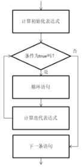
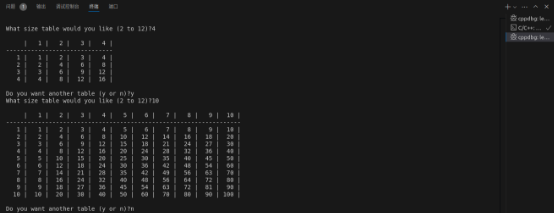
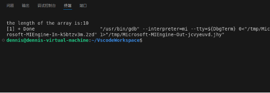

# **第三章：数组和循环**

我们首先先来考虑这样一个问题，如何使用计算机计算100的阶乘？当数字比较少的时候，我们可以直接采用连乘的方式进行计算。但当出现100个数字时，一个一个地进行输入耗时便会非常巨大。而循环操作的引入无疑为解决此类问题提供了便利，本章就将介绍这种神奇的操作。

## **3.1 循环**

### **3.1.1 理解循环**

在使用计算机编程处理数学问题时，我们经常遇到需要重复进行的操作。比如求等差数列的和、求阶乘等。为解决以上问题，我们引入一种可以重复执行某一段代码块的过程，并将此过程称之为循环。循环包括两个基本要素：循环体（要重复执行的语句或语句块）、循环条件（决定何时停止重复循环），循环体每执行一次则称为一次迭代。C++中常见的循环形式由while，do-while以及for循环三种。

### **3.1.2 while循环**

While循环在每次执行前都要检查循环条件是否为真，若不为真则跳出循环。流程图及其语法格式如下所示：
```
 while (condition) *//此处的condition为循环条件，每次执行前都要先判断是否为真*
 {
 //此处添加需要重复执行的内容，即循环体*
 }
```


图1  while循环流程图

我们可以通过一个经典的问题——猜数字问题来进一步理解while循环的使用方法：在本游戏中，计算机每一次都会随机产生一个[0,99]之间的数字。玩家共有五次机会，每一次均可输入一个数字作为猜测结果，若当五次机会全部耗尽后依然没猜中记为游戏失败。下面我们在Ubuntu系统下，采用VSCode将此问题代码表示出来:
```
#include <iostream>  
#include <cmath>  
#include <cstdlib> // 需要读取 rand() 相关内容  
#include <ctime>   // 需要用于随机数种子  

using namespace std;  

int main()  
{  
    srand(static_cast<unsigned int>(time(0))); // 设置随机数种子  
    
    int num = rand() % 100; // 生成0到99之间的随机数  
    int count = 0;  
    int guess;  

    while (count < 5)  
    {  
        cout << "please enter the number you guess: ";  
        cin >> guess;  

        if (guess > num)  
        {  
            cout << "too big!" << endl;  
        }  
        else if (guess < num)  
        {  
            cout << "too small!" << endl;  
        }  
        else  
        {  
            cout << "congratulations!" << endl;  
            break;  
        }  
        count++;  
    }  

    if (count == 5)  
    {  
        cout << "you failed" << endl;  
    }  

    return 0;  
}
```
运行这段程序，结果如下图所示，至此我们便初步掌握了利用while循环编写简单程序的方法。


图2 采用while循环编写猜数字游戏运行结果

### **3.1.3 do-while循环**

Do-while循环要先执行一次循环体中的代码块，随后检查循环条件是否为真，若为真便继续执行，流程图及其语法格式如下所示：
```
 do
 {
/* 循环体 */
} while (/* 循环条件 */);
```


图3 do-while循环流程图

我们将介绍一段计算平均温度的代码，以此来说明do-while循环的应用场景。下面将给出该程序的代码：
```
#include <iostream>  
#include <format>  
#include <cctype>  

using namespace std;  

int main() {  
    char reply {};  
    int count {};  
    double sum {};  

    do {  
        double temperature;  
        cout << "Enter a temperature reading: ";  
        cin >> temperature;  

        sum += temperature;  // 累加温度  
        count++;  

        cout << "Do you want to continue? (y/n): ";  
        cin >> reply;  
    } while (tolower(reply) == 'y');  // 判断是否继续  

    cout << format("The average temperature is {}.\n", sum / count);  // 输出平均温度  
    return 0;  
}
```
因为循环条件是reply=y，而用户在每次迭代中才会给出reply的值。故循环必须运行至少一次，因此采用do-while循环。运行这段程序，结果如下图所示：


图4 采用do-while循环编写平均温度计算程序运行结果

### **3.1.4 for循环**

For循环为一种计数循环，主要用于对语句或语句块执行预知的次数。可以用以分号分隔的三个表达式来控制for循环，第一个表达式用于初始化一个容器，第二部表达式用于检查计数器是否达到给定的极限，第三个表达式用于递增这个计数器。这三个表达式任一一个都可以省略，但分号必须有。流程图及其语法格式如下所示：
```
 for(初始化；条件；迭代)
 {
//循环体
 }
```


图5 for循环流程图

当循环体中只有一条语句时，也可不加花括号，但要保证正常缩进：
```
for(初始化；条件；迭代)
//循环体
```
同时，我们应注意到，在for循环的初始化表达式中定义变量时，该变量的作用范围只有for循环下面的花括号，循环结束，该变量便不复存在。

为更深刻地理解for循环的使用方法，我们来看如下问题：现在进行敲桌子游戏，在[1,100]范围内的所有整数中，如果一个数是7的倍数或十位有7或个位有7，则认定该数字为特殊数字，同时输出敲桌子，否则便输出数字本身。以下给出该问题的代码供参考：
```
#include <iostream>  
#include <cmath>  

using namespace std;  

int main() {  
    for (int i = 1; i <= 100; i++) {  
        if (i % 7 == 0 || i / 10 == 7 || i % 10 == 7) {  
            cout << "knock knock" << endl; // 输出 "knock knock"  
        } else {  
            cout << i << endl; // 输出当前数字  
        }  
    }  
    return 0;  
}
```
运行此程序，部分结果如下所示：


图6 采用for循环编写的敲桌子游戏运行结果

### **3.1.5 浮点数控制for循环**

我们需要认识到，for循环不仅能用整数控制，也可以用小数控制。但此时我们应当注意，因为小数部分的值可能无法被二进制浮点数精确地表示，这可能会对程序带来一些意想不到的负面效应。我们来分析以下程序：
```
#include <iostream>  

using namespace std;  

int main() {  
    for (double i { 0.2 }; i <= 3.0; i += 0.2) {  
        cout << i << ' ';  // 输出当前的 i  
    }  
    return 0;  
}
```
我们也许会认为这段程序的输出结果会是一个从0.2到3.0，公差为0.2的等差数列，但实际上输出结果却是从0.2到2.8的数列，如图7所示。


图7 数列输出结果

出现这个问题的原因就在于在把0.2表示为浮点数时，在精度的最后一位上会出现偏差。而这微小的偏差就导致了把这样的0.2与2.8相加时，其结果反而大于3.0，循环终止。采用如下代码分析误差：
```
#include <iostream>  
#include <format>  
#include <cctype>  

using namespace std;  

int main() {  
    for (double i = 0.2; i <= 3.0; i += 0.2) {  
        cout << format("delta to 3 is {}\n", i + 0.2 - 3.0);  
    }  
    cout << endl;  
    return 0;  
}
```
我们发现，当i=2.8时，为它加上0.2随后对3作差的结果并不是0，而是一个小量，所以循环便被终止了，无法输出3.0。如下图所示：


图8  对3作差结果

而当我们把循环执行条件改为i<=3.0+0.001时，就可以得到正确的输出结果，如图9所示。因此，无法精确表示浮点变量有时会给程序带来一些意想不到的错误，为解决这种问题，可以将循环终止条件改为类似于i-3.0<=0.001这种形式。


图9 正确数列输出结果

### **3.1.6 基于范围的for循环**

若采用传统的循环来遍历数组，由程序员来说明循环的范围容易出现数组越界等错误。因此，在C++20中针对传统的for循环进行了修改，引入了std::ranges库，因此，我们可以尝试采用基于范围的for循环。范围可以是数组、字符串，也可以是标准库提供的容器。在使用前首先需要导入该库，如下所示：

#include<ranges>

随后我们采用array来定义一个数组，与普通数组不同的是，array类型中提供了一系列的内置函数用于对数组进行操作（详见下一章），其定义语法为array<元素数据类型，数组长度> 数组名。

然后我们便可以针对定义好的数组，采用基于范围的for循环方式进行遍历，在该种遍历方式中，for循环后的括号被冒号一分为二，前一部分为可选的初始化部分（**C++20的新功能，需要补充C++20和其它版本的对比）和**用于迭代的变量，此变量每一次迭代的时候都会被赋予范围内的一个新值，后一部分为迭代的范围。其与其它C++版本的格式对比以及语法格式如下所示：


1. for([初始化语句;]用于迭代的变量:迭代的范围)

比如，我们要遍历myArray数组，并把它的每一个元素存放在value中输出，那么我们可以用for(int value:myArray)来执行上述操作。

下面给出完整代码：
```
#include <iostream>  
#include <array>  

using namespace std;  

int main() {  
    array<int, 5> myArray = {1, 2, 3, 4, 5}; // 定义一个数组并初始化  
    for (int value : myArray) { // 使用范围基 for 循环遍历数组  
        cout << value << " "; // 输出当前值  
    }  
    cout << endl; // 输出换行  
    return 0;  
}
```
  运行本段代码，结果如图10所示，可以看到，myArray数组被成功遍历：

  

  图10 采用基于范围的for循环遍历array类型数组的结果

### **3.1.7 采用for\_each遍历数组**

在C++20中，for\_each也是遍历数组的一种方式。使用时需要先引入algorithm、ranges两个头文件，语法格式如下所示：
```
 ranges::for\_each(数组名,[](迭代变量数据类型 迭代变量{
//循环体
}));
```
现假设我们需遍历myArray数组，并将其中每个元素放在value中输出，则该循环可以写作
```
ranges::for\_each(myArray,  [](int value{

//此处输出value的值即可

});
```
下面给出完整代码：
```
#include <iostream>  
#include <array>  
#include <ranges>  
#include <algorithm>  

using namespace std;  

int main() {  
    array<int, 5> myArray = {1, 2, 3, 4, 5}; // 定义并初始化数组  

    // 使用 ranges::for_each 和 Lambda 表达式遍历数组  
    ranges::for_each(myArray, [](int value) {  
        cout << value << " "; // 输出当前值  
    });  

    cout << endl; // 输出换行  
    return 0;  
}
```
运行上述代码，结果如图7所示，可以看到数组被成功遍历。


图7 采用std::ranges::for\_each遍历数组的结果

### **3.1.8 嵌套循环**

有时我们可以把一个循环放在另一个循环的内部，并且嵌套的循环可以是任何类型——在while循环中嵌套for循环，再把while循环嵌套进do-while循环中，最后把do-while循环嵌套在基于范围的for循环中。它们能以任何方式混合在一起。

这些嵌套循环经常用于多维数组的遍历，但也会有其它用途。下面我们来看一个例子：乘法表是许多孩子在学校的必修课，可以利用嵌套循环来生成一个乘法表，代码如下所示：
```
#include <iostream>  
#include <format>  
#include <cctype>  

using namespace std;  

int main() {  
    size_t table {};  
    const size_t table_min {2};  
    const size_t table_max {12};  
    char reply {};  

    do {  
        cout << format("What size table would you like ({} to {})? ", table_min, table_max);  
        cin >> table;  
        cout << endl;  

        if (table < table_min || table > table_max) {  
            cout << "Invalid table size entered. Program terminated." << endl;  
            return 1;  
        }  

        cout << format("{:6}", '|');  
        for (size_t i {1}; i <= table; i++) {  
            cout << format(" {:3} |", i);  
        }  
        cout << endl;  

        for (size_t i {}; i <= table; i++) {  
            cout << "------";  
        }  
        cout << endl;  

        for (size_t i {1}; i <= table; i++) {  
            cout << format(" {:3} |", i);  
            for (size_t j {1}; j <= table; j++) {  
                cout << format(" {:3} |", i * j);  
            }  
            cout << endl;  
        }  

        cout << "\nDo you want another table (y or n)? ";  
        cin >> reply;  

    } while (tolower(reply) == 'y');  

    return 0;  
}
```
在上面的例子中，我们将乘法尺寸表的输入值存储在table中，乘法表中包含从1×1到table×table的所有乘积。并且我们要检查输入的table值是否处于有效范围内，如果在则返回1（第23行）。该乘法表以矩阵的形式显示，我们首先采用一个for循环创建行，随后在其内部嵌套一个for循环用以输出乘积。嵌套循环每执行一次，就生成一行。运行结果如下图所示：



图8 嵌套循环生成乘法表结果

### **3.1.9 循环中断**

我们有时需提前终止循环。当循环没有必要执行下去时，我们可以使用break语句结束循环，程序继续执行后面语句。break在无限循环中经常使用。

首先我们来介绍无限循环的编写，有如下几种形式：
```
 for(;;)
{
*//循环体*
 {
 while(true)
 {
//循环体
 {
```
下面我们将给出一个按升序对数组内容进行排序的例子，用以进一步说明break语句的用法。代码如下所示：
```
#include <iostream>  
#include <cmath>  
#include <cstdlib> // 需要读取 rand() 相关内容  
#include <ctime>   // 需要用于随机数种子  

using namespace std;  

int main()  
{  
    srand(static_cast<unsigned int>(time(0))); // 设置随机数种子  
    
    int num = rand() % 100; // 生成0到99之间的随机数  
    int count = 0;  
    int guess;  

    while (count < 5)  
    {  
        cout << "please enter the number you guess: ";  
        cin >> guess;  

        if (guess > num)  
        {  
            cout << "too big!" << endl;  
        }  
        else if (guess < num)  
        {  
            cout << "too small!" << endl;  
        }  
        else  
        {  
            cout << "congratulations!" << endl;  
            break;  
        }  
        count++;  
    }  

    if (count == 5)  
    {  
        cout << "you failed" << endl;  
    }  

    return 0;  
}
```
数据在第一个while循环中被读入，若读入的数字为0，则认为读入结束，通过break退出循环，若不为0，则将输入的值存入索引为count的数组元素中。若数组中的元素数量到了最大容量，那也要通过break退出输入循环。第二个while循环将输入的数字按照升序排序，布尔变量swapped记录了执行for循环时是否需要交换元素值，若不需要便是已经排序好，直接通过break退出循环，若需要，便交换顺序不对的元素。这种排序方法称为冒泡排序。运行结果如下所示：


图9 冒泡排序程序运行结果

另外从无符号整数中减去一个值时要特别小心，任何负数将被转化成一个极大的整数，从而导致程序崩溃。所以循环进行条件可以改为i<static\_cast<int>(count)-1。

**3.1.10 跳过循环迭代**

有时需要跳过循环迭代，直接开始下一次循环。可以使用continue语句来完成这一操作。形式如下所示：
```
continue;
```
在循环中执行到该语句时，程序会跳到当前阶段的末尾。只要循环控制表达式允许就会立即进行下一次迭代。下面我们将给出一个例子，用以更明确地说明其用法。

## **3.2 数组**

我们考虑这样一个问题：一个年级有200个学生，现需计算这个年级数学考试的平均成绩。从理论上考虑这很简单，只需要将这200个学生的数学成绩相加再除以200就行。而当我们编写代码时，需要引入200个float类型的变量用于定义学生成绩，极大地增加了开发成本。

事实上，我们通过观察可以发现，这些学生的成绩数据类型相同，并且是同一门课程、同一个年级学生的成绩。我们可以将它们组成一个数组，便于后续操作。

### **3.2.1 数组的定义**

在C++中，数组是一种用来存储相同类型元素的数据结构，一维数组是最简单的数组形式，它由一系列按顺序存储的元素组成，二维数组则可理解成是若干一维数组堆叠起来形成的矩阵。

### **3.2.2 一维数组**

它是一种线性结构，通常用于存储一组相同类型数据，适合对向量、序列等进行存储。其可通过下标直接访问，时间复杂度为O(1)。

3\.2.2.1 一维数组的定义与遍历方式

可直接通过下面格式定义，下标从0-数组元素个数-1：

数组元素数据类型 数组名[数组元素个数]；

随后通过如下语法为数组的每个元素赋值：

数组名[index]=a//将下标为index的元素赋值为a。

也可以通过以下格式定义：

数组元素数据类型 数组名[元素个数] {a1, a2, …, an};

或者也可以略去元素个数，直接写为以下形式，此时，编译器会自动确定数组中的元素个数：

数组元素数据类型 数组名[ ] {a1, a2, …, an};

要注意的一点时，初始化列表中的值的个数不能超过数组元素的个数，否则该语句不会编译。但可以少于数组元素的个数。此时没有提供初始值的元素就初始化为0.

若要定义元素值不能被修改的数组，需在类型前面加上关键字const。下面定义了一个unsigned int常量的数组。

若需要遍历一维数组，我们可以通过上节介绍的循环操作进行，该操作时间复杂度为O(n)，示例代码如下所示。
```
#include <iostream>  
#include <format>  
#include <cctype>  
using namespace std;  

int main()  
{  
    double rainfall[12] { 1.1, 2.8, 3.4, 3.7, 2.1, 2.3, 1.8, 0.0, 0.3, 0.9, 0.7, 0.5 };  
    double copy[12] {};  

    for (size_t i {}; i < 12; i++)  
    {  
        copy[i] = rainfall[i];  
    }  

    for (size_t i {}; i < 12; i++)  
    {  
        cout << copy[i] << " ";  
    }  

    return 0;  
}
```
该段代码将rainfall数组中的元素复制到了copy数组中，首先遍历rainfall数组，随后将其中的元素赋值给copy数组中的对应元素，最后遍历copy数组输出元素。但如果我们为数组增加了第13个元素，而我们又忘记更新for循环中使用的12，将会得到错误的结果。

为避免此类结果的发生，我们应该给数组的大小定义一个const变量，用它替代显式值，如下所示：

const size\_t size {12};

随后将循环控制条件中的i<12改为i<size即可

3\.2.2.2 确定一维数组的大小

在实际应用中，我们经常需要求出某个一维数组的大小，在必要时，需要一种确定数组大小的验证方法。

我们可以采用std::size()函数，该函数在使用前需采用以下语句导入array模块：
```
#include<array>
```
假设有如下数组：
```
int values[] {2,3,5,7,11,13,17,19,23,29};
```
我们便可以使用std::size(values)来求出数组的大小为10。完整代码如下所示：
```
#include <iostream>  
#include <array>  

using namespace std;  

int main()  
{  
    int values[] {2, 3, 5, 7, 11, 13, 17, 19, 23, 29};  
    cout << "the length of the array is: " << size(values) << endl;  

    return 0;  
}
```
运行结果如图8所示：



图8 采用std::size()函数获取数组长度的运行结果示意图

如果采用sizeof()函数，则需要用sizeof(values)除以sizeof(values[0])，因为sizeof()返回的是数据所占用的字节数。相比之下，还是采用size(values)比较简洁。

### **3.2.3 多维数组**

3\.2.3.1 基本定义

我们在前面介绍的数组仅需一个索引值定义。但在实际应用中，一个索引值可能无法满足开发者们的需求。此时，我们需要引入更多的索引值，并将这种数组称为多维数组。需要两个索引值的数组成为二维数组，需要三个索引值的称为三维数组，以此类推。

我们考察这样一个例子：某一个农夫有一片胡萝卜地，种植方式为三行四列。如果我们要通过二维数组来描述胡萝卜，则可声明一个二维数组：
```
int carrots[3][4] {};
```
通过该语句定义的三行四列的数组中每个值都被初始化为0。当我们需要存储第二行第三列胡萝卜的重量时，可以采用以下语句：
```
carrots[1][2]=1.5;
```
如果希望初始值不为0，我们也可通过如下方式初始化二维数组：
```
double carrots[3][4] 
{

{2.5,3.2,3.7,4.1},

{4.1,3.9,1.6,3.5},

{2.8,2.3,0.9,1.1}

};
```
而当我们在定义中省略某一些值时，就把被省略的值赋值为0。

在定义时也可省略第一个维度，但不可省略除第一个维度外的所有维度。例如，如果为二维数组提供12个值，编译器不知道数组是三行四列、六行二列抑或是其它组合，这意味着下面的数组定义会导致编译错误：
```
double carrots[][] 
{

{2.5,3.2,3.7,4.1},

{4.1,3.9,1.6,3.5},

{2.8,2.3,0.9,1.1}

};
```
数组名本身引用整个数组，如果采用cout输出数组名，我们将会得到一个十六进制数字，表示数组中首元素的内存地址。要遍历二维数组，可以采用下面的代码：
```
#include <iostream>  

using namespace std;  

int main()  
{  
    double carrots[3][4] {  
        {2.5, 3.2, 3.7, 4.1},  
        {4.1, 3.9, 1.6, 3.5},  
        {2.8, 2.3, 0.9, 1.1}  
    };  
    
    for (int i = 0; i < size(carrots); i++)  
    {  
        for (int j = 0; j < size(carrots[i]); j++)  
        {  
            cout << carrots[i][j] << " ";  
        }  
        cout << endl;  
    }  
    
    return 0;  
}
```
运行代码，结果如下所示：


图9 二维数组遍历结果

要定义一个三维数组，需再添加一对方括号。例如，在一星期的七天中，每天都需记录3个温度，一年共有52个星期。因此可以声明下面的数组，把该数据存为int类型：

int temperatures[52][7][3] {};

该数组中一行共有三个值，一星期的数据需7行，一年就有52个这样的7行数据。通过上述代码，这1092个元素均被初始化为0。若我们需求出第26星期第3天的中间温度，就可以编写下面的代码：

cout<<temperatures[25][2][1]<<endl;

3\.2.3.2 多维字符数组

我们也可以用二维数组来存储多个字符串，但不需要再对每个字符串加花括号，它们的双引号已经起到了花括号的作用。下面通过一段程序来演示这类数组：
```
#include <iostream>  
#include <array>  

using namespace std;  

int main()  
{  
    const size_t max_length {80};  
    char stars[][max_length] {  
        "Fatty", "Clara",  
        "Lassie", "Slim",  
        "Boris", "Mae",  
        "Oliver", "Greata"  
    };  
    
    size_t choice {};  
    cout << "pick a lucky star! Enter a number between 1 and " << size(stars) << ": ";  
    cin >> choice;  
    
    if (choice >= 1 && choice <= size(stars))  
    {  
        cout << "Your lucky star is " << stars[choice - 1] << endl;  
    }  
    else  
    {  
        cout << "Sorry, you haven't got a lucky star" << endl;  
    }  
    
    return 0;  
}
```


图10 示例程序运行结果

运行结果如上图所示，分析代码可知，这个例子主要定义了一个字符串数组，我们忽略了第一个维度，那么这个二维数组便可以包含无限多个字符串，每个字符串最多可以包含max\_length个字符，包括编译器自动添加的终止字符。当我们输入6时，便通过该索引值选中了第6个字符串。

3\.2.3.3 数组的替代品：array与vector

标准库定义了容器，是一个丰富的数据结构的集合，提供了多种方式来组织和访问数据。本小节将会介绍两种基本容器：std::array<>与std::vector<>，它们可以作为C++中普通数组的替代品，使用起来更灵活。

首先我们介绍array<T,N>容器。该容器再<array>模块中定义，使用前需先通过#include<array>导入该模块。定义格式如下所示：
```
std::array<元素数据类型，元素数量> 数组名;
```
我们可以通过下述方式初始化该容器，因为没有指定初始值，所以所有元素均为0。
```
std::array<double, 100> values {};
```
和普通数组相同，也可以在定义时为其赋初值，如下列语句所示：

std::array<double, 100> values {0.5, 1.0, 1.5, 2.0};

该数组只指定了前四个元素的初始值，后面的元素均为0。

从C++17开始，编译器可通过给定的初始化列表推断模板参数，即尖括号内的值。如下所示：
```
std::array values {0.5, 1.0, 1.5, 2.0};
```
编译器将从这条语句推断出数据类型为double，数组长度为4。但要注意的是，若要对参数进行推断，初始化列表便不能为空。

我们也可使用array<>对象的fill()函数将所有元素设置为某个给定的值。示例如下（需提前导入<numbers>模块）：
```
values.fill(std::numbers::pi)
```
当需要访问array中的元素时，我们可以采用访问普通数组的方式访问，另一种方法是使用array<>对象的at()函数访问，这个函数会检查索引值是否超出合法的范围，下面这条语句用来访问values数组中的第i个元素：
```
values.at(i);（等价于values[i];）
```
在array容器大小相同，存储相同类型元素时，我们可将它作为整体，采用比较运算符进行比较。当采用”==”比较结果时，两个容器中每一个元素都必须相同。当采用”!=”比较结果时，至少有一对对应元素是不同的才能返回true。除此之外，剩下所有比较都会根据第一对不相同的元素得到结果。而普通数组则无法直接通过运算符比较

只要两个array<>容器存储相同数量，相同类型的元素，就可以把一个array<>容器赋值给另一个array<>容器，如下所示，其中them和those均为array<>容器：

them=those;

由此可见，array<>容器相对于普通数组更为便利。因此在编写程序时，尽量优先使用array<>容器。我们下面将给出一个示例，进一步展示array<>容器的使用，代码如下所示：
```
// Using array<T, N> to create Body Mass Index(BMI) table  
#include <iostream>  
#include <format>  
#include <array>  

using namespace std;  

int main()  
{  
    const unsigned min_wt {100};  
    const unsigned max_wt {250};  
    const unsigned wt_step {10};  
    const size_t wt_count{1 + (max_wt - min_wt) / wt_step};  
    
    const unsigned min_ht {48};  
    const unsigned max_ht {84};  
    const unsigned ht_step {10};  
    const size_t ht_count{1 + (max_ht - min_ht) / ht_step};  
    
    const double lbs_per_kg {2.2};  
    const double ins_per_m {39.37};  
    
    array<unsigned, wt_count> weight_lbs {};  
    array<unsigned, ht_count> height_ins {};  
    
    for (unsigned i{}, w{min_wt}; i < wt_count; w += wt_step, ++i)  
    {  
        weight_lbs[i] = w;  
    }  

    for (unsigned i{}, h{min_ht}; h <= max_ht; h += ht_step)  
    {  
        height_ins.at(i++) = h;  
    }  
    
    cout << format("{:8}", '|');  
    for (auto w : weight_lbs)  
    {  
        cout << format(":^6|", w);  
    }  
    
    cout << endl;  
    
    for (unsigned i{1}; i < wt_count; i++)  
    {  
        cout << "--------";  
    }  
    
    cout << endl;  
    
    const unsigned int inches_per_foot {12U};  
    for (auto h : height_ins)  
    {  
        const unsigned feet = h / inches_per_foot;  
        const unsigned inches = h % inches_per_foot;  
        cout << format("{:2}'{:2}\" |", feet, inches);  
        
        const double h_m = h / ins_per_m;  
        for (auto w : weight_lbs)  
        {  
            const double w_kg = w / lbs_per_kg;  
            const double bmi = w_kg / (h_m * h_m);  
            cout << format("{:2.1f} |", bmi);  
        }  
        
        cout << endl;  
    }  
    
    for (size_t i{1}; i < wt_count; i++)  
    {  
        cout << "--------";  
    }  
    
    cout << "\nBMI from 18.5 to 24.9 is normal" << endl;  
    return 0;  
}
```
上面这个例子是一个输出BMI表的程序，首先定义了两组变量，与BMI表的体重和高度范围相关。体重和高度存储在元素类型为unsigned的array<>容器中，并在for循环中采用合适的形式将这些元素初始化。而在第二个循环中采用了另一种方法来设置值，以演示at()函数。接下来的两个for循环输出表的列标题，再输出一条线，把列标题与表的其余部分分隔开。表使用嵌套的基于范围的for循环创建。外部循环迭代身高，最左列把身高输出为英尺和英寸。内部循环迭代体重，为当前身高输出一行BMI值。运行结果如下所示：


图11 BMI转换表格程序运行结果

下表总结了一些array<>对象的函数供参考：


|  函数  |               功能               |
| :----: | :-------------------------------: |
| fill() |      把所有元素设置为指定值      |
| size() | 返回元素个数，返回值为size\_t类型 |
|  at()  |      返回某个索引值处的元素      |

下面我们将介绍vector，这是一个序列容器，大小可以自动增加，以容纳任意数量的元素。使用vector时需要导入<vector>模块，创建方法如下所示，但是这不会给元素分配任何空间。
```
std::vector<元素数据类型> 数组名;
```
当我们要向其内部添加元素时，我们可以采用push\_back()函数，在已有元素的后面添加新元素。例如：
```
std::vector<double> values;

values.push\_back(3.14);
```
通过以上语句，3.14便被添加至数组内部。我们也可以采用预定义的元素个数来初始化vector<>，例如：
```
std::vector<double> values(20);
```
该语句定义了一个长为20的vector<>容器，其中每个元素初始值都为0。如果不希望让0成为默认值，我们可以通过以下语句显式指定一个默认值，在这个数组中，所有元素都被设置为99L。
```
std::vector<long> numbers(20,99L);
```
也可使用初始化列表指定初始值，如下所示：
```
std::vector<int> primes(2,3,5,7,11,13,17,19);
```
上面创建的prime向量容器包含8个元素，其初始值放在给定的初始化列表中。

如果初始化vector<>时至少使用了一个给定的值，C++17编译器同样可以推断出模板类型参数，这可以省去一些键入工作。同时我们也可类比普通数组，采用类似于values[i]的方式来引用vector<>容器中的某个元素，但不能用这种方式创建新元素。而在vector<>中，也可以使用at()函数，所以只要索引值可能超出合法的范围，就应该使用at()函数。若希望知道vector<>的大小，可以使用size()函数，并且它提供了函数front()和back()，可以访问第一个和最后一个元素。也可以采用比较运算符将两个vector<>类型数组按字典序进行比较。若要判断vector<>是否为空，则可以调用empty()这个成员函数。

从C++20开始，可以使用std::erase()删除vector<>中某个元素出现的所有位置，但它不是vector的一个成员函数，第一个参数为数组名，第二个参数为要删除的值。调用方式如下所示：

std::vector numbers{ 7,9,7,2,0,4 };

std::erase(numbers, 7);

随后我们可以看到，numbers数组变为{9,2,0,4}。若要删除最后一个元素，我们也可以调用pop\_back()函数，而clear()函数是清空数组。下面我们将给出一个例子，进一步展示数组的使用：
```
#include<iostream>  
#include<vector>  
#include<format>  
using namespace std;  

int main()  
{  
    vector<double> x;  
    while (true)  
    {  
        double input {};  
        cout << "Enter a non-zero value, or 0 to end:";  
        cin >> input;  
        if (input == 0)  
        {  
            break;  
        }  
        x.push_back(input);  
    }  
    
    if (x.empty())  
    {  
        cout << "Nothing to sort..." << endl;  
    }  
    
    cout << "Starting sort." << endl;  
    while (true)  
    {  
        bool swapped { false };  
        for (size_t i {}; i < x.size() - 1; ++i)  
        {  
            if (x[i] > x[i + 1])  
            {  
                const auto temp = x[i];  
                x[i] = x[i + 1];  
                x[i + 1] = temp;  
                swapped = true;  
            }  
        }  
        if (!swapped)  
        {  
            break;  
        }  
    }  
    
    cout << "Your data in ascending sequence:\n";  
    const size_t perline {10};  
    size_t n {};  
    for (size_t i {}; i < x.size(); ++i)  
    {  
        cout << format("{:8.1f}", x[i]);  
        if (++n == perline)  
        {  
            cout << endl;  
            n = 0;  
        }  
    }  
    cout << endl;  
    
    return 0;  
}
```
因为数据存储在vector<double>类型的容器中，所以不再需要对用户施加最大元素数量的限制。内存以递增的方式分配，以容纳输入的数据。我们也不再需要跟踪用户输入的值的数量，vector<>会自动完成这项工作。输出结果如下所示：


图12 采用vector<>的排序程序输出结果

下表总结了vector<>中常用的一些函数供参考：


|      函数      |           功能           |
| :-------------: | :----------------------: |
| front()，back() | 访问第一个和最后一个元素 |
|     size()     |         查询大小         |
|  push\_back()  |     在末尾加入新元素     |
|   pop\_back()   |     删除最后一个元素     |
|    assign()    | 重新初始化vetcor<>的内容 |