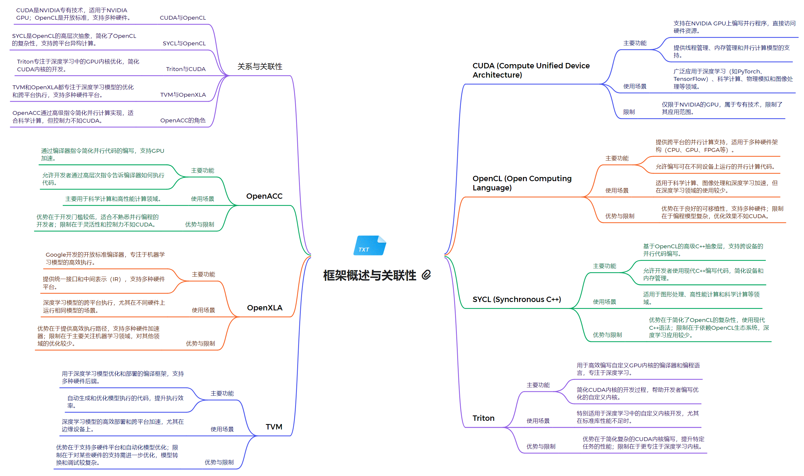

# NVIDIA 平台

NVIDIA 是一家领先的图形处理器(GPU)制造商,在人工智能(AI)领域拥有广泛的技术布局。NVIDIA 的 GPU 在深度学习、机器学习等 AI 应用中发挥着关键作用,为开发者提供了强大的硬件加速能力。

除了硬件,NVIDIA 平台还具备了一系列软件工具和框架,帮助开发者更好地利用 GPU 进行 AI 开发。接下来我们将介绍以下几个重要的 NVIDIA 平台相关技术并在后续通过AI技术栈进行深入分析:

## CUDA
CUDA 是 NVIDIA 开发的一种通用并行计算架构,可以利用 NVIDIA GPU 进行高性能计算。CUDA 提供了一个编程模型和指令集,使开发者能够编写高效的并行程序,充分发挥 GPU 的计算能力。

## OpenCL
OpenCL 是一种开放标准的并行计算框架,可以在异构计算平台(如 CPU、GPU、FPGA 等)上运行。与 CUDA 类似,OpenCL 也为开发者提供了编程模型和指令集,用于开发并行应用程序。

## SYCL (DPC++)
SYCL 是基于 OpenCL 的一种C++层次化的异构编程模型。DPC++ 是 SYCL 的一种实现,由 Intel 开发并贡献给 LLVM 社区。DPC++ 支持在 CPU、GPU 和其他加速器上运行并行计算任务。

## Triton
Triton 是 NVIDIA 开发的一个高性能推理服务器,可以部署和运行各种深度学习模型。Triton 支持多种框架(TensorFlow、PyTorch 等)和部署环境,为开发者提供了灵活的模型部署解决方案。

## Apache TVM
Apache TVM 是一个开源的端到端机器学习编译器栈,可以针对不同的硬件平台(CPU、GPU、FPGA 等)优化机器学习模型的性能。TVM 可以与 NVIDIA 的 CUDA 和 Triton 等技术集成使用。

## OpenXLA
OpenXLA 是 Google 开源的一个机器学习编译器框架,可以将不同的机器学习模型编译为高效的原生代码。NVIDIA 正在与 Google 合作,将 OpenXLA 与 CUDA 等技术进行集成。

## OpenACC
OpenACC 是一种指令级并行编程模型,可以让开发者更容易地将现有的 C、C++ 或 Fortran 代码移植到 GPU 上运行。OpenACC 为开发者提供了一种声明式的编程方式,无需深入了解 GPU 的底层细节。
