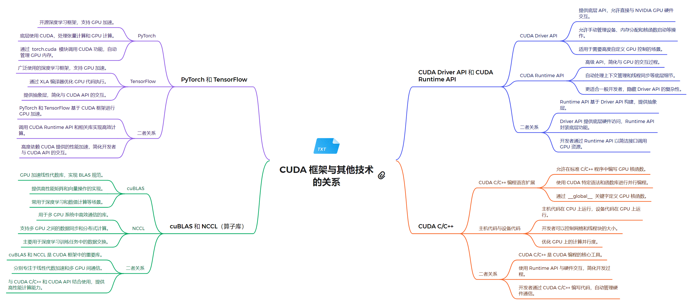

# 技术栈架构
**1. 系统软件层**
  - NVIDIA GPU 驱动：为 GPU 提供基本的系统级支持
  - CUDA Driver API：低级 API，提供对 GPU 的直接控制
    - 允许直接管理设备、内存分配和程序执行
    - 适用于需要细粒度控制的高级应用
    - 提供与 NVIDIA GPU 硬件交互的底层接口

**2. 运行时环境层**
  - CUDA Runtime API：高级 API，简化了 GPU 编程，自动管理许多底层细节
    - 提供更高级的抽象，简化了 GPU 的使用
    - 自动处理上下文管理和程序加载等任务
    - 更适合一般开发者使用，提供了更好的易用性

**3. 编程模型和语言层**
  - CUDA C/C++：扩展了 C/C++ 语言，允许开发者编写在 GPU 上运行的并行程序
    - 允许在 CPU 和 GPU 上混合编程
    - 使用 CUDA 特定语法（如 `__global__`）来定义 GPU 函数
    - 通过 `<<<>>>` 语法启动内核
    - 支持主机代码和设备代码的混合编写

**4. 计算库层**
  - cuBLAS：用于线性代数计算的库
    - 提供 GPU 加速的矩阵运算和 BLAS 功能
    - 广泛用于深度学习中的矩阵计算
  - NCCL：用于多 GPU 通信的库
    - 支持多 GPU 之间的高效通信和数据交换
    - 主要用于分布式深度学习训练
  - 其他专用算子库（如 cuDNN）

**5. 框架模型层**
  - PyTorch：支持动态计算图的深度学习框架
    - 通过 `torch.cuda` 模块提供 CUDA 功能
    - 自动管理 GPU 内存
    - 支持 CPU 和 GPU 之间的数据转移
  - TensorFlow：支持静态和动态计算图的深度学习框架
    - 通过 XLA 编译器优化 GPU 代码执行
    - 提供高级 API，简化了 CUDA API 的使用

### 关系解析

1. **CUDA Driver API 和 CUDA Runtime API 的关系**
    - Runtime API 构建在 Driver API 之上，提供了更高级的抽象
    - Driver API 提供更多控制，但使用更复杂
    - Runtime API 更容易上手，隐藏了 Driver API 的复杂性
    - 开发者可以根据需求选择使用 Runtime API 或直接使用 Driver API
2. **PyTorch 和 TensorFlow 与 CUDA 的关系**
    - 两者都基于 CUDA Runtime API 实现 GPU 加速
    - 提供了高级抽象，使开发者无需直接编写 CUDA 代码
    - 支持自动微分和 GPU 加速的深度学习模型训练
    - PyTorch 和 TensorFlow 都支持 CPU 和 GPU 训练
3. **cuBLAS 和 NCCL 与 CUDA 的关系**
    - 这些库是 CUDA 生态系统的重要组成部分
    - 它们利用 CUDA 的并行计算能力，提供高性能的数学运算和通信功能
    - 与 CUDA C/C++ 和 CUDA API 结合使用，提供高性能计算能力

通过以上结构，CUDA 技术路线为开发者提供了从底层硬件控制到高层应用开发的全面支持，使得 GPU 并行计算的强大功能能够被有效地应用到各种计算密集型任务中。
