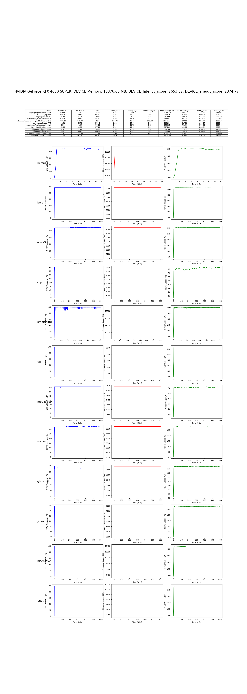

# 框架模型层

使用基于 PyTorch 的经典深度学习模型集合在 CUDA 平台上对 GPU NVIDIA 进行性能测试

仓库地址：[AI-Benchmark-SDU](https://github.com/AII-SDU/AI-Benchmark-SDU)

部分模型代码展示：

LLama3：

```
'''
Copyright (c) 2024, 山东大学智能创新研究院(Academy of Intelligent Innovation)

Redistribution and use in source and binary forms, with or without
modification, are permitted provided that the following conditions are met:

1. Redistributions of source code must retain the above copyright notice, this
   list of conditions and the following disclaimer.

2. Redistributions in binary form must reproduce the above copyright notice,
   this list of conditions and the following disclaimer in the documentation
   and/or other materials provided with the distribution.
'''
# Copyright (c) Academy of Intelligent Innovation.
# License-Identifier: BSD 2-Clause License
# AI Benchmark SDU Team

from model.model_set.model_base import BaseModel
from llama_cpp import Llama


class llama3_nvidia_amd(BaseModel):
    def __init__(self):
        super().__init__('language/generative/llama3')

    def get_input(self):
        self.input = "Q: Name the planets in the solar system? A: "

    def load_model(self):
        self.llm = Llama(
            model_path="model/model_set/pytorch/language/generative/llama3/ggml-meta-llama-3-8b-Q4_K_M.gguf",
            n_gpu_layers=99,
            #   n_gpu_layers=-1, # Uncomment to use GPU acceleration
            chat_format="llama-3",
            seed=1337, # Uncomment to set a specific seed
            n_ctx=2048, # Uncomment to increase the context window
            verbose=False
            )

    def get_params_flops(self) -> list:

        return [803, float('nan')]


    def inference(self):
        output = self.llm (
                prompt = self.input, # Prompt
                max_tokens=512, # Generate up to 32 tokens, set to None to generate up to the end of the context window
                stop=["Q:", "\n"], # Stop generating just before the model would generate a new question
                echo=True # Echo the prompt back in the output
            )
        completion_tokens = output['usage']['completion_tokens']
        return completion_tokens
  
  
```

CLIP：

```
'''
Copyright (c) 2024, 山东大学智能创新研究院(Academy of Intelligent Innovation)

Redistribution and use in source and binary forms, with or without
modification, are permitted provided that the following conditions are met:

1. Redistributions of source code must retain the above copyright notice, this
   list of conditions and the following disclaimer.

2. Redistributions in binary form must reproduce the above copyright notice,
   this list of conditions and the following disclaimer in the documentation
   and/or other materials provided with the distribution.
'''
# Copyright (c) Academy of Intelligent Innovation.
# License-Identifier: BSD 2-Clause License
# AI Benchmark SDU Team

import torch
from model.model_set.model_base import BaseModel
from model.model_set.models.multimodality.classification.clip.utils.model import build_model
from model.model_set.models.multimodality.classification.clip.utils.simpletokenizer import SimpleTokenizer as _Tokenizer
from thop import profile

class clip_nvidia_amd(BaseModel):
    def __init__(self):
        super().__init__('multimodality/classification/clip')

        self.text = ["a diagram", "a dog", "a cat"]
        self.input_shape =(1, 3, 224, 224)
        self.device = torch.device('cuda' if torch.cuda.is_available() else 'cpu')
        self.model_path = "model/model_set/pytorch/multimodality/classification/clip/ViT-B-32.pt"

    def get_input(self):
        self.img = torch.randn(self.input_shape).to(torch.float32).to(self.device)
        _tokenizer = _Tokenizer()
        sot_token = _tokenizer.encoder["<|startoftext|>"]
        eot_token = _tokenizer.encoder["<|endoftext|>"]
        all_tokens = [[sot_token] + _tokenizer.encode(text) + [eot_token] for text in self.text]
        context_length: int = 77
        truncate = False
        result = torch.zeros(len(all_tokens), context_length, dtype=torch.int)

        for i, tokens in enumerate(all_tokens):
            if len(tokens) > context_length:
                if truncate:
                    tokens = tokens[:context_length]
                    tokens[-1] = eot_token
                else:
                    raise RuntimeError(f"Input {self.text[i]} is too long for context length {context_length}")
            result[i, :len(tokens)] = torch.tensor(tokens)
  
        self.texts = result.to(self.device)

    def load_model(self):
        jit = False
        model = torch.jit.load(self.model_path, map_location=self.device if jit else "cpu").eval()
        state_dict = None
        self.model = build_model(state_dict or model.state_dict()).to(self.device)

    def get_params_flops(self) -> list:
        flops, _ = profile(self.model, (self.img, self.texts), verbose=False)
        params = sum(p.numel() for p in self.model.parameters() if p.requires_grad)
        return [flops / 1e9 * 2,  params / 1e6]

    def inference(self):
        image_features = self.model.encode_image(self.img)
        text_features = self.model.encode_text(self.texts) 
        return image_features, text_features
  
  
```

在 NVIDIA GeForce RTX 4080 SUPER 上的测试结果：


