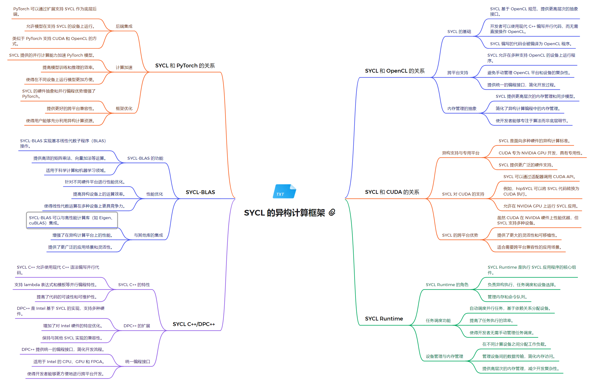

# 技术栈架构
**1. 系统软件层**
- 后端驱动程序：
  - OpenCL 驱动：为支持 OpenCL 的设备提供底层支持
  - CUDA 驱动：允许在 NVIDIA GPU 上运行 SYCL 代码
  - Level Zero 驱动：Intel 的低级硬件抽象层，为 Intel GPU 提供直接访问
- 硬件抽象层：
  - 提供统一的接口，隐藏不同后端的复杂性
  - 允许 SYCL 在多种硬件平台上运行，包括 CPU、GPU 和 FPGA

**2. 运行时环境层**
- SYCL Runtime：
  - 管理设备发现、内存分配和数据传输
  - 处理任务调度和执行
  - 实现异步执行模型和事件同步
  - 提供错误处理和异常管理
  - 支持设备选择和上下文管理

**3. 编程模型和语言层**
- SYCL C++：
  - 基于现代 C++ 标准（C++17 或更高）
  - 提供单源编程模型，主机和设备代码在同一文件中
  - 使用模板和 lambda 表达式简化并行编程
  - 支持数据并行和任务并行编程模型
- DPC++ (Data Parallel C++)：
  - Intel 的 SYCL 实现和扩展
  - 增加了额外的功能，如统一共享内存（USM）和子组功能
  - 提供与 Intel 硬件的深度集成和优化

**4. 计算库层**
- SYCL-BLAS：
  - 提供 BLAS（基础线性代数子程序）的 SYCL 实现
  - 支持向量和矩阵操作的高性能计算
  - 针对不同硬件后端优化
- oneDPL (oneAPI DPC++ Library)：
  - 提供并行算法和容器
  - 实现了许多标准模板库（STL）的并行版本
- oneDNN (oneAPI Deep Neural Network Library)：
  - 深度学习原语的高性能实现
  - 支持卷积、池化等常见神经网络操作

**5. 框架模型层**

- TensorFlow with SYCL：
  - 通过 SYCL 后端支持，允许 TensorFlow 模型在多种硬件上运行
- PyTorch with SYCL：
  - 集成 SYCL 支持，提供 PyTorch 在异构系统上的加速

##### 关系解析

SYCL作为一个统一的高级抽象层，连接了多种底层计算技术，包括PyTorch、OpenCL和CUDA。在与PyTorch的集成方面，SYCL提供了计算加速和程序优化的能力，允许开发者利用SYCL的并行计算能力来增强PyTorch模型。对于OpenCL，SYCL简化了其使用复杂性，提供了更高级的抽象，同时保持了对OpenCL底层功能的访问能力。在CUDA方面，SYCL允许代码在NVIDIA GPU上运行，同时保持跨平台兼容性，为开发者提供了更大的灵活性。SYCL-BLAS作为一个重要组件，提供了高效的线性代数运算，支持各种硬件平台的优化。SYCL C++/DPC++扩展了C++标准，提供了更灵活的编程模型，特别适合Intel架构。SYCL Runtime作为核心组件，管理设备执行、内存同步、任务调度等关键功能，确保了跨平台的一致性和高效性。这种架构设计使SYCL能够在保持高性能的同时，提供了跨多种硬件平台的统一编程模型，大大简化了异构计算的开发复杂度，使开发者能够更容易地利用不同的加速器技术，同时保持代码的可移植性和效率。