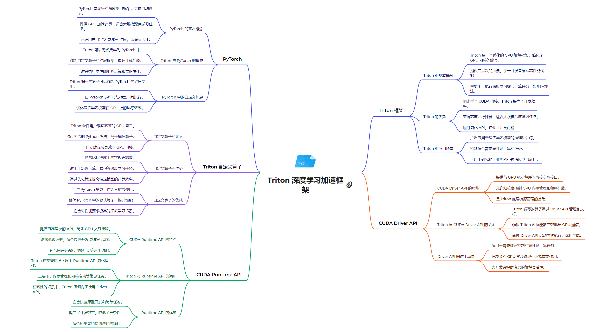

# 技术栈架构
**1. 系统软件层**
   - **NVIDIA GPU 驱动**：为 GPU 提供基本的系统级支持。
   - **CUDA Driver API**：低级 API，提供对 GPU 的直接控制。
     - 允许直接管理设备、内存分配和程序执行。
     - 适用于需要细粒度控制的高级应用。
     - 提供与 NVIDIA GPU 硬件交互的底层接口。

**2. 运行时环境层**
   - **CUDA Runtime API**：高级 API，简化了 GPU 编程，自动管理许多底层细节。
     - 提供更高级的抽象，简化了 GPU 的使用。
     - 自动处理上下文管理和程序加载等任务。
     - 更适合一般开发者使用，提供了更好的易用性。

**3. 编程模型和语言层**
   - **Triton DSL (领域特定语言)**：扩展了 Python，允许开发者编写在 GPU 上运行的并行程序。
     - 允许在 CPU 和 GPU 上混合编程。
     - 使用 Triton 特定语法定义 GPU 函数。
     - 通过方言（Dialect）提供优化的操作和功能。

**4. 计算库层**
   - **Triton 实现的算子库**：提供高性能的计算内核，专门针对各种深度学习操作进行优化。
     - 针对特定操作的高效实现，如矩阵运算。

**5. 框架模型层**
   - **PyTorch**：支持动态计算图的深度学习框架，通过 `torch.cuda` 模块提供 CUDA 功能。
     - 自动管理 GPU 内存，支持 GPU 和 CPU 之间的数据转移。
   - **TensorFlow**：支持静态和动态计算图的深度学习框架。
     - 通过 XLA 编译器优化 GPU 代码执行，提供高级 API 来简化 CUDA API 的使用。

## 关系解析

本图展示了Triton深度学习加速框架的核心组成和技术关系。Triton作为中心，与PyTorch、CUDA Runtime API和CUDA Driver API形成了紧密的技术生态。在PyTorch方面，Triton通过自定义算子、JIT编译和GPU内核融合等技术，显著提升了深度学习模型的性能。Triton自定义算子部分详细阐述了其如何优化内存访问、自动并行化以及与PyTorch的无缝集成。在底层，Triton通过CUDA Runtime API实现了高效的GPU编程，包括内存管理、设备操作和kernel启动等功能。同时，Triton还利用CUDA Driver API进行更底层的硬件控制和优化，如直接管理GPU上下文、内存分配和设备属性查询等。这种多层次的架构设计使Triton能够在保持高度灵活性的同时，提供卓越的性能优化，特别是在复杂的深度学习工作负载中。通过整合这些技术，Triton为开发者提供了一个强大的工具，能够充分利用GPU的计算能力，同时简化了高性能深度学习应用的开发过程。