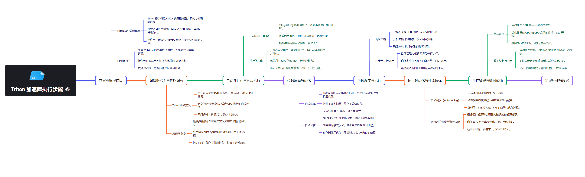

# Triton (NVIDIA)

Triton 是一个创新的开源项目，旨在简化 GPU 编程并提高计算性能。它提供了一种高级抽象，使开发者能够更容易地编写高效的 GPU 内核，而无需深入了解底层硬件细节。Triton 的设计理念是在保持高性能的同时，提供更好的可读性和可维护性。

Triton 引入了几个关键概念：

- Triton DSL（领域特定语言）：Triton 提供了一种特定于 GPU 编程的语言，它是 Python 的一个子集，增加了一些特定于并行计算的原语。

- 自动调优：Triton 能够自动选择最佳的执行参数，如线程块大小和内存访问模式。

- 多维张量操作: Triton 原生支持多维张量操作，使得复杂的数学运算变得简单。

- 动态形状支持:与传统 CUDA 编程不同，Triton 支持动态形状的输入，增加了代码的灵活性。

## Triton 的工作原理

Triton 的工作原理可以分为以下几个关键步骤：
 - 代码分析：Triton 编译器分析用 Triton DSL 编写的代码。
 - 中间表示生成：将代码转换为 MLIR（Multi-Level Intermediate Representation）。
 - 优化：在 MLIR 层面进行各种优化。
 - 代码生成：将优化后的 MLIR 转换为目标硬件的机器代码（如 PTX 或 AMDGPU ISA）。
 - 运行时执行：使用相应的 GPU API 加载和执行生成的代码。

## Triton 的编译流程

Triton 的编译流程是其核心优势之一，包括以下主要阶段：

1. **Triton DSL → MLIR**
   - 解析 Triton DSL 代码
   - 生成初始的 MLIR 表示

2. **MLIR 优化**
   - 执行特定于 Triton 的优化pass
   - 应用通用的 MLIR 优化

3. **MLIR → LLVM IR**
   - 将优化后的 MLIR 转换为 LLVM IR

4. **LLVM IR → 目标代码**
   - 使用 LLVM 后端生成目标特定的机器代码（如 PTX）

5. **JIT 编译**
   - 在运行时即时编译生成的代码

这个流程允许 Triton 在保持高级抽象的同时，生成高度优化的机器代码。

## 与 GPU Runtime 和 API 的对接

Triton 通过多层抽象与不同的 GPU 平台进行交互：

1. ***CUDA Driver API***
- 使用低级 API 如 `cuModuleLoad` 和 `cuLaunchKernel` 加载和执行 PTX 代码。

2. ***CUDA Runtime API***
- 利用更高级的 API 如 `cudaLaunchKernel` 简化内核启动过程。

3. ***ROCm 和 HIP API***
- 为 AMD GPU 提供支持，使用 HIP API 进行交互。

4. ***具体实现细节***
- 代码生成：生成适合目标平台的代码（PTX 或 AMDGPU ISA）。
- 运行时集成：创建封装底层 API 调用的 GPU Driver 对象。
- 内核加载与启动：使用相应的 API 加载编译好的 GPU 代码并启动内核。
- 结果获取与错误处理：同步执行结果，处理可能的错误。

## Triton 的抽象层

Triton 提供了多个抽象层，以简化跨平台 GPU 编程：

设备抽象
- 定义通用的 Device 接口，隐藏不同 GPU 架构的细节。

内存管理抽象
- 提供统一的内存分配和数据传输接口。

内核启动抽象
- 简化不同平台上的内核配置和启动过程。

编程模型抽象
- 提供统一的编程模型，使开发者能够编写可移植的代码。

## Triton 与 PyTorch 的集成

Triton 可以与 PyTorch 无缝集成，为深度学习模型提供性能优化：

自定义 CUDA 内核
- 使用 Triton 编写高效的自定义操作，集成到 PyTorch 模型中。

性能关键操作的优化
- 针对特定的计算密集型操作，如矩阵乘法，使用 Triton 实现高性能版本。

## Triton 的优势与局限性

### 优势
1. 简化 GPU 编程，提高开发效率。
2. 自动优化，减少手动调优的需求。
3. 良好的可移植性，支持多种 GPU 架构。
4. 与 PyTorch 等深度学习框架的无缝集成。

### 局限性
1. 学习曲线可能较陡，特别是对于不熟悉 GPU 编程的开发者。
2. 在某些极端情况下，手动优化的 CUDA 代码可能仍然更快。
3. 生态系统相对较新，社区支持和工具链还在发展中。