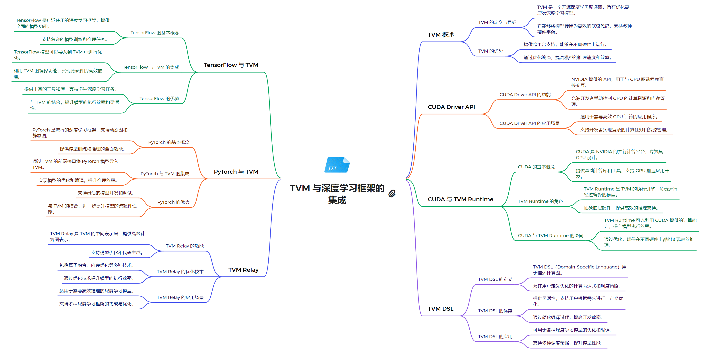

# 技术栈架构
**1. 系统软件层**
- CUDA Driver API：低级 API，提供对 NVIDIA GPU 的直接控制
  - 允许直接管理设备、内存分配和程序执行
  - 适用于需要细粒度控制的高级应用
  - 为 TVM 提供与 NVIDIA GPU 硬件交互的底层接口
- TVM Compiler Infrastructure：TVM 的编译器基础设施
  - 支持多种硬件后端，包括 CUDA 设备
  - 提供了一个灵活的编译流程，可针对不同硬件进行优化

**2. 运行时环境层**
- CUDA Runtime API：高级 API，简化了 GPU 编程，自动管理许多底层细节
  - 为 TVM 提供更高级的抽象，简化了 GPU 的使用
  - 自动处理上下文管理和程序加载等任务
- TVM Runtime：TVM 框架的运行时环境
  - 管理 TVM 编译的模型的执行
  - 支持多种硬件后端，包括 CUDA 设备
  - 与 CUDA Runtime API 集成，提供对 NVIDIA GPU 的支持

**3. 编程模型和语言层**
- CUDA C/C++：扩展了 C/C++ 语言，允许开发者编写在 GPU 上运行的并行程序
  - 为 TVM 提供了一种与 NVIDIA GPU 交互的编程方式
  - 可与 TVM DSL 结合使用，实现对 CUDA 设备的优化
- TVM DSL：TVM 提供的领域特定语言
  - 用于描述和优化机器学习模型
  - 提供了一种声明式的方式来表达计算
  - 可以针对 CUDA 设备等不同硬件后端进行优化

**4. 计算库层**
- cuBLAS：用于线性代数计算的库
  - 提供 GPU 加速的矩阵运算和 BLAS 功能
  - 可与 TVM Relay 集成，实现对 CUDA 设备的优化
- NCCL：用于多 GPU 通信的库
  - 支持多 GPU 之间的高效通信和数据交换
  - 可与 TVM 结合使用，支持分布式深度学习训练
- TVM Relay：TVM 的高级编程接口
  - 提供了一种声明式的方式来表达机器学习模型
  - 支持针对 CUDA 设备等不同硬件的优化编译

**5. 框架模型层**
- PyTorch with TVM：利用 TVM 优化 PyTorch 模型在 CUDA 设备上的性能
- TensorFlow with TVM：利用 TVM 优化 TensorFlow 模型在 CUDA 设备上的性能
- 其他基于 TVM 的深度学习框架集成
  - 通过 TVM 实现对 CUDA 设备的高性能优化

## 关系解析
TVM作为一个灵活的深度学习编译器框架，与PyTorch深度集成,通过自定义算子、JIT编译和GPU内核融合等技术,大幅提升了PyTorch模型在GPU上的执行效率。同时,TVM还利用CUDA Runtime API和CUDA Driver API,实现了对GPU硬件的精细控制和优化,包括内存管理、设备操作和内核启动等。这种多层次的架构设计使TVM能够充分发挥GPU的计算能力,同时为开发者提供了一个高度灵活和易用的工具。此外,TVM还提供了自己的运行时环境TVM Runtime,以及用于部署的TVM Relay和TVM DSL等组件,形成了一个完整的深度学习加速生态系统。通过整合这些技术,TVM为开发者带来了显著的性能提升,同时简化了高性能深度学习应用的开发过程。
