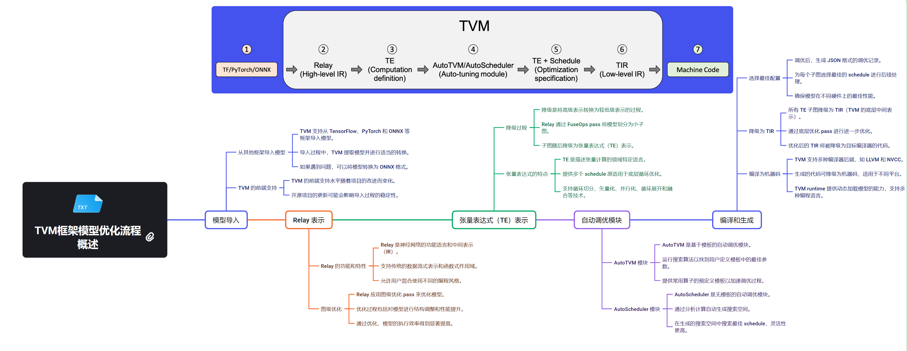

# Apache TVM (NVIDIA)

Apache TVM（Tensor Virtual Machine）是一个开源的深度学习编译器框架，旨在优化和部署机器学习模型到各种硬件平台，包括NVIDIA GPU。TVM在NVIDIA平台上的应用为开发者提供了强大的工具，以提高深度学习模型的性能和效率。

## Apache TVM 概述

1. **开源项目**：TVM是Apache软件基金会的顶级项目。

2. **端到端优化**：从高级模型描述到低级硬件指令的全栈优化。

3. **跨平台支持**：支持多种硬件后端，包括CPU、GPU、FPGA等。

4. **自动调优**：使用机器学习技术自动优化张量运算。

## TVM 在 NVIDIA 平台上的特点

1. **CUDA 支持**：TVM可以生成高效的CUDA代码，充分利用NVIDIA GPU的计算能力。

2. **性能优化**：通过自动调优和特定于NVIDIA架构的优化，提供卓越的性能。

3. **灵活性**：支持各种NVIDIA GPU架构，从消费级到数据中心级别的产品。

4. **与NVIDIA生态系统集成**：可以与NVIDIA的其他工具和库（如cuDNN）协同工作。

## TVM 核心概念

1. **计算图优化**：优化深度学习模型的计算图结构。

2. **调度原语**：提供细粒度的控制来指定计算的执行方式。

3. **自动调优**：使用机器学习来搜索最佳的优化策略。

4. **运行时**：轻量级运行时支持模型的高效执行。

### TVM 流程图

下图显示了 TVM 当前执行与优化过程：

### 使用 TVM 的工作流程

1. 导入预训练模型（如从PyTorch、TensorFlow等）
2. 使用TVM编译和优化模型
3. 在目标NVIDIA设备上进行自动调优
4. 导出优化后的模型
5. 在NVIDIA平台上部署和执行优化后的模型

### TVM 支持的硬件概述

下图显示了 TVM 当前支持的硬件后端：

## TVM vs 其他框架 on NVIDIA

1. **vs CUDA**：TVM生成CUDA代码，但提供了更高级的抽象和自动优化。

2. **vs TensorRT**：TVM提供更广泛的模型支持和更灵活的优化策略。

3. **vs PyTorch/TensorFlow**：TVM作为编译器，可以优化这些框架生成的模型。

## TVM 在 NVIDIA 平台上的优势

1. **性能提升**：通过自动调优和特定于NVIDIA的优化，显著提高模型性能。

2. **内存优化**：更有效地利用GPU内存，支持更大的模型。

3. **跨设备优化**：同一模型可以针对不同的NVIDIA GPU架构进行优化。

4. **自定义算子支持**：轻松集成和优化自定义CUDA算子。

随着深度学习模型变得越来越复杂，TVM在NVIDIA平台上的重要性可能会进一步增加。它为开发者提供了一种强大的工具，以充分利用NVIDIA硬件的潜力，同时保持跨平台的灵活性。

Apache TVM为NVIDIA平台提供了一个强大的深度学习优化和部署解决方案。它结合了高性能、灵活性和易用性，使开发者能够充分发挥NVIDIA GPU的计算能力。随着AI和深度学习技术的不断发展，TVM有望在NVIDIA生态系统中扮演越来越重要的角色，推动更高效、更智能的计算解决方案的发展。

