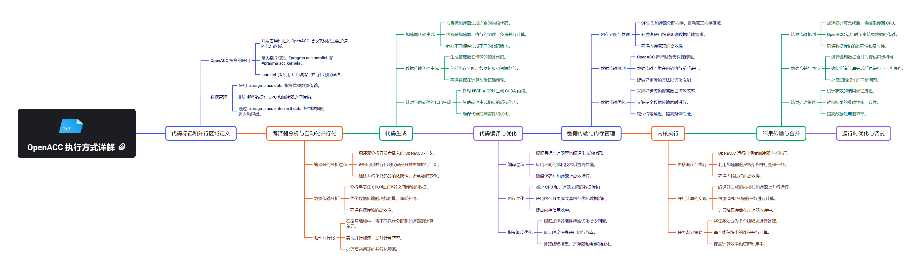

# OpenACC

OpenACC 是一种用于异构计算系统（如 GPU 加速器）的编程模型，它允许程序员通过指令简化代码的并行化和加速。它的技术栈可以分为几个层次，从底层硬件到高层的应用框架，包括系统软件层、运行时环境层、编程模型和语言层、计算库层和框架模型层。

OpenACC作为一种异构并行编程标准,通过指指令集的方式,为开发者提供了一种简单高效的方法来利用GPU等加速器进行并行计算。从图中可以看到,OpenACC与CUDA Runtime API和CUDA Driver API存在密切联系,利用这些底层API实现了对GPU硬件的精细控制和优化,包括内存管理、设备操作和内核启动等。同时,OpenACC还与编程语言和编译器技术深度集成,如支持C/C++和Fortran,并与OpenMP、OpenCL等其他并行编程模型进行了融合,形成了一个丰富的异构计算生态系统。这种多层次的架构设计使OpenACC能够充分发挥GPU的计算能力,为开发者带来显著的性能提升,同时简化了高性能应用的开发过程。
