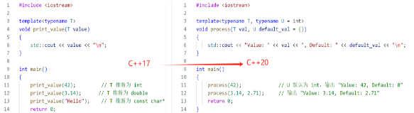
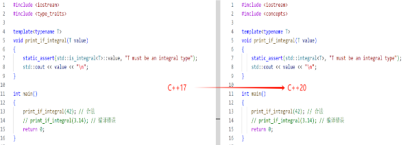

# **第四章 函数**

C++中的函数分为很多种，包括内置函数、标准库函数、用户自定义函数、成员函数、虚函数、函数模板和Lambda表达式。

## **4.1 内置函数**

我们所说的内置函数其实就是C++编译器自带的函数，它不需要用户来编写，取之即用。常见的内置函数包括数学函数、字符串函数、类型转换函数等。例如，sin()函数用于计算正弦值，strlen()函数用于计算字符串的长度等。这些函数都属于C++的标准库函数，因此在程序中无需显式包含相应的头文件即可直接使用。
```
#include <iostream>
#include <cmath>
using namespace std;
int main()
{
double number, squareRoot;
cout << "输入一个数字: ";
cin >> number; // sqrt()是一个用于计算平方根的库函数*
squareRoot = sqrt(number);
cout << "数字 " << number << " 的平方根= " << squareRoot << "\n";
return 0;
}
```
输出结果为：


在上面的示例中，调用sqrt()库函数来计算数字9的平方根。

上述程序中的注意代码#include <cmath>。 在这里cmath是头文件。sqrt()函数定义在cmath头文件中。当你使用#include <cmath>将文件cmath的内容包含到这个程序中时，您可以在这个程序中使用cmath中定义的所有函数。此外需要注意的是，每个有效的C ++程序至少具有一个函数，即main()函数。

## **4.2 标准库函数**

标准库函数是C++标准库提供的一组函数，他们可以实现各种常见的操作，包括输入输出、容器操作、算法操作等。标准库函数通常定义在各自的头文件中，例如<iostream>头文件中定义了输入输出函数，<vector>头文件中定义了向量容器类，<algorithm>头文件中定义了各种算法函数等。程序员在开发时可以很方便的调用，涵盖了输入输出、字符串处理、数学运算、容器管理、算法操作等多个方面。

### **4.2.1 输入输出库：**

如<iostream>中的std::cout和std::cin，用于控制台的输入输出操作。

### **4.2.2 字符串处理库：**

如<string>中的std::string类，各种字符串相关的操作（拼接、比较、查找等）。

### **4.2.3 容器库：**

如<vector>、<list>、<map>等提供不同类型的数据结构，可以存储和管理集合数据。

### **4.2.4 算法库：**

如<algorithm>中的各种算法（排序、查找、变换等），它们是针对容器的通用算法。

### **4.2.5 数学库：**

如<cmath>提供的数学函数，比如std::sqrt()（计算平方根）、std::pow()（计算幂）等。

### **4.2.6 日期和时间库：**

如<ctime>中的函数，用于处理时间和日期，比如std::time()、std::difftime()等。

### **4.2.7 线程和并发库（C++11及以后）：**

如<thread>用于多线程编程，<mutex>用于线程同步等。

### **4.2.8 文件操作库：**

如<fstream>用于文件的读写操作，包括std::ifstream（输入文件流）和std::ofstream（输出文件流）。

### **4.2.9 使用标准库函数的优势**

- 提高生产力：标准库函数可以节省开发时间，避免重复造轮子。
- 可靠性：它们经过广泛使用和测试，通常比自己实现的功能更稳健。
- 可移植性：C++标准库在不同的编译器和操作系统上具有良好的兼容性，可以让你的代码在多种平台上运行。
- 性能优化：许多标准库函数都被优化，可以提供更好的性能和效率。

## **4.3 用户自定义函数**

用户自定义函数是程序员自己定义的函数，可以根据实际需求定义不同类型的函数来实现不同的功能。用户自定义函数的基本结构包括函数头和函数体，其中函数头包括函数名、参数列表和返回值类型，函数体包括函数的具体实现。例如，下面是一个简单的用户自定义函数示例：
```
 #include <iostream>
 using namespace std;
 int add(int a, int b)
 {
return a + b;
 }
 int main()
 {
int sum = add(1, 2);  *// 调用add()函数计算1+2的和*
cout << sum << endl;  *// 输出3*
return 0;
 }
```
在上面的示例中，add();函数是一个用户自定义函数，它接受两个整数参数并返回他们的和。在main()函数中，我们调用了add()函数来计算1和2的和，并将结果存储在变量sum中。

## **4.4 成员函数**

成员函数就是定义在类中的函数，他可以访问类的私有成员和保护成员。成员函数的调用方式包括通过对象和通过指针。通过对象调用成员函数时，可以使用点运算符.来访问成员函数；通过指针调用成员函数时，可以使用箭头运算符 “->”来访问成员函数。
```
#include <iostream>  
#include <cmath> // 包含cmath库用于数学常量和函数  

class Circle {  
public:  
    // 构造函数  
    Circle(int r) : radius(r) {}  

    // 计算面积的成员函数  
    double area() {  
        return M_PI * radius * radius; // 使用M_PI常量计算圆的面积  
    }  

    // 访问器函数，用于设置半径  
    void setRadius(int r) {  
        radius = r;  
    }  

private:  
    int radius; // 半径  
};  

int main() {  
    Circle circle(0); // 创建一个Circle对象，同时初始化半径为0  
    circle.setRadius(5); // 设置半径为5  
    double area = circle.area(); // 通过对象调用area()函数计算面积  
    std::cout << area << std::endl; // 输出78.5398...  
    return 0;  
}
```
代码说明：

类定义：定义了一个 Circle 类，包含一个私有成员变量 radius 以及一个计算面积的成员函数 area()。

构造函数：Circle(int r)，用于初始化 radius。

成员函数：area() 计算圆的面积，使用了 M\_PI 来表示 π（圆周率），需要包含 <cmath> 头文件。

访问函数：setRadius(int r) 允许设定半径。

主函数：在 main() 中，创建一个 Circle 对象，调用设置半径的函数，然后计算并输出圆的面积。

## **4.5 虚函数**

虚函数是一种在基类中声明、在派生类中实现的函数，用于实现多态。虚函数允许派生类重写基类的函数，从而实现不同的功能。当通过基类指针或引用调用虚函数时，实际调用的是派生类中的函数。
```
class Shape {  
public:  
    virtual int area() {  
        return 0;  
    }  
};  

class Rectangle : public Shape {  
public:  
    Rectangle(int w, int h) : width(w), height(h) {}  

    int area() {  
        return width * height;  
    }  

private:  
    int width;  
    int height;  
};  

int main() {  
    Shape *shape = new Rectangle(5, 4);  
    int area = shape->area();  // 调用Rectangle中的area()函数计算面积  
    cout << area << endl;  // 输出20  
    delete shape;  
    return 0;  
}
```
在上述示例中，Shape类定义了一个虚函数area()，并将其声明为虚函数，以便在派生类中重写。Rectangle类是Shape类的派生类，它重写了area()函数以计算矩形的面积。在main()函数中，我们通过Shape指针创建了一个Rectangle对象，并调用了area()函数来计算矩形的面积。

## **4.6 函数模板**

函数模板是一种通用的函数定义，可以用来创建多个具有相似功能的函数。函数模板定义时使用类型参数，可以在函数调用时指定具体的类型，从而创建对应的函数。函数模板可以用于任何类型，包括内置类型、用户自定义类型和标准库类型。
```
template<typename T>
T max(T a, T b)
{
  return a > b ? a : b;
}
 int main()
 {
int i = max(1, 2);
double d = max(3.14, 2.71);
cout << i << endl;  // 输出2
cout << d << endl;  // 输出3.14
return 0;
 }
```
上面的示例代码中，max函数是一个函数模板，它用于返回两个参数中的最大值。函数模板的类型参数是T，可以用于任何类型。在main()函数中，我们调用了两次max函数，一次使用整数参数，一次使用双精度浮点数参数。由于编译器能够自动推断出函数模板的类型参数，因此我们不需要显式地指定类型参数。

那么C++中的函数究竟是什么呢？对于我们初学者来讲可能显得不太容易理解，我们可以把这多种类别的函数看作是一个运作的餐厅。接下来我们就把函数中包含的内容比喻为餐厅中的各个组成。

## **4.7 Lambda表达式**
Lambda 表达式就像一个快速制作小点心的秘方。在 C++ 中，Lambda 允许你定义一个匿名函数（没有名字的函数），而且它可以方便地捕获外部变量，用于计算或处理数据。这样你就能在需要时快速调用这些小点心的制作流程，而不需要事先准备好所有的工具和材料。它的一般语法如下所示：
```
[capture list](parameter list) -> return type

{

function body

}
```
下面给出一个Lambda表达式示例：
```
#include <algorithm>  
#include <iostream>  
#include <vector>  

using namespace std;  

int main() {  
    vector<int> v = {1, 2, 3, 4, 5};  
    int sum = 0;  
    for_each(v.begin(), v.end(), [&sum](intx) { sum += x; });  
    cout << sum << endl;  // 输出15  
    return 0;  
}
```
上面的示例代码中，我们使用STL算法for\_each遍历了一个整数向量，并使用Lambda表达式计算向量中所有整数的和。Lambda表达式的参数列表包含了一个int类型的参数x，function body部分使用了这个参数计算和，并将结果累加到sum变量中。[&sum]部分用于将sum变量作为Lambda表达式的外部变量进行捕获。由于Lambda表达式的返回值类型可以被推断出来，因此我们没有指定返回值类型。

## **4.8 趣味理解**

如果你感觉还是对上面讲解的函数知识理解不够深刻，下面的例子或许会对你有帮助：

（1）函数作为“菜品”：

在一个餐厅中，每道菜可以被看作是一个函数。顾客（调用者）通过点菜（调用函数）来请求特定的菜品（功能）。

菜品名称：每道菜都有一个名称，类似于函数名，便于顾客识别和点餐。

配料（参数）：菜品的原材料就是函数的参数。当顾客点餐时，可以根据个人口味（参数）请求不同的配料，比如“加辣”或“少盐”。

上菜（返回值）：餐厅最后把菜品呈上来的过程就像函数返回结果，顾客期待最终的美食（返回值）。

（2） Lambda 表达式作为“临时供餐”

有时餐厅会根据当日的食材推出临时供餐（例如，今日鲜鱼），它相当于一个临时的、按需提供的菜品。

灵活性：顾客可以根据当天的市场供应（条件）选择是否点这道特餐，这类似于使用 Lambda 表达式来快速定义一些简单的功能而无需事先定义函数。

（3） 函数模板作为“多样化菜谱”

想象餐厅的菜单上有一类“自定义汉堡”，顾客可以选择不同种类的肉（牛肉、鸡肉、素食等），这就像函数模板。

适应性：这种汉堡可以根据顾客的选择（输入类型）灵活变化，体现了函数模板的特性，即同一函数可以处理不同类型的输入。

（4） 概念（Concepts）作为“厨师标准”

餐厅的厨师会有一套标准，在选购食材之前会检查材料（比如新鲜程度、菜的质量等），这就是我们说的概念的作用。

规范性：只有符合相应标准的食材才能被用来制作菜品，这提升了菜品的质量，类似于在C++20中使用概念来确保传入函数的参数符合预期类型和条件。

（5） 范围（Ranges）作为“配菜组合”

在餐厅里有些主菜会配有自动组合的配菜，比如沙拉和薯条，这可以比作C++20中的范围（Ranges）。

自动配合：通过简单的点餐，主菜自动与特定配菜搭配，这类似于使用范围可以简化对容器的操作。

（6） 协程作为“并行厨房”

大型餐厅的厨房可能会同时忙于准备多道菜，每个厨师在准备不同的菜，这类似于C++20中的协程。

高效运作：厨师在等待某个配料的同时，可以继续完成其他菜品的准备。这种并行处理让餐厅的运作更加高效，类似于使用协程处理异步任务。

## **4.9 C++20函数新变化**

除此之外，需要值得注意的是C++20中函数的内容做出了一些新的变化，比如C++20中放宽了constexpr函数使用更多特性、引入了consteval关键字、改进模板参数，提供更灵活的模板参数定义，支持推断模板参数、引入concepts等等，下面我们一起来学习这些内容：

### **4.9.1 constexpr 函数的扩展**

在 C++17 中，constexpr 函数有一定的限制，例如不能使用动态内存分配。而在 C++20 中，这些限制被放宽，允许 constexpr 函数使用更多特性。


### **4.9.2 consteval 函数的引入**

C++20 引入了 consteval 关键字，表示函数必须在编译时求值。
```
consteval int square(int x)
{
return x \* x;
}
int main()
{
constexpr int result = square(5); *// 合法*
*// int val = square(rand()); // 不合法，因为 rand() 在运行时*
std::cout << "Square of 5 is: " << result << "\n";
return 0;
}
```
### **4.9.3 模板参数的改进**

C++20支持推断模板参数，使得模板参数定义更加灵活。



### **4.9.4 使用 Ranges 库**

C++20使用 Ranges 库，使得处理集合的操作更加简洁和高效。


### **4.9.5 Concepts 的引入**

C++20 引入了 Concepts，允许在模板中定义约束条件，使得代码的可读性和安全性提高。


