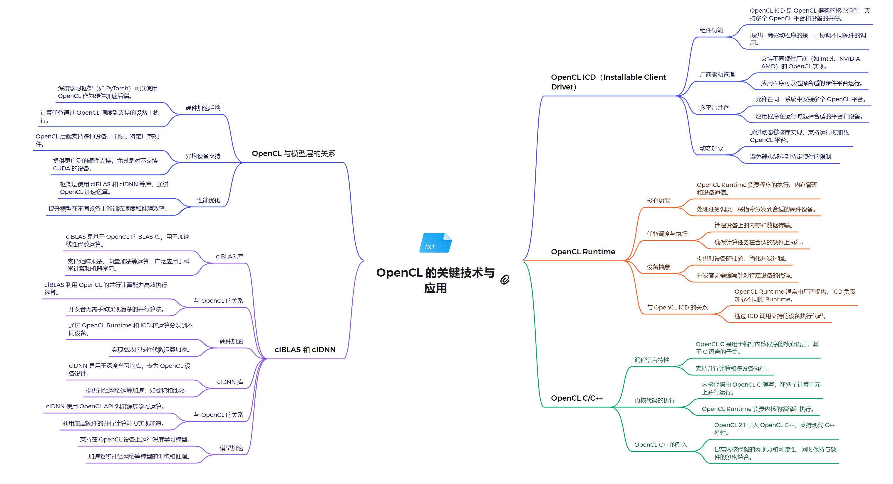

# 技术栈架构

**1. 系统软件层**
- 设备驱动程序：
  - 为特定硬件（如 GPU、CPU、FPGA）提供底层支持
  - 实现 OpenCL 规范定义的功能
  - 处理设备特定的优化和功能
- OpenCL ICD (Installable Client Driver)：
  - 提供对多个 OpenCL 实现的支持
  - 允许在同一系统上共存多个 OpenCL 供应商的实现
  - 管理不同 OpenCL 实现之间的切换和交互

**2. 运行时环境层**
- OpenCL Runtime：
  - 提供 OpenCL API 的实现
  - 管理设备、上下文、命令队列和内存对象
  - 处理内核编译和执行
  - 协调主机和设备之间的数据传输
  - 支持事件和同步机制

**3. 编程模型和语言层**
- OpenCL C/C++：
  - 基于 C99 标准的编程语言，用于编写 OpenCL 内核
  - 支持向量数据类型和内置函数
  - 提供内存模型和同步原语
  - 允许编写可在各种设备上执行的并行代码
- OpenCL C++ 包装器：
  - 为 C++ 程序员提供面向对象的 API
  - 简化内存管理和错误处理
  - 提供更现代的 C++ 接口

**4. 计算库层**
- clBLAS：
  - OpenCL 实现的基本线性代数子程序（BLAS）库
  - 提供矩阵和向量操作的高性能实现
  - 支持多种设备类型
- clDNN (Compute Library for Deep Neural Networks)：
  - 用于深度学习的 OpenCL 加速库
  - 提供常见的神经网络层和操作
  - 优化for各种硬件平台

**5. 框架模型层**
- TensorFlow with OpenCL：
  - 通过 ComputeCpp 或其他 OpenCL 后端支持 OpenCL
  - 允许在支持 OpenCL 的设备上运行 TensorFlow 模型
- Caffe with OpenCL：
  - 使用 OpenCL 后端的 Caffe 深度学习框架
  - 支持在各种 OpenCL 设备上训练和推理
- OpenCV with OpenCL：
  - 计算机视觉库，集成了 OpenCL 支持
  - 利用 OpenCL 加速图像和视频处理操作
- ArrayFire：
  - 高性能计算库，支持 OpenCL 后端
  - 提供线性代数、信号处理和计算机视觉功能
  - 简化了 OpenCL 编程，提供高级抽象

### 关系解析
OpenCL作为一个开放的异构计算框架，在模型层面支持硬件加速、跨设备兼容性和性能优化。它的核心组件包括OpenCL ICD、OpenCL Runtime和OpenCL C/C++语言。

OpenCL ICD (Installable Client Driver) 是一个关键组件，它允许多个OpenCL实现共存，提供了一个统一的接口来管理不同厂商的OpenCL实现。这种设计极大地增强了OpenCL的灵活性和可扩展性，使得开发者可以在不同的硬件平台上无缝切换。OpenCL Runtime负责管理设备、内存和任务调度等核心功能。它处理内存分配、数据传输、内核编译和执行等底层操作，为开发者提供了一个抽象层，简化了异构计算的复杂性。Runtime与ICD紧密协作，确保了OpenCL应用程序的高效运行。

在编程语言方面，OpenCL C/C++扩展了标准C/C++，增加了并行计算所需的特性。它支持向量数据类型、内存模型和并行编程构造，使得开发者能够充分利用异构计算资源。OpenCL 2.1引入了SPIR-V中间表示，进一步增强了跨平台兼容性和编译优化。clBLAS和clDNN是基于OpenCL的重要库，分别针对基础线性代数子程序和深度神经网络计算进行了优化。这些库充分利用了OpenCL的并行计算能力，为科学计算和机器学习应用提供了高性能解决方案。OpenCL与其他技术的集成也是其强大之处。例如，深度学习框架如PyTorch可以利用OpenCL进行GPU加速，而OpenCL本身也支持与CUDA等其他并行计算框架的互操作。

总的来说，OpenCL通过其灵活的架构、强大的运行时系统和丰富的编程接口，为异构计算提供了一个全面的解决方案。它不仅支持跨平台开发，还能够充分发挥各种计算设备的性能潜力，在高性能计算、图像处理、科学模拟等领域发挥着重要作用。OpenCL的生态系统持续发展，不断适应新的硬件架构和计算需求，为未来的并行计算和异构系统开发铺平了道路。