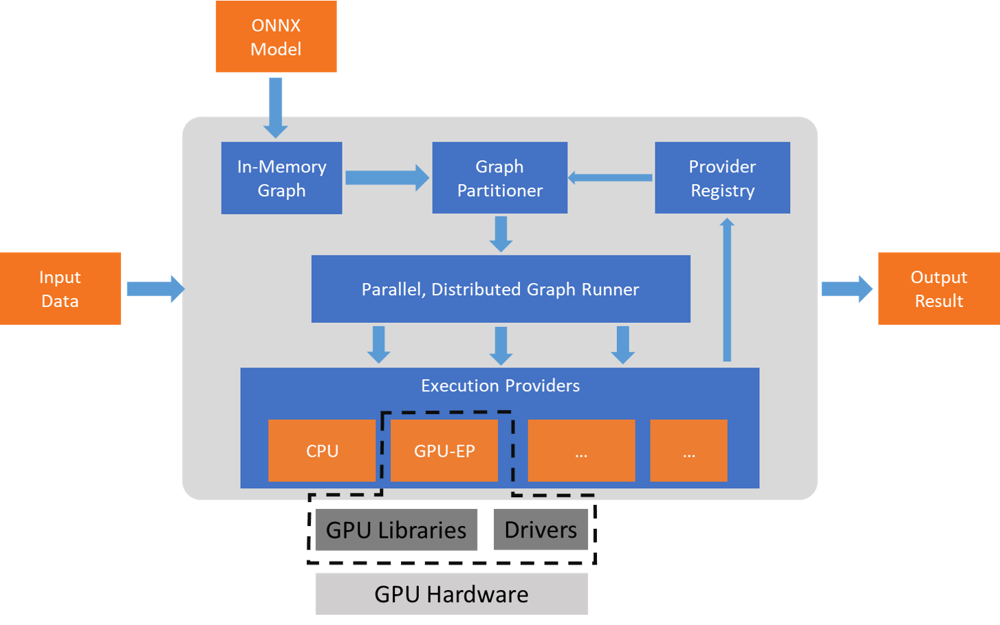

# ONNX (AMD)

ONNX（Open Neural Network Exchange）是一个开源的深度学习模型交换格式，旨在促进不同深度学习框架之间的互操作性。通过ONNX，模型可以在不同的框架之间进行转换和共享，例如从PyTorch导出为ONNX格式，再在TensorFlow或其他支持ONNX的框架中加载和运行。ONNX定义了一个标准的计算图表示方法以及相关的操作符集，使得开发者可以在多个平台上运行同一个模型。

### ONNX的核心功能：
- **跨框架互操作性**：支持多种主流深度学习框架（如PyTorch、TensorFlow、MXNet等）之间的模型交换。
- **硬件加速支持**：通过ONNX Runtime，能够在多种硬件平台（如英伟达GPU、AMD GPU、CPU等）上高效运行。
- **标准化操作符**：定义了一个通用的操作符集，确保不同框架之间的模型在语义上的一致性。
- **广泛的生态系统**：ONNX已被许多深度学习框架和硬件平台支持，形成了一个跨平台、跨框架的通用格式。

ONNX为开发者提供了更大的灵活性，使得模型可以在开发环境和生产环境中无缝迁移，极大提高了模型的部署效率。

