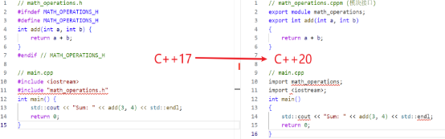

# **第六章 模块和名称空间**

对于大型程序，虽然可以把所有代码塞到一个源文件中，但会造成原文件过大，修改、编译困难的问题。如果把彼此相关的源代码组织成为可组合起来的逻辑单元，放到各自的文件中，那么管理大型代码库就容易多了。C++20中，模块是首选的组合单元。

并且随着代码库增长越多，或者依赖于越多的第三方库，就越有可能存在相同名称的两个函数、全局变量、类型等。在C++中，推荐的方法是让不同的子系统在独立的名称空间中声明自己的函数，变量等名称。

## **6.1模块**

模块是一个封装的代码单元，可以包含函数、类、变量等。模块通过接口文件定义其公共 API，其他代码可以通过导入模块来使用这些 API。

在C++20之前，使用头文件（#include）进行代码分割，容易出现头文件重复包含和编译速度慢等问题，尤其在大型项目中尤为明显。C++20引入模块后解决了很多问题。模块只用编译一次，不用像头文件一样需要反复编译，大大缩短了编译时间。模块中的某些修改不会触发该模块用户的重新编译。模块不受任何外部定义的宏的影响，并且在模块内部定义的任何宏对模块外部的任何代码都不可见。

模块的定义通常分为两个部分：模块接口和模块实现。

### **6.1.1模块接口：**

模块需要显式地声明要导出的内容。使用export关键字从模块中导出实体，没有从模块中导出的内容，只在该模块中可见。所有导出实体的集合叫做接口。

模块接口文件，是为模块提供功能定义的接口。模块接口文件通常以.cppm为扩展名。模块接口以声明开头，声明该文件正在定义一个具有特定名称的模块。
```
 // math\_operations.cppm (模块接口)
 export module math\_operations;
 export int add(int a, int b)
 {
   return a + b;
 }
 export int subtract(int a, int b)
 {
    return a - b;
 }
```
### **6.1.2模块实现：**

一个模块被分为一个模块接口文件和一个或多个模块实现文件。模块实现文件通常以.cpp为扩展名。关于模块的实现用户可以自主选择是放在模块接口文件中还是模块实现文件中。

模块实现文件中同样包含一个已命名模块的声明，用于指定实现所针对的模块，但不用加export关键字。
```
 // math\_operations.cpp (模块实现)*
 module math\_operations; *// 不需要 export*
 int multiply(int a, int b)
 {
return a \* b;
 }
 int divide(int a, int b)
 {
return a / b;
 }
```
### **6.1.3导入模块：**

如果想使用某个模块的功能，就需要导入这个模块。导入模块之后，可以直接使用模块定义的函数和类。通过import可以声明导入的模块，例如：
```
import <iostream>
 *// main.cpp
 #include math\_operations;
 #include <iostream>;
 int main()
 {
std::cout << "Sum: " << add(3, 4) << std::endl;
std::cout << "Difference: " << subtract(10, 5) << std::endl;
// multiply 和 divide 不可用，因为它们没有被 export
return 0;
 }
```
注意：C++20中某些可用的头文件不能保证是可导入的，为了安全，还是使用#include替换import声明。#include指令应该放在全局模块片段，必须出现在任何命名模块声明之前，以匿名模块的声明开始。

### **6.1.4模块的分割**

模块可以分为多个文件，使用import语句来引用其他模块。
```
 // math\_operations.cppm (模块接口)*
 export module math\_operations;
 export int add(int a, int b);
 export int subtract(int a, int b);
 // math\_operations\_impl.cpp (模块实现)*
 module math\_operations;
 int add(int a, int b)
 {
return a + b;
 }
 int subtract(int a, int b)
 {
return a - b;
 }
```
### **6.1.5预编译模块**

C++20还引入了预编译模块的概念，可以将模块编译成二进制格式，以加快后续的编译过程。

6\.1.6模块的优势

（1）减少编译时间：模块通过一次编译即可生成中间代码，后续只需引用模块的接口，而不必去重新解析整个头文件。

（2）避免命名冲突：模块使用独立的命名空间，避免了头文件中常见的命名冲突问题。

（3）简化依赖管理：使用模块可以减少编译器需要处理的依赖关系，从而提高编译效率。

6\.1.7模块与头文件的对比

下面的示例展示了如何使用模块与传统的头文件机制进行对比。

在这个例子中，`math\_operations.h` 是一个常规的头文件，其中定义了一个 `add` 函数。每次编译 `main.cpp` 时，编译器都要处理这个头文件。

对比说明：

① 模块接口文件 (.cppm): 在使用模块时，我们创建一个 `.cppm` 文件来定义模块接口。在文件中使用 `export` 关键字，表明哪些函数是外部可见的。

② 导入模块: 使用 import语句来引入模块，而不是使用 #include。这样做可以显著减少编译器处理的符号表。

③ 编译与链接: 使用模块的代码在编译时会生成一个一次性编译的模块文件，未来的编译会快速引用这个中间代码，而不需重新解析整个模块。

## **6.2名称空间**

在C++中，名称可以是变量、函数、结构、枚举、类以及类和结构的成员。当随着项目的增大，名称相互冲突的可能性也将增加。使用多个厂商的类库时，可能导致名称冲突。例如，两个库可能都定义了名为 List、Tree 和 Node 的类，但定义的方式不兼容。用户可能希望使用这个个库的 List 类，而使用另一个库的Tree类。这种冲突被称为名称冲突问题。

名称空间用来处理不同代码段的名称冲突问题。库函数的名称无法改变，而改变自己的函数名称有非常痛苦。则可以使用名称空间，从而制定定义名称的环境。

### **6.2.1 名称空间的定义声明**

定义命名空间,需要使用到namespace关键字,后面跟命名空间的名字,然后接一对{}即可,{}中即为命名空间的成员。比如：
```
 #include <iostream>;
 namespace mycode
 {
void foo()
{
 std::cout << "foo() called in the mycode namespace" << std::endl;
}
 }
```
foo()函数放在mycode名称空间中，与第三方库中的同名函数区分开。如果想调用名称空间的foo()，需使用：：在函数名之前给出名称空间。：：为作用域解析运算符：
```
Mycode::foo();
```
或者helloworld中
```
std::cout<<“hello world!”<<std::endl;
```
### **6.2.2名称空间的使用**

同一名称空间的代码可以调用该名称空间的其他代码，而不需要显示说明该名称空间。用using指令避免预先指明名称空间。这个指令会通知编译器，后面的代码将使用指定名称空间的名称。
```
 using namespace mycode;
 int main()
 {
mycode::foo(); // Calls the "foo" function in the "mycode" namespace
foo();   // implies mycode::foo();*
 }
```
一个源文件中可包含多条 using 指令，但注意不要过度使用。

可以在Hello World 程序中加入名称空间，cout和endl实际上是定义在std名称空间中的名称。可使用using 指令重新编写Hello World程序，如下所示。
```
 #include <iostream>;
 using namespace std;
 int main()
 {
cout <<" Hello, World!" << endl;
 }
```
初次之外，可以使用using 指令引用名称空间内的特定项。如：using std::cout，后面的代码可使用cout 而不需要预先指明这个名称空间，但仍然需要显式说明std名称空间中的其他项。
```
using std::cout;

cout << "Hello, World!" << std::endl;
```
警告:全局作用域应放在较小的作用域，例如名称空间或类作用域中，甚至是在文件头部。

### **6.2.3内联名称空间**

C++11标准引入了内联命名空间的概念，它的语法就是在namespace前面加个inline关键字，如：
```
 inline namespace MyCode
 {
// source code*
 }
```
内联命名空间中的名字可以被上层命名空间直接使用，也就是说，我们无需在内联空间的名字前添加该命名空间的名字为前缀，通过上层命名空间的名字就可以直接访问他，如下：
```
namespace MyCode {  
    namespace V1 {  
        void foo() {}  
    }  

    inline namespace V2 {  
        void foo() {}  
    }  
}  

int main() {  
    MyCode::V1::foo();  
    MyCode::foo();  
}
```
调用Lib\_V1命名空间的foo函数，前面需要加上Lib\_V1的前缀，而访问Lib\_V2命名空间的foo函数则不需要。内联命名空间的作用之一是，当我们有一个模块，这个模块提供了一组接口供外部调用，有时我们需要升级接口以提供不同的功能，而新接口不与老接口兼容，我们希望新写的代码将调用我们提供的新接口，但是又不希望影响老的代码，所以老的接口需要保留。这时就可以使用内联命名空间的办法来解决，就如上面的例子中，我们把新接口放在命名空间Lib\_V2中，并定义为内联的命名空间，使用者只需通过MyCode前缀就可以访问到它们，如：MyCode::foo()，老的代码的逻辑不需要改动，只需将原来调用接口的地方加个前缀，如MyCode::Lib\_V1::foo()。

内联命名空间在第一次定义时必须加上inline关键字，之后再重新打开命名空间时可以加上inline关键字，也可以不加上。

### **6.2.4 嵌套名称空间**

嵌套命名空间在C++98中已有，如上节中的代码就定义了一个嵌套命名空间，但它的写法比较冗余，如果要定义多重的嵌套则显得更加冗余，特别是在代码缩进时，比如：
```
 namespace A
 {
namespace B
{
namespace C
{
     void foo() {}
}
}
 }
```
访问foo函数时通过A::B::C::foo()来调用，如果定义命名空间时也可以像这样的话代码将会变得更加简洁，因此C++17标准中引入了更简洁的嵌套命名空间的定义方式，如：
```
 namespace A::B::C
 {
void foo() {}
 }
```
这样代码就显得简洁得多，它也更符合我们的使用习惯。当遗憾的是，在C++17中没有解决在嵌套命名空间中定义内联命名空间，也就是说在上面的嵌套命名空间中没法加入inline关键字，使得子命名空间成为内联的，直到C++20标准中完善了这个功能。
```
namespace A::B::inline C {  
    void foo() {}  
}  

// 它等同于如下定义：  
namespace A::B {  
    inline namespace C {  
        void foo() {}  
    }  
}  

// 调用foo函数：  
A::B::foo();  

// 或者也可以这样定义：  
namespace A::inline B::C {  
    void foo() {}  
}  

// 它等同于如下定义：  
namespace A {  
    inline namespace B {  
        namespace C {  
            void foo() {}  
        }  
    }  
}
```
### **6.2.5 名称空间的优势**

① 防止名称冲突：当多个开发者或第三方库使用相同的类名、函数名或其他标识符时，可能会发生名称冲突。命名空间可以确保每个标识符都有其独特的全限定名。

② 更好的组织结构：命名空间有助于将代码逻辑分组，使其更易于管理和理解。

③ 提高可读性和可维护性：通过明确地定义代码所属的范围，命名空间可以使代码更加清晰，从而提高可读性和可维护性。

# <a name="_toc177736253"></a>**第七章：C++20 的协程与并发**

