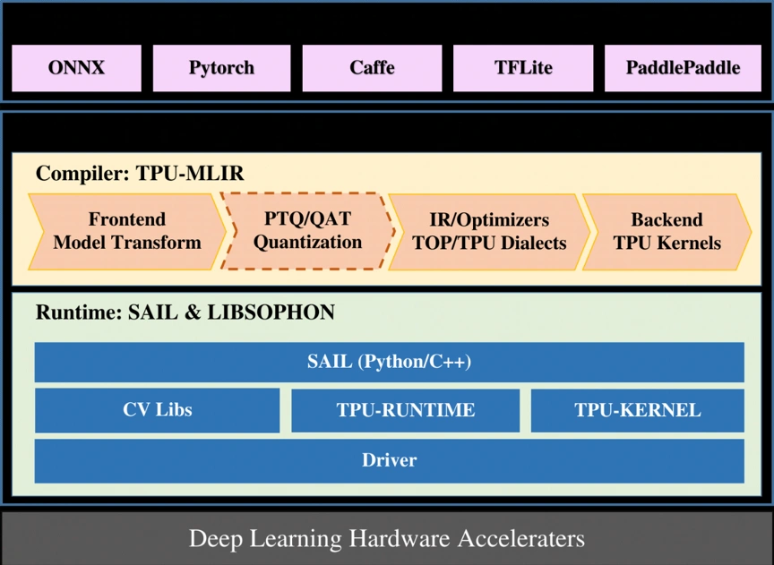

# 技术栈架构

**1. 系统软件层**
   - SOPHON设备驱动：为TPU提供基本的系统级支持（类似于NVIDIA GPU驱动）
   - TPU-Kernel：基于SOPHON BM1684、BM1684X底层原子操作接口的底层编程接口（类似于CUDA Driver API）
     - 需要用户熟悉设备硬件架构和指令集
     - 提供与SOPHON TPU硬件交互的底层接口
     - 适用于需要细粒度控制的高级应用

**2. 运行时环境层**
   - BMLib：提供基础接口，包括设备Handle管理、内存管理、数据搬运、API发送和同步等（类似于CUDA Runtime API的部分功能）
   - BMRuntime：用于模型推理的运行时库（提供了类似CUDA Runtime API的高级抽象）
     - 简化了TPU的使用
     - 自动处理许多底层细节

**3. 编程模型和语言层**
   - BMLang：基于C++的面向SOPHON智能视觉深度学习处理器的高级编程库（类似于CUDA C/C++的角色）
     - 使用张量数据(bmlang::Tensor)和计算操作(bmlang::Operator)编写代码
     - 通过bmlang::compile或bmlang::compile_with_check生成可运行的BModel
     - 支持在TPU和CPU上混合编程
   - TPU-MLIR：支持将PyTorch、ONNX等框架模型转换为TOP MLIR，然后lowering到TPU MLIR，最后部署到BModel
   - TPU-NNTC：支持多种框架模型的转换和量化，生成可在TPU上运行的BModel
**4. 计算库层**
   - BMCV：提供张量运算及图像处理功能，如色彩空间转换、尺度变换、仿射变换等（类似于cuBLAS和其他CUDA专用算子库）
   - SOPHON-MW：支持SOPHON设备硬件加速的多媒体库，包括SOPHON-OpenCV和SOPHON-FFmpeg

**5. 框架模型层**
   - SAIL (Sophon Artificial Intelligence Library)：支持Python/C++的高级接口（类似于PyTorch和TensorFlow对CUDA的支持）
     - 对BMRuntime、BMCV、sophon-mw等底层库接口的封装
     - 简化了TPU编程，提供更高级的抽象
   - PyTorch、TensorFlow等框架：通过TPU-MLIR或TPU-NNTC工具链支持这些框架模型的转换和优化，以在TPU上运行

总的来说，算能TPU的架构在很多方面与CUDA相似，都提供了从底层硬件接口到高级框架支持的完整堆栈。主要区别在于TPU更专注于深度学习处理器的优化，并提供了专门的模型编译和优化工具。

图片展示了算能TPU的软件栈架构，从顶层的深度学习框架到底层的硬件加速器，在图片中，SAIL位于中间层，作为运行时环境的一部分。而在AI技术栈中，SAIL被放在较高的"框架模型层"。这种差异反映了SAIL的多功能性：
   - 作为运行时环境：SAIL提供了对底层硬件和库的封装，使其能够高效地执行编译后的模型。
   - 作为高级接口：SAIL也提供了Python/C++的高级API，使开发者能够更容易地使用TPU的功能。

这种双重角色解释了为什么SAIL可以在不同的架构描述中出现在不同的层次。在实际应用中，SAIL既是连接高层框架和底层硬件的桥梁，也是开发者直接使用的高级接口。
