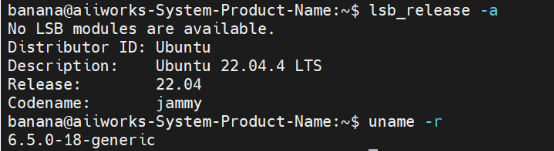
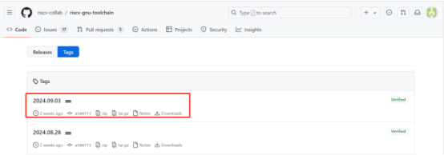

# <a name="_toc177736260"></a>**第八章：基于 RISC-V Duo 开发板的小实验**

## <a name="_toc177736261"></a>**8.1 Duo（CV800B）的硬件架构与功能**

Milk-V Duo 是一款基于 CV1800B 芯片的超紧凑型嵌入式开发平台。 它可以运行 Linux 和 RTOS，为专业人士、工业 ODM、AIoT 爱好者、DIY 爱好者和创作者提供可靠、低成本、高性能的平台。

### <a name="_toc177736262"></a>**8.1.1 CV1800B简介**

CV1800B 是一款高性能、低功耗芯片，适用于住宅消费监控 IP 摄像机、家庭智能等众多产品，集成 H.264/H.265 视频压缩编码器和 ISP；支持数字宽动态、3D降噪、去雾、镜头畸变校正等图像增强和校正算法，为客户提供专业级的视频图像质量。

该芯片集成了自主研发的智能参考解决方案（人体检测、区域检测、运动检测），内置 DDR 以及完整的外围设备和外围设备，为支持客户产品开发和量产提供了高度集成且简单的解决方案。

### <a name="_toc177736263"></a>**8.1.2 CV1800B 上手指南**

安装系统

从microSD卡启动

需要准备：

- Duo，Duo256M 或者 DuoS
- 大于 1GB 的 microSD 卡
- Type-C 数据线

下载镜像和工具：

下载链接：[https://github.com/milkv-duo/duo-buildroot-sdk/releases/](https://github.com/milkv-duo/duo-buildroot-sdk/releases/)

选择下图中的内容下载：


下载镜像烧录工具，例如[balenaEtcher](https://etcher.balena.io/) 或 [Rufus](https://rufus.ie/en/)。

烧录镜像：

下面是使用BalenaEtcher 烧录系统镜像的步骤。

如图所示，点击Flash from file


点击 Select target


点击Flash！


随后，使用5V适配器或者电脑USB，用Type-C线连接Duo。Duo上的蓝色灯闪烁，表明启动成功。

注意：如果开机后蓝色 LED 未闪烁，说明系统没有正常运行，可能是烧录到 microSD 中的镜像有问题。您可以尝试用其他烧录软件重新烧录镜像，常用的烧录软件有 balenaEtcher，Rufus，Win32DiskImager 等。

## <a name="_toc177736264"></a>**8.2 如何在 Duo 开发板上运行 C++20 程序**

### <a name="_toc177736265"></a>**8.2.1 准备开发环境**

推荐使用本地的Ubuntu系统，本次使用：Ubuntu 20.04 LTS。也可以使用虚拟机中的Ubuntu系统、Windows 中 WSL 安装的 Ubuntu、基于 Docker 的 Ubuntu 系统。

### <a name="_toc177736266"></a>**8.2.2 安装编译依赖的工具**
```
sudo apt-get install wget git make
```
### <a name="_toc177736267"></a>**8.2.3 获取 Examples 源码**
```
git clone https://github.com/milkv-duo/duo-examples.git
```
### <a name="_toc177736268"></a>**8.2.4 加载编译环境**
```
cd duo-examples

source envsetup.sh
```
第一次加载会自动下载所需的 SDK 包，大小为180M左右，下载完会自动解压到duo-examples下，解压后的目录名为duo-sdk，下次加载时检测到已存在该目录，就不会再次下载了。

注: 如果因为网络原因无法完成SDK包的下载，请通过其他途径获取到duo-sdk.tar.gz包，手动解压到duo-examples目录下，重新source envsetup.sh。

### <a name="_toc177736269"></a>**8.2.5 编译测试**

以hello-world为例，进入该例子目录直接执行make即可：
```
cd hello-world

make
```
编译成功后将生成的helloworld可执行程序通过网口或者RNDIS网络等方式传送到 Duo 设备中，比如默认固件支持的 RNDIS 方式，Duo 的 IP 为192.168.42.1，用户名是root，密码是milkv。

scp helloworld root@192.168.42.1:/root/

发送成功后，在 ssh 或者串口登陆的终端中运行./helloworld，会打印Hello, World!
```
[root@milkv]~# ./helloworld

Hello, World!
```
显示出上述结果后，表明我们的开发环境可以正常使用了。

## <a name="_toc177736270"></a>**8.3 了解RISC-V**

众所周知，指令集在计算机软件和硬件之间架起一座沟通的桥梁，所谓的CPU指令集架构（ISA）就是CPU支持的所有指令和指令的字节级编码。像X86、ARM等不同的CPU家族都有着各自不同的ISA。我们说的RISC-V开源更确切地来说就是对指令集规范和标准的开源。

- RISC-V的初始构思（2010年）

RISC-V的概念最初由加州大学伯克利分校的研究团队提出，旨在创建一个简洁、灵活且开放的指令集架构，以满足学术研究和工业应用的需求。

- 开放性与标准化（2014年）

RISC-V的开放性吸引了广泛的关注，2014年，RISC-V基金会（非营利性组织）成立，旨在推动RISC-V的标准化和推广。该基金会汇集了来自学术界和工业界的专家，推动RISC-V的开发和应用。

- 扩展与应用（2016-2018年）

随着RISC-V的推广，多个扩展被提出并标准化，包括浮点扩展（F和D）、原子扩展（A）等。RISC-V逐渐被应用于嵌入式系统、处理器设计和高性能计算等领域。

- 工业应用与生态系统发展（2019年至今）

RISC-V开始在多个行业中获得实际应用，包括人工智能、物联网、数据中心等。越来越多的公司和组织开始支持RISC-V，推动其生态系统的发展，包括编译器、操作系统和硬件实现。

- 持续演进与未来展望

RISC-V仍在不断演进，新的扩展和特性持续被提出，旨在满足不断变化的技术需求。随着开源硬件的兴起，RISC-V有望在未来的计算架构中占据重要地位。

## <a name="_toc177736271"></a>**8.4 RISC-V、Duo与C++20**

前面我们讲到，Milk-V Duo是一款基于 CV1800B 芯片的超紧凑型嵌入式开发平台，基于RISC-V架构。下面我们将讲解如何在Duo上运行我们的C++20程序，这里将会讲解到新知识——交叉编译，包括交叉编译的概念、工具链的准备、环境搭建、编译的过程等等。

### <a name="_toc177736272"></a>**8.4.1 交叉编译是什么？**

简单的说，交叉编译就是在宿主机上将高级程序语言生成能够在目标机器上运行的可执行代码。也可以说交叉编译是指在一个操作系统或硬件架构（称为主机）上使用编译器生成适用于另一个操作系统或硬件架构（称为目标）的可执行文件。它的主要应用场景包括操作系统开发、多平台开发、嵌入式系统等，它具有高效率、高灵活性、节省资源的优点，但是环境的配置和调试的困难仍然是初学者需要面对和解决的。

交叉编译中包含两个概念，一个是体系结构（Architecture）一个是操作系统（Operating System）。同一个体系结构可以运行不同的操作系统；同一个操作系统也可以在不同的体系结构上运行。

交叉编译的必要性：

- 硬件限制：某些目标平台（如嵌入式设备）可能没有足够的资源来进行本地编译。
- 开发效率：在开发者的主机上编译可以加快开发速度，避免在目标设备上进行长时间的编译。
- 多平台支持：开发者可以为多个平台生成可执行文件，而不需要在每个平台上都进行编译。

  嵌入式系统开发时，运行程序的目标机器通常具有有限的存储空间和运算能力，然而，一般的编译工具链需要很大的存储空间，并需要很强的额CPU运算能力，为了解决这种问题就出现了交叉编译工具链，目前大多数交叉编译工具链都是在linux系统上运行的，这也取决于linux系统强大的功能和系统的稳定性。

### <a name="_toc177736273"></a>**8.4.2 交叉编译使用的工具链**

（1） 软件基础环境：


（2） 下载、安装和编译相关工具链

1. 链接：[https://github.com/riscv/riscv-gnu-toolchain](https://github.com/riscv/riscv-gnu-toolchain)
2. 下载下图所示的压缩包：


1. 点击



1. 下载

使用命令：
```
wget https://github.com/riscv-collab/riscv-gnu-toolchain/releases/download/2024.09.03/riscv64-glibc-ubuntu-22.04-gcc-nightly-2024.09.03-nightly.tar.gz
```


1. 解压：
```
tar -xzf riscv64-glibc-ubuntu-22.04-gcc-nightly-2024.09.03-nightly.tar.gz
```
1. 添加环境变量：

使用命令：sudo nano ~/.bashrc

验证：
```
banana@aiiworks-System-Product-Name:~$ echo $PATH

/usr/local/sbin:/usr/local/bin:/usr/sbin:/usr/bin:/sbin:/bin:/usr/games:/usr/local/games:/snap/bin:/home/banana/tool/riscv/bin
```
### <a name="_toc177736274"></a>**8.4.3 交叉编译的步骤**

假设你正在开发一个应用程序，目标是让它在Milk-V Duo（基于RISC-V架构的设备）上运行，但你在一台 x86 架构的 PC 上进行开发。你可以使用交叉编译工具链（如 gcc 的交叉编译版本）来编译你的代码，使其能够在 Milk-V Duo 上运行。

示例步骤：

安装交叉编译工具链：在你的 PC 上安装适合 Milk-V Duo（RISC-V架构） 的交叉编译工具链，例如 riscv64-unknown-linux-gnu。

编写代码：下面编写一个C++20代码，使用了C++20中的std::ranges和std::format，同样也可以检测我们的环境是否真正的支持C++20。
```
#include <iostream>

#include <vector>

#include <ranges>

#include <format>

int main() {

// 检查 std::ranges

std::vector<int> numbers = {1, 2, 3, 4, 5};

auto even\_numbers = numbers | std::views::filter([](int n) { return n % 2 == 0; });

std::cout << "Even numbers: ";

for (int n : even\_numbers) {

std::cout << n << " ";

}

std::cout << std::endl;

// 检查 std::format

std::string formatted = std::format("Hello, {}!", "C++20");

std::cout << formatted << std::endl;

return 0;

}
```
使用交叉编译器编译代码：
```
riscv64-unknown-linux-gnu-g++ -static -std=c++20 -o check\_cpp20 check\_cpp20.cpp
```
这一段命令中riscv64-unknown-linux-gnu-g++：

是一个交叉编译器，专门用于将C++代码编译为适用于RISC-V架构（64位）的Linux操作系统的可执行文件。g++是GNU C++编译器的名称。
```
-static：
```
这个选项指示编译器生成一个静态链接的可执行文件。静态链接意味着所有需要的库都将被包含在最终的可执行文件中，而不是在运行时动态链接。这使得生成的可执行文件在没有依赖库的情况下也能运行，但文件大小会增大。
```
-std=c++20：
```
这个选项指定使用C++20标准进行编译。C++20是C++语言的一个版本，包含了许多新特性和改进，如范围（ranges）、概念（concepts）、协程（coroutines）等。
```
-o check\_cpp20：
```
这个选项指定输出文件的名称。在这个例子中，编译器将生成一个名为check\_cpp20的可执行文件。
```
check\_cpp20.cpp：
```
这是要编译的源代码文件的名称。编译器将读取这个文件并生成可执行文件。

将生成的可执行文件传输到 Milk-V Duo：使用 scp 或其他文件传输工具将 hello 文件传输到 Milk-V Duo。

在 Milk-V Duo上运行：
```
./ check\_cpp20
```
通过以上步骤，你就可以在 x86 PC 上编写和编译代码，并在 Milk-V Duo 上运行它。这就是交叉编译的基本概念和实际应用。

下面是运行结果，很明显我们配置的工具链是成功的：

